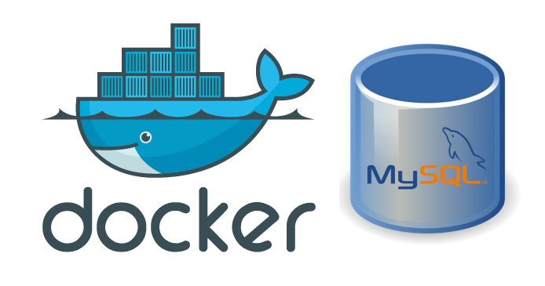

# SQL Overview and Relational DBs on Containers Practice

In this practice we will manipulate data on a Relational Database within a containerized environment

### Prerequisites
* [Install docker](https://docs.docker.com/engine/install/) 
* Install a db client (i.e. [DBeaver](https://dbeaver.io/download/)) 

### What You Will Learn
- How to use a docker container of a relational database
- Docker commands
- Operative System commands and Overview
- How to connect to a Docker Container
- How to connect to a Database by using a DB client
- SQL Overview
- Transactions Overview