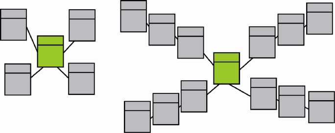
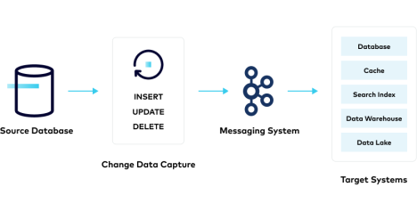
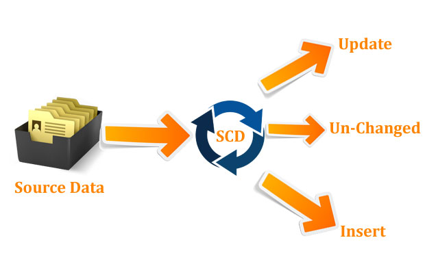

# SQL CDC

In this practice we will create an CDC for a products dataset which is incomplete.

## Before start

Let's review some concepts we will be using during this session

* `Data Warehouse` \
  A data warehouse is a `centralized repository of data that is optimized for querying and analysis`
  * Single source of truth
  * Usually extracted from various sources
  * Consistent format

* `Data Lake` \
  A data lake is a `large and centralized repository of raw and unstructured data`
  * Store data in its original format (raw/semi-raw)
  * Large amounts of data at a lower cost

* `Data Mart` \
  A data mart is a `subset of a data warehouse that is optimized for a specific business area or department`
  * Support the specific needs of individual business units
  * Targeted and efficient data analysis

### Data Warehousing Components

|Tool|Notes|
|-|-|
|ETL|Extract from sources, normalize and load into the datawarehouse|
|OLAP|`Multi-dimensional` analysis capabilities to perform complex data analysis|
|Data Visualization|`Interactive/graphical` representation of the data stored in the data warehouse|
|BI|Reporting, analysis, and visualization capabilities for data in the data warehouse (`data-driven`)|

### Data Modeling Techniques

`Dimensional modeling` \
Optimized for querying and analysis, uses fact and dimension tables
>The goal of dimensional modeling is to create a simple and intuitive model that makes it easy to answer business questions using SQL queries.

* Structures
  * `Dimension` \
    Contains `descriptive information about a particular aspect of the data`, such as a product, customer, time, or location.
    Can be used to categorize and group the data in the fact table.
  * `Fact` \
    Contains `one or more measures that represent the data that is being analyzed` such as sales, quantities, or amounts.

* Schema types \
  The fact table is the core of the schemas, the dimension table is connected using a foreign key, this can be visually represented on a star or snowflake schema
  * `Star` schema \
    On the star schema the fact only have 1 dimension deep level, this lead to multiple tables (sometimes not on 3NF) connected to a center table.
  * `Snowflake` schema \
    On the snowflake schema, you can have 2 or more dimension deep level, this lead to multiples tables (on a higher Normal Form than Star schema) *OLTP-like*

  > \
  >Left: Star Schema \
  >Right: Snowflake Schema

Article: [Star Schema vs Snowflake Schema: 6 Key differences][star_vs_snowflake]

>There are more modeling techniques, however this is the most widely spreaded

* Article: [5 Data Modeling Techniques][modeling_tecniques]
* Article [7 Data Modeling Techniques For Better Business Intelligence][modeling_bi]

### Change Data Capture (CDC)

#### Batch/Bulk

When people say replication/migration the most common approach used to be batch/bulk: this means during specific hours of the day start moving pieces of the database. However this means:

* Affect the operation (if used during operating hours)
* High % usage or resources (peaks processor/memory/network)
* Desync between information changed after it was moved to the new database

Because of these disadvantages people started to prefer CDC instead

#### Change data capture

>`Change Data Capture (CDC)` captures incremental changes to data and data structures (schemas) from the source database.

This means with CDC:

* Changes can be propagated in real time or near real time
* Lower % usage resources (but during more time, processor/memory/network)
* Less disruptions to operation
* Higher compliance, auditing, and tracking capabilities (Timestamps and transactional context)
* Enhanced data accuracy

   \

Article: [Change Data Capture (CDC): What it is and How it Works?][cdc_how_it_works]

### SCD (Slowly changing dimensions)

* `Slowly Changing Dimensions` \
  Type of dimension in data warehousing that handles `data that gradually change over time`.

  Depending on the changes, you can have different types:

  * Type 0: `No changes` (Original) \
    The data will never change

    Ex. `Birth Date`, `Original Credit Score`

  * Type 1: `Overwrite` \
    The partial initial data is empty, so when it's ready you will overwrite it.

    Ex. Register without email, then confirming email

  * Type 2 SCD: `New row` \
    On the table, you maintain a history and instead of update you use an insert tagging the changes.

    Ex. HR Table with income

    * `Numeric version` (The highest year is the latest)

      |employee_id|income|year|
      |-|-|-|
      |1|1000|2023|
      |1|1500|2024|

    * `Date Range` (The end date NULL is the latest)

      |employee_id|income|start_year|end_year|
      |-|-|-|-|
      |1|1000|2023|2024|
      |1|1500|2024|NULL|

    * `Initial Date/Current` (The date range is given when ordering the rows)

      |employee_id|income|start_year|current|
      |-|-|-|-|
      |1|1000|2023|False|
      |1|1500|2024|True|

  * Type 3: `New column` \
    Adding old/new column will preserve last change done, the second to last change done will not be preserved

    Ex. HR table of positions (previous_position is the version field)

    * Before insert

      |employee_id|position|previous_position|
      |-|-|-|
      |1|Jr Dev|NULL|

    * After insert

      |employee_id|position|previous_position|
      |-|-|-|
      |1|Mid Dev|Jr Dev|

    * After another insert

      |employee_id|position|previous_position|
      |-|-|-|
      |1|Sr Dev|Mid Dev|

  * Type 4: `Mini Dimension (History table)` \
    When you have high volatile data that would make high row count (stock, account balance...) you can split those fields into a mini dimension

    Ex. Bank customer

    * Before rework

      |customer_id|balance|first_name|last_name|register_date|card_number|
      |-|-|-|-|-|-|
      |1|1000|Enrique|Garcia|2023|1234-5678-9012-3456|

    * After rework

      |customer_id|first_name|last_name|register_date|mini_dimension|
      |-|-|-|-|-|
      |1|Enrique|Garcia|2023|1|

      |mini_customer_id|balance|card_number|
      |-|-|-|
      |1|1000|1234-5678-9012-3456|

  * Type 5: `4+1?`

    >The type 5 technique builds on the type 4 mini-dimension by embedding a “current profile” mini-dimension key in the base dimension that's overwritten as a type 1 attribute. This approach is called type 5 because 4 + 1 equals 5.

    Other sources does not recognize type 5 as valid:

    * Article: [Type 5 is real?][type_5]

  * Type 6: `Combined` \
    Combination of Type 1, 2 ande 3. This means that Type 6 SCD has both columns are rows in its implementation.

    * Before insert

      |employee_id|position|previous_position|start_year|end_year|current|
      |-|-|-|-|-|-|
      |1|Jr Dev|NULL|2021|-|Y|

    * After insert

      |employee_id|position|previous_position|start_year|end_year|current|
      |-|-|-|-|-|-|
      |1|Jr Dev|NULL|2021|2022|N|
      |1|Mid Dev|Jr Dev|2022|-|Y|

  > \
  >SCD action types

Learn more in deep about SCD types with:

* Article: [Implementing Slowly Changing Dimensions (SCDs) in Data Warehouses][scd_dw]
* Article: [Slowly changing dimension][scd_wiki]
* Article: [Slowly Changing Dimension Types 0, 4, 5, 6 and 7][scd_numbers]
* Article: [Dimensional Modeling][dimensional_modeling]
* Article: [Types of dimension][dimension_types]

## Practice

Use the backup files in the [data][data_folder] to restore the database.

* The products may have changed over the years
  >You can ignore the id column in the backups as it's just an enumerator
* Business doesn't have a history logger
  >The backup folder is the only information available
* You need to keep track of the data on every year

>On the future the data will be received every january 1st

### Requirements

* Load the backup files into pandas dataframes
  * Add the required data (year) into the dataframes
* Setup a new database with snowflake
* Create the related `products` table
* Load the Dataframe into the snowflake database
  * Connect to snowflake

### Step 0 - pyenv

* Use the example in [session 4][py_env] to create your python environment.

  ```sh
  python3 -m venv myenv
  source myenv/bin/activate
  ```

* Install `pandas` into the virtual environment

  ```sh
  pip install pandas
  ```

* Create `cdc.py` and add the import

  ```py
  import pandas
  ```

### Step 1 - Dataframes

* Get the files list

  ```py
  import os # To read folder/files

  # List files in directory
  list_dir = os.listdir("practice_files")
  # print(list_dir)
  ```

* Load files into dataframes

  ```py
  for file_name in list_dir:
    # load file to dataframe
    df = pandas.read_csv(f'./practice_files/{file_name}')
    # print(df)
  ```

### Step 2 - Dataframe modifications

* Add the year to the data frame in which records were created

  ```py
  _, year = file_name.split("_")
  year = year.replace(".csv", "")
  df["valid_for_year"] = year
  # print(year)
  ```

### Step 3 - Snowflake

* Go to `snowflake` and log in.
* Select the `Data` tab
* In the up-right corner we will see a button `+ Database`
* it should pop up a modal with two fields: `Name` and `Comment`

  
* You can fill it with the information you want
  >`Name` should not contain spaces.
* For this exercise use `Fundamentals_DB`
* Now push `Create` button
  * Go to the worksheets

    

### Step 4 - Snowflake Tables

* Create a new worksheet with the button in the top-right corner

  
* Set context
  >As snowflake is a multiple database container (data warehouse), at first it won't have a context of what are you willing to use

    ```sql
    USE Fundamentals_DB;
    /*Select the datawarehouse to compute your querys*/
    USE WAREHOUSE COMPUTE_WH;
    ```

* Create the table
  >Use the same worksheet

    ```sql
    CREATE TABLE products (
      name varchar(500),
      description varchar(500),
      price FLOAT,
      stock FLOAT,
      /*Additional fields*/
      valid_for_year INTEGER
    )
    ```

### Step 5 - Python-Snowflake connector

* Install the snowflake connector

  ```sh
  pip install snowflake-connector-python
  ```

* Set the connector properties and put the code inside the connection

  ```py
  from snowflake.connector import connect

  with connect(
    account="<SNOWFLAKE_LOCATOR>",
    user="<SNOWFLAKE_USERNAME>",
    password="<SNOWFLAKE_PASSWORD>",
    database="<SNOWFLAKE_DB>",
    schema="<SNOWFLAKE_DB_SCHEMA>",
    warehouse="<SNOWFLAKE_WAREHOUSE>",
    region="<SNOWFLAKE_AWS_REGION>"
  ) as connection:
    ...
  ```

  |Parameter|Notes|-|
  |-|-|-|
  |`SNOWFLAKE_LOCATOR`|This is the parameter that you can get when you log in to snowflake and go to Admin > Accounts.|The field that you will need is in the column "Locator"|
  |`SNOWFLAKE_USERNAME`|The username that you registered in snowflake|-|
  |`SNOWFLAKE_PASSWORD`|The password that you used to register in snowflake|-|
  |`SNOWFLAKE_DB`|The database that you want to connect and make queries to.|-|
  |`SNOWFLAKE_DB_SCHEMA`|The schema in which you want to operate|Optional|
  |`SNOWFLAKE_WAREHOUSE`|Warehouse that you want to use to compute your queries.|-|
  |`SNOWFLAKE_AWS_REGION`|In this case for AWS you will need to put the AWS Region Id in which our snowflake server is located.|This information can be found in the same panel as the `SNOWFLAKE_LOCATOR` under the column "REGION. Check note below for more information|

>Note: You should use the region id instead of the region name.
>
>Ex. For `US East (N. Virginia)` use `us-east-1`
>
>Follow the guideline on: [Non-VPS Account Locator Formats by Cloud Platform and Region][snow_regions_aws]
>
>Ex. `US West (Oregon)` note reads `No additional segments required.` meaning the parameter is not required for string connection builder AKA `connect` function

### Step 6 - Dump to snowflake

* Import the type

  ```py
  from snowflake.connector import connect, SnowflakeConnection
  ```

* Create a generic function to handle the dataframes

  ```py
  def upload_to_snowflake(connection: SnowflakeConnection, data_frame, table_name):
    with connection.cursor() as cursor:
      query = f"INSERT INTO {table_name} (name, description, price, stock, valid_for_year) VALUES (%s, %s, %s, %s, %s)"
      data = data_frame[['name', 'description', 'price', 'stock', 'valid_for_year']].values.tolist()

      cursor.executemany(query, data)
  ```

* Call the function with the df and the connection to snowflake

  ```py
  for current_file in csv_files:
    ...
    upload_to_snowflake(connection, df, "products")
  ```

### Step 7 - Results

* Execute using

  ```python3 cdc.py```

* Check the results on the snowflake tables

## Conclusion

In this session we took a look into CDC, SCD and Data modeling. Then we built a datawarehosue structure using Data modeling techniques and a simple CDC to restore a database from backups.

## Homework (Optional)

* Investigate what are the top 5 advantages and disadvantages of Star vs Snowflake schemas

## Still curious

* So what is CDC?

  In simple terms, *CDC means to track the changes done to a source data in real time or near real time.* \
  In this practice we use backups, however real scenarios does not use backups as they are menat to be  real time or near real time, the most common way to do it is by using polling, logs or triggers.

* CDC Real case study

  Imagine you work at a highway goverment tracking, they need you to register and provide analytic data for the accidents occurring in some section of the road, currently you cannot modify the structure of the tables, but you can log in the triggers as much as needed.

  A solution would be to implement logs, that then will be collected tracking the information about type of accident, section of the road (km), insurance cost... and dump it into another database or datawarehouse to perform analysis.

* What other things can you do with CDC?

  Replication, Data Integration, Disaster Recovery, Data Migration, Audit and compliance...

* The things you need to have in mind when setting up a CDC are:
  * Change Identification: What changes do I need to track?
  * Granularity: How deep into the changes I need to go? (column, row, table...)
  * Real-time or Batch: How quick do I need the changes (schedule based or real time)
  * Capture Methods:
    * Log-Based CDC
    * Trigger-Based CDC
    * Polling-Based CDC
  * Timestamps or Sequence Numbers: How do I need to identify the order of changes?
  * Change Propagation: Once I got the changes, how do I want to deliver those changes to other systems? (Reports, other DBs, apps...)

* Check the following articles for more information:
  * Article: [What is CDC][what_is_cdc]
  * Article: [CDC with SQL Server][cdc_sql_server]

## Links

### Used during this session

* [pyenv setup][py_env]
* [Pre Setup][pre_setup]

* [What is CDC][what_is_cdc]
* [CDC with SQL Server][cdc_sql_server]

* Article: [5 Data Modeling Techniques][modeling_tecniques]
* Article [7 Data Modeling Techniques For Better Business Intelligence][modeling_bi]

### Session reinforment and homework help

* [Star Schema vs Snowflake Schema: 6 Key differences][star_vs_snowflake]
* [Implementing Slowly Changing Dimensions (SCDs) in Data Warehouses][scd]

[data_folder]: ./practice_files

[pre_setup]: pre-setup%20README.md
[py_env]: ../session_4_python_for_data/pre-setup.md#step-1---virtual-environment

[what_is_cdc]: https://www.redhat.com/en/topics/integration/what-is-change-data-capture
[cdc_sql_server]: https://learn.microsoft.com/en-us/sql/relational-databases/track-changes/about-change-data-capture-sql-server?view=sql-server-ver16
[modeling_tecniques]: https://www.vertabelo.com/blog/data-modeling-techniques/
[modeling_bi]: https://www.klipfolio.com/blog/6-data-modeling-techniques
[cdc_how_it_works]: https://dbconvert.com/blog/change-data-capture-cdc-what-it-is-and-how-it-works/
[type_5]: https://gchandra.gitbook.io/data-warehousing/data-warehousing-concepts/types-of-dimensions/slowly-changing-dimensions/scd-type-5-fun-fact
[scd_dw]: https://www.sqlshack.com/implementing-slowly-changing-dimensions-scds-in-data-warehouses/
[scd_wiki]: https://en.wikipedia.org/wiki/Slowly_changing_dimension
[scd_numbers]: https://www.kimballgroup.com/2013/02/design-tip-152-slowly-changing-dimension-types-0-4-5-6-7/
[dimensional_modeling]: https://gchandra.gitbook.io/data-warehousing/data-warehousing-concepts/dimensional-modelling
[dimension_types]: https://gchandra.gitbook.io/data-warehousing/data-warehousing-concepts/types-of-dimensions/
[snow_regions_aws]: https://docs.snowflake.com/en/user-guide/admin-account-identifier#non-vps-account-locator-formats-by-cloud-platform-and-region

[star_vs_snowflake]: https://www.thoughtspot.com/data-trends/data-modeling/star-schema-vs-snowflake-schema
[scd]: https://www.sqlshack.com/implementing-slowly-changing-dimensions-scds-in-data-warehouses/
