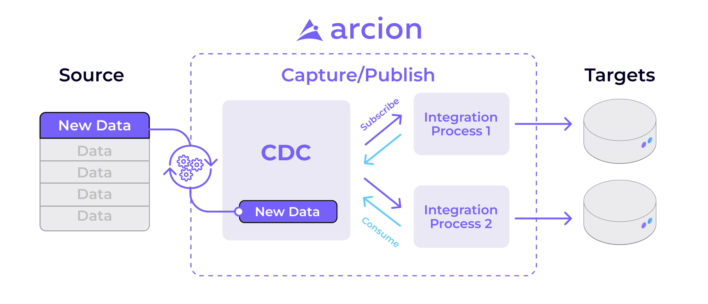

# Data Load Techniques

This practice is intended to teach you which are the types of data load.
In this practice, you will learn what are the implications for this three load techniques

- Upsert/Delta load/Append
- Truncate and reload/Full load
- External tables


## External tables

while this is not a Load technique like the other two, this is a very helpful tool to reduce
costs, because you will store your data into an S3 bucket instead of a normal table, and is also
useful for ELT processes.

## CDC (Change Data Capture)

Change data capture (CDC) is a technique used to capture and record changes made to data in a database. The goal of CDC is to make it possible to keep a replica of the data in a secondary system up-to-date with the changes made in the primary system, in near real-time. CDC is particularly useful in scenarios where data needs to be replicated across systems for analytics, reporting, or backup purposes.

CDC works by monitoring the database for changes, such as inserts, updates, and deletes, and capturing those changes in real-time. The captured changes are then stored in a log, which can be used to apply the same changes to a secondary system. There are different ways to implement CDC, such as using database triggers, log-based replication, or a combination of both.



## Loading Techniques

+ **Truncate and reload**: In this method, the entire table is deleted and then reloaded with fresh data. This method is useful when the data is small or the entire table needs to be refreshed. However, it can be time-consuming and can cause data loss if not done carefully.
+ **Incremental/Delta/Upsert**: In this method, only the changes made since the last data load are loaded into the table. This method is useful when the data is large and only a small amount of data has changed since the last load. This can reduce the amount of data that needs to be loaded and can save time. Depending on the specific implementation, this method may be referred to as incremental, delta, or upsert.
+ **Append**: In this method, new data is added to the existing data in the table. This method is useful when the new data needs to be added to the existing data rather than replacing it. This method can be used for cases where the data is constantly being updated and needs to be refreshed regularly.


# Practice

According to the last pipeline `session_10_Fundamentals` we need to do a few changes to the table.

First of all, this time we have information for another company, and we don't want the data to be mixed
or wrong, so we need to add another column to the table and the python script.

## Step 1

#### Table

```snowflake
    ALTER TABLE FUNDAMENTALS_DB.PRODUCTS ADD COLUMN company_name VARCHAR(500);
```

## Step 2

#### Script

Once that we have the table updated, we need to update some data in our script.

let's see where.

```python
def upload_to_snowflake(connection: SnowflakeConnection, data_frame, table_name):
    with connection.cursor() as cursor:
        query = f"INSERT INTO {table_name} (name, description, price, stock, valid_for_year) VALUES (%s, %s, %s, %s, %s)"
        data = data_frame[['name', 'description', 'price', 'stock', 'valid_for_year']].values.tolist()

        cursor.executemany(query, data)
```

in this section of the script, the problem is that the columns are explicitly placed, let''s change it'

```python
import pandas as pd


def upload_to_snowflake(connection: SnowflakeConnection, data_frame: pd.DataFrame, table_name):
    data_frame = data_frame.drop("id", axis=1)
    
    with connection.cursor() as cursor:
        column_secrets = ['%s'] * len(data_frame.columns)
        column_preparated_str = ','.join(column_secrets)
        query = f"INSERT INTO {table_name} VALUES ({column_preparated_str})"
        cursor.executemany(query, data_frame.values.tolist())
        print('Data Frame inserted!')
```

## Step 3

now we can load the whole data without worrying about the new columns that we added.
The only problem would be that we need to differentiate the new data for Company A.

so we just need to add after

```python
df["valid_for_year"] = year
```

the following line
```python
df["company_name"] = "Company A"
```

## Step 4

The only problem is that due to the structure change, we need to truncate the table.

```snowflake
TRUNCATE TABLE FUNDAMENTALS_DB.PRODUCTS;
```

and then we can run the python script that uploads the data.

## Step 5

Let's use a generic function to load both company A and company B, it can be the following

```
def insert_company_data(company):
    list_dir = os.listdir(company) 

    csv_files = filter(lambda item: item.endswith(".csv"),
                       list_dir)  # Making sure that we are just using the correct file format


    for current_file in csv_files:
        print(current_file)
        df = pd.read_csv(f'./{company}/{current_file}')
        _, year = current_file.split("_")
        year = year.replace(".csv", "")
        df["valid_for_year"] = year
        df["company_name"] = company
        print(df)
        upload_to_snowflake(connection, df, "products")
```

## Step 6

Now let's call this function inside the snowflake connect code as

```
with connect(
    account="jmb74483",
    user="enriquegarciaenroute",
    password="Lalilulelo2121",
    database="fundamentals_db",
    warehouse="COMPUTE_WH",
    region="us-west-2"
) as connection:

    for company in ['Company A', 'Company B']:
        insert_company_data(company)
```

## Step 7

Let's run the code and see both companies are on the products table.

# Conclusion

We used the Delta load and truncate and reload.
When we tried to load data for the new table structure, we truncated the table data, and we loaded again everything.
And then the Delta load by just adding te data for company B without removing company A's data.