# Reporting Bases

>Reporting Bases: Base data (Usually raw) or datasources used for generating reports in BI and Data Analytics.

In this session we will explore a BI or visualization tool (such as Tableau or the one of your preference)

## Prerequisites

* Follow the [pre-setup guideline][pre-setup]

## Before start

Let's review some important concepts:

### BI Tools

`Business Intelligence (BI) tools` are software applications that help organizations analyze, visualize, and gain insights from their data. These tools enable businesses to make informed decisions by transforming raw data into meaningful and actionable information. BI tools often provide features such as data integration, querying, reporting, dashboarding, and analytics.

Popular flavors and main features:

* `Tableau`
  * Shareable file dashboard
  * Focused on story telling
  * No dependence on Stack
* `Microsoft Power BI`
  * Seamless integration with Microsoft products
  * Focused on data mining
* `QlikView/Qlik Sense`
  * Focused on Data discovery
  * No dependence on Stack
* `Looker`
  * Cloud based
  * No dependence on Stack
* `SAP BusinessObjects`
  * Focused Data exploration
  * Seamless integration with SAP products

### Data Engineering VS Data Science

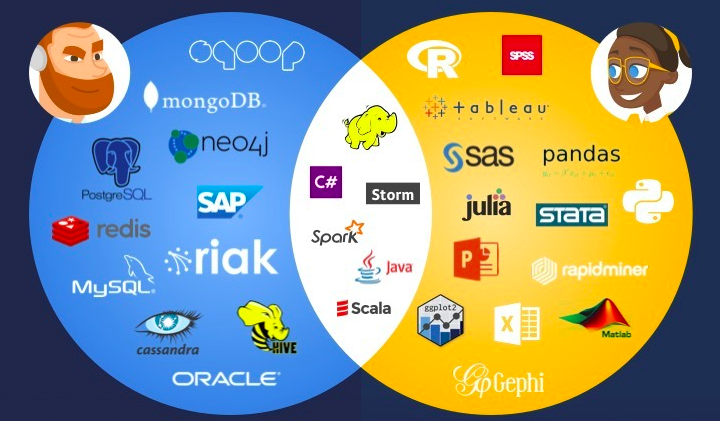

Data Engineering and Data Science are two related, yet distinct fields within the broader data domain. They both deal with data but focus on different aspects of the data lifecycle and require different skill sets.

#### Data Engineering

Data Engineering primarily focuses on `making the data reliable`; they take of the design, development, and management of data infrastructure, pipelines, and systems.

* `Building and maintaining data pipelines` \
  ELT or ELT pipeline
* `Data storage and management` \
  Design and optimize database, data warehouse and datalakes
* `Data quality and consistency` \
  Clean, validate, and standardize data
  > Data governance and ensure that data complies with organizational policies and regulations.
* `Data integration` \
  Integrate data from different sources and make it accessible to others (apps/users)
* `Performance optimization` \
  Optimize data processing and query performance

#### Data Science

Data Science focuses on extracting insights, knowledge, and patterns from data using various analytical, statistical, and machine learning techniques. Data scientists are responsible for:

* `Data exploration and analysis` \
  Identify trends, patterns, and relationships that can provide valuable insights for decision-making.
* `Statistical modeling and machine learning` \
  Develop and apply statistical models and machine learning algorithms to make predictions, classify data, or discover hidden patterns in the data.
* `Data visualization` \
  Create visual representations of data
* `Experimentation and hypothesis testing` \
  Design experiments and tests to validate hypotheses and evaluate the effectiveness of different strategies or solutions.
* `Decision support` \
  Communicate their findings to stakeholders and help them make data-driven decisions.

## Practice

* Connect your database with your BI tool (Tableu)
* Create the following reports
  * `Total sales by state`
  * `Total sales by state by brand`
  * `Average sales by state by brand`
* Using the previous 3 reports create a dashboard: `Sales by state`

### Step 0 - ODBC driver

* Download and install the driver from [here][odbc_snow]

This driver will help us with the methods to read data from Tableu

### Step 1 - Snowflake

Before we go to tableu we need some information

* Go to `Snowflake` > `Accounts`
  * Copy the server from the `Account` field \
    Should be in the shape of `https://abcdef-abc12345.snowflakecomputing.com`

      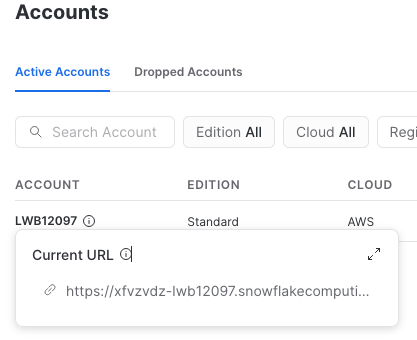

### Step 2 - Tableu Desktop

* Open Tableu Desktop
* On the `Left Panel >`
  * Select `More... >`
* Search `Snowflake` and click on it
* Paste the server value you get on previous step
  * Role: Empty
  * Authentication: `Username and Password` \
    Write your user and password
  * Click `Sign In`
* Select the connection parameters for the report
  * `Warehouse`: Any
  * `Database`: `fundamentals_db`
  * `Schema`: `public`

You should be able to see all the tables in that Schema

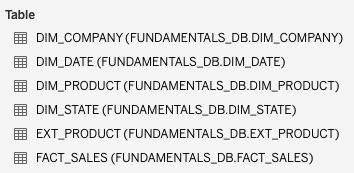

>To ensure we got a quick connection to snowflake we used `user/password` login, however, this is not the most recommended way to do it when using a production server, in order to connect we need to do something similar to the external tables (Integration)
>
>Here are some documents that describe how this would be done for Snowflake:
>
>* [Integrate Snowflake with OAuth partners][snowflake_oauth]
>* [Snowflake with custom clients][snowflake_custom]
>* [Snowflake create integration][snowflake_integration]

### Step 2 - Dashboard

In order to create reports we can drag 'n drop tables and tableu will analyze the information allowing us to create some

You can change the Sheet (Report) name in order tu customize the view using double click

* Report: `Total sales by state`
  * Tables: `fact_sales`, `dim_state`
    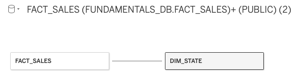
  * Sheet
    * Columns: `dim_state.state`
    * Rows: `SUM(fact_sales.sales)` \
      *Dropping the column sales automatically will create the SUM wrapper*

      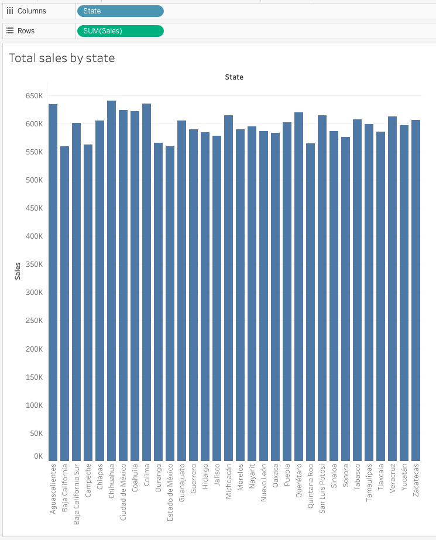

* Report: `Total sales by state by brand` \
  *We will be using the Brand name field, this is on `dim_product`*
  * Go back to `Data source` tab and drag the required table
    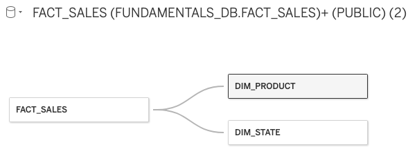
  * Duplicate the previous report tab and rename the new sheet
    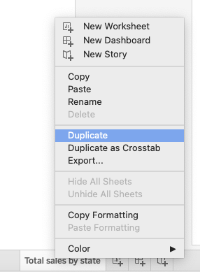
  * Modify the report
    * `Pages`: `dim_product.brand`
      >Notice you now will have a Page selector (Brand) on the Right Panel of the sheet

      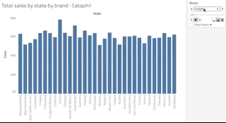

* Report: `Average sales by state by brand`
  * Duplicate the previous report and update
    * Name
    * Measurement
      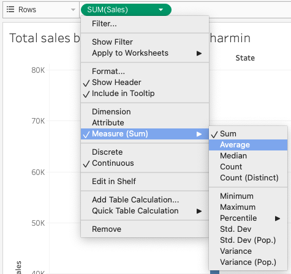

* Dashboard: `Sales by state`
  * Next to the Sheets tabs, you will see this icon  click it to create a new dashboard

  * Drag 'n drop the previously created sheets to create the dashboard \
    *Notice the filter **Brand** moves both sheets at the same time*

    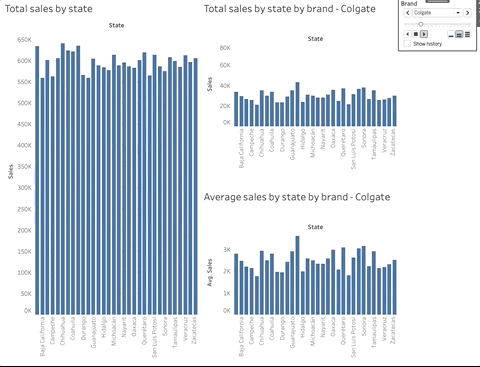

You can save your work as a file that you can reopen or share

## Conclusion

*Data engineering* cares about data transformation and quality (ETL, ELT...) and *Data science* uses that processed information to get value out of that information (Reports, BI, Querys...)

Reporting bases are created by Data Engineers, then are used by data scientists

## Homework

* Using Tableu Create the following reports
  * Sold items (count) by category by company
  * Total sales by category by year and month \
    *Page should be **YYYY.M***
  * Total sales by state by brand
  * Total sales by company by year
* Create a dashboard

Your dashboard should look like this

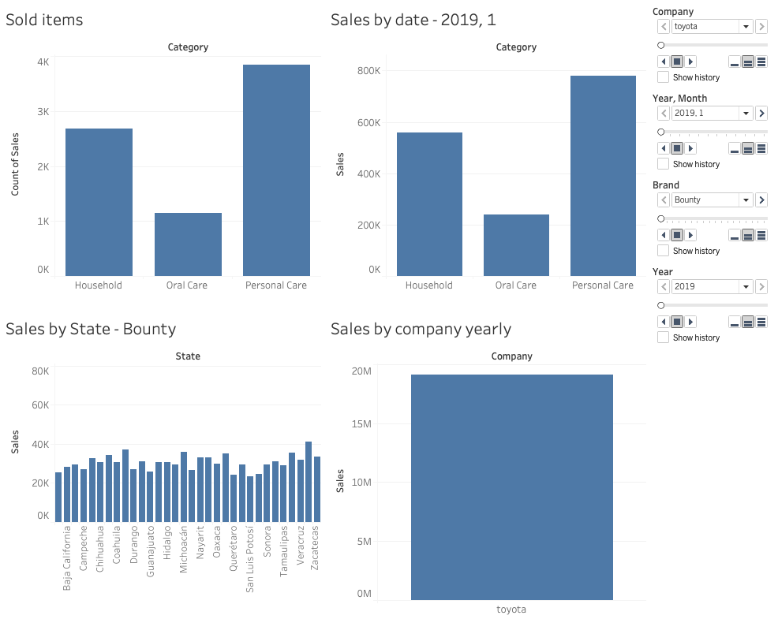

### Optional

* Use the `Performance Recorder` tool to review what queries is generating every sheet
* Compare these queries with the required for last session homework

## Still curious

We mention some BI tools today, however the most popular BI are Tableau and Power BI.

* What are the main differences?
* When will you choose one or the other?
* Which one is cheaper?
* Could you give a "no-brain" of a situation where you will pick:
  * Power BI
  * Tableu

You can use the following articles to try answer these questions:

* [Tableau vs. Power BI: The Better Choice in 2023?][tableau_vs_powerbi]
* [Power BI vs Tableau: Which Should You Choose in 2023?][which]
* [Power BI vs. Tableau: Top 10 Major Differences][differences]

## Links

### Used during this session

* [Pre-Setup][pre-setup]

* [ODBC Snowflake Connector][odbc_snow]
* [Integrate Snowflake with OAuth partners][snowflake_oauth]
* [Snowflake with custom clients][snowflake_custom]
* [Snowflake create integration][snowflake_integration]

* [Tableau vs. Power BI: The Better Choice in 2023?][tableau_vs_powerbi]
* [Power BI vs Tableau: Which Should You Choose in 2023?][which]
* [Power BI vs. Tableau: Top 10 Major Differences][differences]

### Session reinforment and homework help

* [Record and Analyze Workbook Performance][tableu_performance_recorder]
* [Workbook optimizer][tableu_wbo]

[pre-setup]: ./pre-setup.md

[odbc_snow]: https://developers.snowflake.com/odbc/

[snowflake_oauth]: https://docs.snowflake.com/en/user-guide/oauth-partner
[snowflake_custom]: https://docs.snowflake.com/en/user-guide/oauth-custom
[snowflake_integration]: https://docs.snowflake.com/en/sql-reference/sql/create-security-integration-oauth-snowflake

[tableau_vs_powerbi]: https://geekflare.com/tableau-vs-power-bi/
[which]: https://www.datacamp.com/blog/power-bi-vs-tableau-which-one-should-you-choose
[differences]: https://intellipaat.com/blog/power-bi-vs-tableau-difference/

[tableu_performance_recorder]: https://help.tableau.com/current/pro/desktop/en-us/perf_record_create_desktop.htm
[tableu_wbo]: https://help.tableau.com/current/pro/desktop/en-us/wbo_overview.htm
