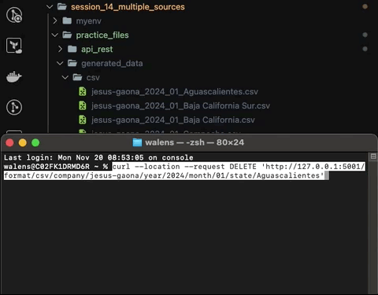
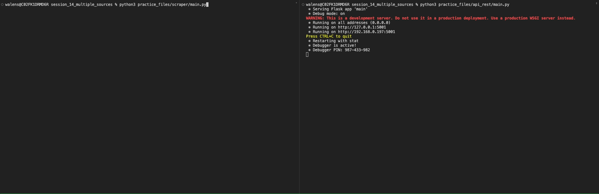
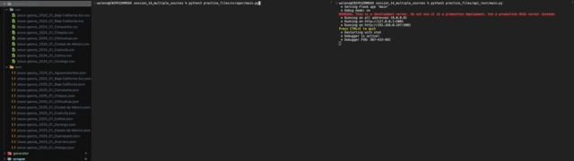

# Multiple Data Sources

In this session we will explore how to have the same different output from different data sources

## Prerequisites

* Follow the [pre-setup guideline][pre-setup]

## Before start

>One of the most common scenarios is to have the data spreaded among several data sources, before getting some valuable insights from this we need to normalize the data, you can do it via ELT or ETL but the data scientist will expect a single source of truth.

In this practice we will simulate:

* Preexistent data
* Data we need to scrape from API
* Data we have as backup script

Then we will join them into a single source of truth

### Scraper

A "scraper" or "web scraper" refers to a software tool or script designed to extract data from websites. It automatically navigates web pages, gathers information, and saves it for further use or analysis.

Web scraping can serve various purposes:

* Data Collection: Gathering data from websites for analysis, research, or integration into other applications or databases.
* Monitoring: Tracking changes or updates on websites over time.
* Competitive Analysis: Extracting information about competitors' products, prices, or market strategies.
* Aggregation: Collecting data from multiple sources to create a unified dataset.

## Practice

In this practice we will simulate 3 different inputs and we will join them into a single table.

* Generate data using the `generator` tool
  * year: `2024`
    * company: `<first name>-<last name>`
    * format: `csv`
  * year: `2025`
    * company: `<first name>-<last name>`
    * format: `json`
  * year: `2026`
    * company: `<first name>-<last name>`
    * format: `sql`
* Load the SQL backup
* Run the `API REST` to simulate the client
* Create the table using the script on the `scraper` folder
* Scrape the data into the snowflake database
  * Ensure you call the `DELETE` method to remove files from the "client" API once you are done with the files
* Unify the data into a final table (`ext_product`, `sales_scrapper` and `sales_backup`)
  * Ensure you filter your external table by your company (`firstname-lastname`)

### Step 0 - Generator

>The generator tool accepts some flags to modify the data output, run with the `-h` or `--help` to get the help menu for those flags
>
>On a real life scenario these files would be extracted from the client database instead of being randoms

```sh
python3 practice_files/generator/main.py -h
```

* Generate csv & json files for the API \
  *This will generate csv & json folders inside generated_data*

  ```sh
  python3 practice_files/generator/main.py -y 2026 -c jesus-gaona -f csv
  python3 practice_files/generator/main.py -y 2026 -c jesus-gaona -f json
  ```

* Generate SQL backup \
  *This will generate sql file/folder inside generated_data*

  ```sh
  python3 practice_files/generator/main.py -y 2026 -c jesus-gaona -f sql
  ```

### Step 0.1 - API REST

* Run the API REST using

  ```sh
  python3 practice_files/api_rest/main.py
  ```

>On a real life scenario this server will be given to you by the client, instead of running in your local machine

### Step 1 - Backup

* Login to your snowflake console
* Run the generated sql script \
  on `generated_data/sql/backup.sql`
* Remove the `sql` folder as we no longer need it

This should create a table named `sales_backup` and the data generated

>On a real life scenario this script will be given to you (not generated)

### Step 2 - Scraper Table

* Login to your snowflake console
* Run the generated sql script \
  on `scraper/create_table.sql`

This should create a table named `sales_scraper`

### Step 3 - Explore the API

* Go to `http://127.0.0.1:5001` \
  *Given the response you can go deep into the API completing the path*

  ```json
  {
    "format": [
      "json",
      "csv"
    ]
  }
  ```

* Complete the path `/format/<format>` \
  *This will give additional details of files available with that description*

  ```json
  {
    "company": [
      "jesus-gaona"
    ],
    "format": "json"
  }
  ```

* Explore the API

|Deep|Path|
|-|-|
|Format|/format/\<format>|
|Company|/format/\<format>/company/\<company>|
|Year|/format/\<format>/company/\<company>/year/\<year>|
|Month|/format/\<format>/company/\<company>/year/\<year>/month/\<month>|
|State|/format/\<format>/company/\<company>/year/\<year>/month/\<month>/state/\<state>|

* Delete a used resource on the API \
  *Once your perform an insert based on a resource you can delete that resource in order to not re-read it in the next cycle*
  * Perform a GET request on the API

    ```sh
    curl --location 'http://127.0.0.1:5001/format/csv/company/jesus-gaona/year/2024/month/01/state/Aguascalientes'
    ```
  
  * Perform a DELETE request on the API

    ```sh
    curl --location --request DELETE 'http://127.0.0.1:5001/format/csv/company/jesus-gaona/year/2024/month/01/state/Aguascalientes'
    ```

  * This will delete the file on the folder \
    *if this is the last file on the folder, the folder will be deleted*

    

    * Additionally this will create a log on the server

    ```log
    127.0.0.1 - - [21/Nov/2023 08:48:00] "DELETE /format/csv/company/jesus-gaona/year/2024/month/01/state/Aguascalientes HTTP/1.1" 200 -
    ```

* Understand different formats \
  *Given csv or json the final response may change*
  * `csv`

    ```json
    {
      "format": "csv",
      "company": "jesus-gaona",
      "year": "2024",
      "month": "01",
      "state": "Aguascalientes",
      "data": [
        [
          "col1",
          "col2"
        ],
        [
          "row1-col1",
          "row1-col2"
        ],
        [
          "row2-col1",
          "row2-col2"
        ]
        ...
      ]
    }
    ```

  * `json`

    ```json
    {
      "format": "json",
      "company": "jesus-gaona",
      "year": "2025",
      "month": "01",
      "state": "Aguascalientes",
      "data": {
        "col1": {
          "row1": "Head & Shoulders",
          "row2": "Pantene"
        },
        "col2": {
          "row1": "Personal Care",
          "row2": "Household"
        }
        ...
      }
    }
    ```

### Step 4 - Scraper

#### Step 4.1 - Preexistent files

* `common/constants`
  * `HOST`: Base address of the API
  * `SNOW_CREDS`: Snowflake credentials based on environment variables
  * `TABLE_NAME`: Table name to insert scraped data
  * `Format(Enum)`: Enumerator to handle different formats
  * `Path(Enum)`: Partials path to build the URL's
  * `Field(Enum)`: Fields to extract the data from the response
* `common/snow`
  * `conn`: Snowflake connection
  * `upload_to_snowflake`: Insert a dataframe into snowflake
* `common/utils`
  * `do_req`: *(Placeholder)* Perform a request and return the field based on a response
  * `do_req_del`: *(Placeholder)* Perform a delete request and return True/False based on success
* `main`: *(Placeholder)*

#### Step 4.2 - Scrape Urls

>The first thing we need to understand is how we navigate the API and dynamically generate the URL's
>
>Formats > Companies > Years > Months > State > Data

* Create an array to iterate valid formats \

  ```py
  from common.constants import Format

  FORMATS = [Format.CSV.value, Format.JSON.value]
  ```

* Create a function and iterate `FORMATS` \
  *For each iteration we will make a url and a request to that url to navigate to the next level*

  ```py
  from common.constants import Format, Path, Field
  from common.utils import do_req

  FORMATS = [Format.CSV.value, Format.JSON.value]

  def scrape_paths():
    for scr_format in FORMATS:
      # print(scr_format)
      url_format = f"{Path.FORMAT.value}{scr_format}"
      companies = do_req(url_format, Field.COMPANY.value)
      # print(companies)
  
  scrape_paths()
  ```

* Iterate companies

  ```py
    for company in companies:
      url_year = f"{url_format}{Path.COMPANY.value}{company}"
      years = do_req(url_year, Field.YEAR.value)
      # print(years)
  ```

* Iterate years

  ```py
      for year in years:
        url_month = f"{url_year}{Path.YEAR.value}{year}"
        months = do_req(url_month, Field.MONTH.value)
        # print(months)
  ```

* Iterate months

  ```py
        for month in months:
          url_state = f"{url_month}{Path.MONTH.value}{month}"
          states = do_req(url_state, Field.STATE.value)
          # print(states)
  ```

* Iterate states and create the final urls \
  *We will use these values to iterate in a different function*

  ```py
  import pandas

  def scrape_paths():
    df = pandas.DataFrame([], columns=["format", "company", "year", "month", "state", 'uri'])
    ...
          for state in states:
            url_data = f"{url_state}{Path.STATE.value}{state}"
            new_row = {
              'format': scr_format,
              'company': company,
              'year': year,
              'month': month,
              'state': state,
              'uri': url_data
            }
            df.loc[len(df)] = new_row
  return df

  df = scrape_paths()
  # print(df)
  ```

* Run the program \
  *In this moment you should be able to see how the request are being performed on the server*

  ```sh
  python3 practice_files/scraper/main.py
  ```

  

#### Step 4.3 - Scrape Data

In this step we should have a dataframe with the urls ready to be requested

* Create a function and pass the dataframe

  ```py
  def scrape_data(df: pandas.DataFrame):
    pass

  df = scrape_paths()
  scrape_data(df)
  ```

* Iterate the dataframe and obtain the data values from the request

  ```py
  def scrape_data(df: pandas.DataFrame):
    for i, row in df.iterrows():
      data = do_req(row['uri'], Field.DATA.value)
      # print(data)
  ```

* Handle the different scenarios (json or csv)

  ```py
  from common.snow import handle_json, handle_csv
  ...

  def scrape_data(df: pandas.DataFrame):
    ...
      if Format.JSON.value == row['format']:
        handle_json(data, row['company'], row['year'], row['month'], row['state'])
      elif Format.CSV.value == row['format']:
        handle_csv(data, row['company'], row['year'], row['month'], row['state'])
  ```

* Declare `handle_json` & `handle_csv`

  ```py
  def handle_csv(data: list, company:str, year:str, month:str, state:str):
    pass

  def handle_json(data: list, company:str, year:str, month:str, state:str):
    pass
  ```

* CSV to Dataframe \
  >On the csv the `Data` is an array, which contains the values by rows, the first row are the headers, the second row onwards are the values
  
  ```py
  def handle_csv(data: list, company:str, year:str, month:str, state:str):
    columns = data[0]
    data_values = data[1:]
    df = pandas.DataFrame(data_values, columns=columns)
  ```

* JSON to Dataframe \
  >On the csv the `Data` is a dictionary, which contains the values by columns, the property name is the header and the subitems are the records of the column, pandas already provides a function to parse this
  
  ```py
  def handle_json(data: list, company:str, year:str, month:str, state:str):
    df = pandas.DataFrame.from_dict(data)
  ```

* Add additional common information \
  *If we attempt to insert any of these 2 dataframes we might get an error, since the information is not complete, we need to add company, year, month and state according to our sql script, these values are already passed as parameters into the handler functions*

  ```py
  def handle_csv(data: list, company:str, year:str, month:str, state:str):
    ...
    df = add_extra_cols(df, company, year, month, state)

  def handle_json(data: list, company:str, year:str, month:str, state:str):
    ...
    df = add_extra_cols(df, company, year, month, state)

  def add_extra_cols(df: pandas.DataFrame, company:str, year:str, month:str, state:str):
    df['company'] = company
    df['year'] = year
    df['month'] = month
    df['state'] = state
    return df
  ```

* Call the insert to snowflake function

  ```py
  def handle_csv(data: list, company:str, year:str, month:str, state:str):
    ...
    upload_to_snowflake(conn, df)

  def handle_json(data: list, company:str, year:str, month:str, state:str):
    ...
    upload_to_snowflake(conn, df)
  ```

* Delete the already used data

  ```py
  from common.utils import do_req, do_req_del
  ...

  def scrape_data(df: pandas.DataFrame):
    ...
    do_req_del(row['uri'])
  ```

#### Step 4.4 - Add a spinner loader (Optional)

This step is optional, as you can guide yourself by the prints

* Declare the chars to load the spinner as a global variable in main.py

  ```py
  chars = r'/-\|'
  ```

* On the function `scrape_data` use the index to iterate over the chars and do a print

  ```py
  import sys

  ...

  def scrape_data(df: pandas.DataFrame):
    for i, row in df.iterrows():
      sys.stdout.write(f'\rLoading... {chars[i % len(chars)]}')
      sys.stdout.flush()
  ```

* Once your program is done write the done output \
  *The spaces are important in order to overwrite the previous output*

  ```py
  sys.stdout.write('\rDone!       \n')
  ```

#### Step 4.5 - Scrape into DB

* Set the environment variables

  ```sh
  export SNOW_USER=<username>
  export SNOW_PWD=<password>
  export SNOW_ACCOUNT=<abc12345>
  export SNOW_WH=COMPUTE_WH
  export SNOW_DB=fundamentals_db
  export SNOW_SCHEMA=public
  ```

* Run the scraper

  ```py
  python3 practice_files/scraper/main.py
  ```

When you run the scraper you should be able to see the requests done on the server, the new records inserted into snowflake and the files being deleted from the server folder



### Step 5 - Snowflake Multiple Sources

At this point we have `ext_product` from previous practice, we have `sales_scrapper` and `sales_backup`, let's combine all these 3 tables into a single one

* Create final table

  ```sql
  CREATE TABLE sales_combined (
    name VARCHAR(255),
    category VARCHAR(255),
    brand VARCHAR(255),
    price DECIMAL(10, 2),
    sales DECIMAL(10, 2),
    company VARCHAR(255),
    year INT,
    month VARCHAR(2),
    state VARCHAR(255)
  );
  ```

* Insert the data \
  >Since we have a lot of data into the extarnal table, we will filter by our company \
  >If you don't have a company, use one of the already existing or remove to insert the full external table

  ```sql
  INSERT INTO sales_combined (name, category, brand, price, sales, company, year, month, state)
  SELECT sb.name, sb.category, sb.brand, sb.price, sb.sales, sb.company, sb.year, sb.month, sb.state
  FROM sales_backup sb;
  
  INSERT INTO sales_combined (name, category, brand, price, sales, company, year, month, state)
  SELECT ss.name, ss.category, ss.brand, ss.price, ss.sales, ss.company, ss.year, ss.month, ss.state
  FROM sales_scrapper ss;
  
  INSERT INTO sales_combined (name, category, brand, price, sales, company, year, month, state)
  SELECT ep.name, ep.category, ep.brand, ep.price, ep.sales, ep.company, ep.year, ep.month, ep.state
  FROM ext_product ep
  WHERE ep.company = 'firstname-lastname';
  ```

## Homework (Optional) - Investigation

* Give a query to populate `sales_Combined` in a single SQL instruction
* Create a materialized view instead of `sales_combined`

## Links

### Used during this session

* [Pre-Setup][pre-setup]

[pre-setup]: ./pre-setup.md
