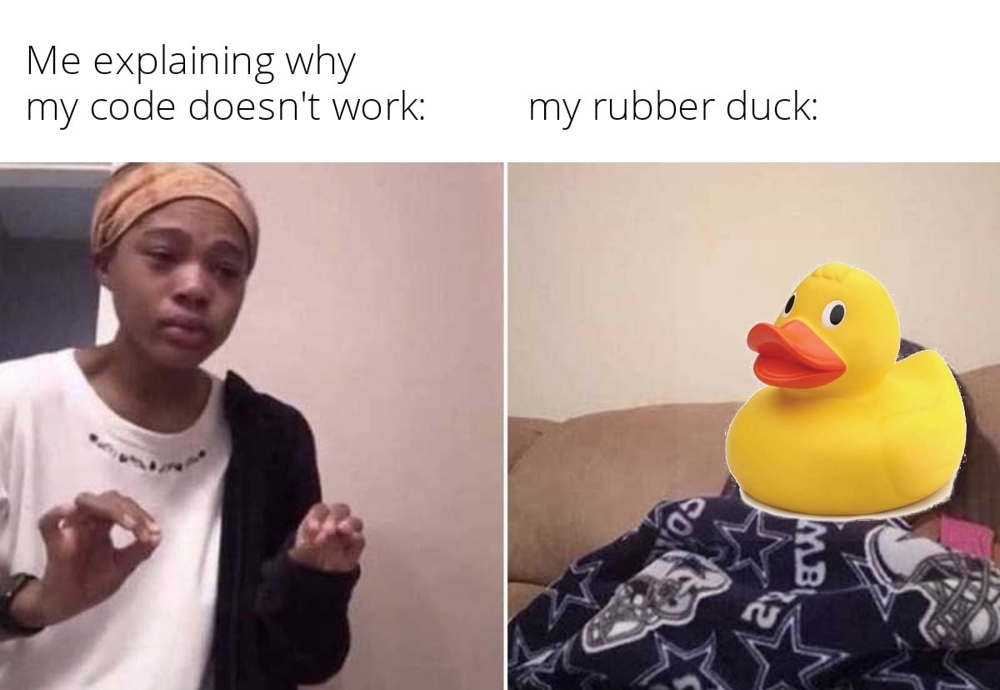

# Interview Readiness

In this session we will prepare for a real life interview, and we will see some exercises that could be sent to you as code challenges.

## What You Will Learn

* Recruiter/Interviewer POV
* Common topics
* Interview Schema
* General Tips
* Code challenges

Remember we are aiming to a Top-Mid/Senior position, so it's ok if you are not an expert on all these subjects, but you should be able to describe with ease and be involved with most of them.

> You might be wondering why the interview session is 15 instead of 20, the reason is because from this lesson onwards we will be focusing more on the technology than the concept.
>
> In other words, so far all concepts you saw can be applied almost at 100% to any other technology/stack but starting from next lesson we will review specific setups and features from distinct clouds or providers

## Recruiter/Interviewer POV

### 1 - Problem-solving skills

* Coming up with the correct solution is good
* Coming up with the correct solution for the correct reason is great
* Coming up with the correct solution for the correct reason and be able to communicate it with ease is amazing.

### 2 - Data engineer experience

* Tell me about yourself? / Can you tell me about your experience?
* This is probably the most common question to open an interview, be prepared for it

Try to highlight:

* Years of experience
* What technologies you have used previously
* What is the area you feel more comfortable
* Any relevant experience that can help with required stack

#### 2.1 - Final Project Experience

Come with your own introduction: Ex. You are a Senior Software Developer with 5+ years of experience on .Net, you took this course and finished the final project.

>\- Can you tell me about your experience? \
>\- Over the last 6 years I've been working with .Net platform as a developer, using SQL Server with Azure, Crystal reports, coaching and being the team leader of N people usin Agile/SCRUM, also managing the CI/CD part, also designing Databases from scratch and doing maintenance. Over the last 3 month's I've been focusing on the Data Engineer area, using Docker/Composer, scrappers, multithread airflow with python and AWS CLI, HDFS on S3, Snowflake and Tableau.

Note: *Remember every thing you mention you may be asked, if you are not comfortable going deep don't mention it, try to mention all the things you've used during your final project as a priority instead of the topics of this course, it will be easier to give examples that way*

### 3 - Data modeling

* Focus on when you should use OLTP vs OLAP design
* Clarify as much as needed.
* Describe the schema while you are writting it so the interviewer understand why are you selecting:
  * PK/FK
  * Relations
  * Fields you are missing
  * ...

### 4 - Familiarity with data security and compliance

This is an area that most of the time we don't think about, because it's not "part of our role" or because the cloud already manage that for us.

* How do I protect from intruders?
* How do I restrict in the organization?
* How do I restrict the applications?
* What happen when somebody gets the information from my users?
* How do I know who is using their access to check what?
* How do I make aware my co-workers and partners about all the previous questions?

>Most of these questions are common sense, what data is higher priority than other... but be aware that some clients have this as a priority since information is their business priority

Note: *You are not expected to be an expert on this but be comfortable working with sensible data at various levels*

### 5 - Communication

* How easily is for me to explain to a non-technical person technical concepts?

>Came up with your own simple definitions beforehand also some analogies if required to explain complex concepts

Have you ever heard about the [Rubber Duck Debugging][rubber_ducking]?



### 6 - Data pipelines and deployments

* You should be able to understand, explain and create data pipelines and deployments from scratch
  >It's okay if you don't have the knowledge on all the CI/CD concepts, but you should have at least knowledge for 1 stack of pipeline
* Choose your flavor, here are some examples:
  * Data ex. EC2/Docker -> Python/Airflow/ETL -> S3/HDFS -> Snowflake -> Tableau
  * Deployment ex. Commit -> Github Actions/Flow -> Github Docker -> ECR -> ECS/Blue-Green

### 7 - Cloud platforms

>As we review on previous lessons cloud is the new standard for Data pipelines

* In general you are expected to mount and describe a pipelines in any of:
  * AWS
  * GCP
  * Azure

### 8 - Passion for learning

Technology is constantly evolving, data engineering is evolving too, also is very unlikely that you will be a perfect fit for the stack customer is using, and even if you are the perfect fit for the stack, still need to learn business rules.

* How often do you search for tendencies?
* When was the last time I took a course or certification?

## Common topics

### Database Design

* OLTP VS OLAP
  * Designing an OLTP Database
  * Designing an OLAP or Datawarehouse Database
* Lambda Architecture and ETLs Architectures
* Datawarehouse, Datamart and Datalake concepts
* Datalake partitions
* Star and Snoflake schemas

### SQL

* DDL VS DML
* Transaction
  * Commit
  * Rollback
* View VS Materialize View
* Query
  * Joins (LEFT, RIGHT, INNER, OUTER)
  * Distinct
  * Group By
  * Having
  * CTE (Common Table Expressions)
  * Window Functions
  * Subqueries

### Processes

* Batch VS Streaming
* ETL VS ELT
* Types of data load:
  * Truncate and reload
  * Incremental/Delta/Upsert
  * Append
* Data troubleshooting

### Algorythms

>These algorythms are something to expected to know, but not from memory, instead always try to search for new optimized ways to perform a task

* Common used algorithms are:
  * Binary Search
  * Bubble Sort
  * Merge Sort
  * Quick Sort
  * Selection Sort
  * Insertion Sort
  * Depth-First Search (DFS)
  * Breadth-First Search (BFS)
  * Dijkstra's Algorithm
  * Dynamic Programming (DP)
  * Recursion
  * Binary Tree Traversal (Pre-order, In-order, Post-order)
  * Hash Tables and Hashing Algorithms

Here is a resource to know the implementation of the algorithms: [Algorythms][video_algorythms]

### Big O notation

>Big O notation is a mathematical way to describe how the performance of an algorithm or a piece of code changes as the amount of input space (memory) and time gets larger.

Big O notation allows for quick comparisons for the most efficient solution, in simplified expressions that count same caliber steps or space units.

### How to read Big O notation

O(\<Expression>)

* **O** stands for "order of magnitude"
* **()** Expression delimiter
* **Expression** Mathematical expression represented by a number, this number represents the longest time consumed by the function

### Examples

>Before entering the examples, let's asume the minimum unit we are using here is a byte (integer) reading it or doing a sum operation with it.

* **O(1)**: `Constant`. The algorithm uses a constant amount of memory and time regardless of the input size.
* **O(log n)**: `Logarithmic`. The amount of memory and time used by the algorithm increases logarithmically as the input size grows larger.
* **O(n)**: `Linear`. The amount of memory and time used by the algorithm increases linearly as the input size grows larger.
* **O(n^2)**: `Quadratic`. The amount of memory and time used by the algorithm increases quadratically as the input size grows larger.

>Take in consideration O(n) + O(n) is still O(n), since we are only taking the highest operation possible, not the sum of all the operations. \
>Same way O(n^2) + O(n^3) is O(n^3)

Another way to visualize is to see how many cycles do we need to do to all the information to solve the problem.

#### Example: Prime number

Calculate if n is a prime number:

```py
def is_prime(number):
  if number <= 1:
    return False  # Numbers less than or equal to 1 are not prime
  elif number <= 3:
    return True   # 2 and 3 are prime numbers
  elif number % 2 == 0 or number % 3 == 0:
    return False  # Numbers divisible by 2 or 3 are not prime
  
  i = 5
  while i * i <= number:
    if number % i == 0 or number % (i + 2) == 0:
      return False  # Numbers divisible by i or i + 2 are not prime
    i += 6
  
  return True  # If no divisors are found, the number is prime
```

Giving the above code:

* Immediately discarding special cases 1-3 numbers
* We also discard divisible by 2 and 3 leaving 1/3 of the numbers available for the cycle
* we start cycle on 5 (next primer after 3)
* We do jumps on 6 (assuming 5 is the last fixed prime)
* We iterate based on i^2

>From the above steps the largest consuming of time is the iteration based on i^2, so this gives us a steps number of *sqrt(n) - 3* \
>We discard the first 3 steps as we always take the highest complexity step resulting in

Complexity: **O(sqrt(n))**

>What does this means in simple terms? \
>If we give a number 100, the maximum number of steps we are iterating are sqrt(100) or 10 steps

### Exercise

Based on the code:

* Write the corresponding big O notation
* Explain why

```sql
/*1. Get the count of unique customers*/
SELECT COUNT(*) FROM customers;
```

```py
"""2. Given an array, find the biggest number"""
def find_max_value(my_list):
  max_value = my_list[0]
  for num in my_list:
    if num > max_value:
      max_value = num
  return max_value
```

```py
"""3. Given an array, return the first element"""
def get_first_element(my_list):
    if len(my_list) > 0:
        return my_list[0]
    else:
        return None
```

```py
"""4. Order an array, via bubble sort"""
def bubble_sort(my_list):
  n = len(my_list)
  for i in range(n):
    for j in range(0, n - i - 1):
      if my_list[j] > my_list[j + 1]:
        my_list[j], my_list[j + 1] = my_list[j + 1], my_list[j]
```

```sql
/*5. Select all customers that share the same postal code*/
SELECT * FROM customers WHERE postal_code = '12345';
```

```py
"""6. Give the position in an array of a target using binary search"""
def binary_search(sorted_list, target):
  low = 0
  high = len(sorted_list) - 1
  
  while low <= high:
    mid = (low + high) // 2
    mid_value = sorted_list[mid]
    
    if mid_value == target:
      return mid  # Target found
    elif mid_value < target:
      low = mid + 1
    else:
      high = mid - 1

  return -1  # Target not found
```

```sql
/*7. Retrieve all combinations of 2 customers who ever interact with each other*/
SELECT c1.customer_id, c2.customer_id
FROM customers c1, customers c2
WHERE c1.customer_id <> c2.customer_id;
```

```sql
/*8. Retrieve an employee by Id*/
SELECT * FROM employees WHERE employee_id = 1005;
```

```py
"""9. Based on an array, generate all permutations"""
def generate_permutations(my_list):
  if len(my_list) <= 1:
    return [my_list]
  else:
    permutations = []
    for i in range(len(my_list)):
      without_i = my_list[:i] + my_list[i+1:]
      for perm in generate_permutations(without_i):
        permutations.append([my_list[i]] + perm)
    return permutations
```

### Answers

1. Get the count of unique customers:
    * O(1)
    * The result is stored is a separate index section of the SQL, the result time is always the same
2. Given an array, find the biggest number
    * Log(n)
    * The biggest number could be in any place of the array, therefore the chandes of finding it mirror a Gauss bell (Log)
3. Given an array, return the first element
    * O(1)
    * We don't iterate, just take a look if the first element exists before returning it
4. Order an array, via bubble sort
    * O(n^2)
    * Bubble sort consists of comparing each element (n) with all the others (n times), resulting n^2 (is not exaclty n^2 but we always round up on big O notation)
5. Select all customers that share the same postal code
    * O(n)
    * We iterate over all customers for check; resulting in a full cycle, if giving 100 elements (n), we doo 100 comparisons (n)
6. Give the position in an array of a target using binary search
    * O(log n)
    * Binary search or binary tree works by splitting into 2, then into 2... giving an average of log n (Gauss Bell distribution)
7. Retrieve all combinations of 2 customers who ever interact with each other
    * O(n^2)
    * We are retriving pairs of self joined table, which means for each element n we append n elements to the result (n^2)
8. Retrieve an employee by Id
    * O(log n)
    * The Id's on the databases works by hash tables and indexes, these indexes handle an complexity of log n, which means you don't iterate over all the table when searching for an element by id, if you search by other field the complecity would be O(n) instead
9. Based on an array, generate all permutations
    * O(n^n)
    * A permutations is a combination where order matters, it recursively explores all possible arrangements of elements, resulting in a complexity of O(n^n) where "n" is the number of elements in the list. As the size of the input list increases, the number of permutations grows exponentially.

## Interview Schema

The most common scenario you can expect is divided into 3 or 4 sections:

### SQL Problem/Design

You are introduced to a problem when you will decide based on the conditions and you will decide:

* OLAP/ OLTP
* Keys / Relations
* Extra fields

Then you will bes asked to perform queries, SQL code challenge or questions about SQL concepts

### Python Problems

You are expected to know the engine and you will be presented with 1 or more code challenge, these may include handling structures, recursion, datasets...

>In some rare cases, python can be replaced with Java, Scala... but the general rule is 90% or more of your daily job will be python.

### Soft skills

Depending on your seniority you will be asked about your leadership and social problem solving.

### Other hard skills

Depending on the position the customer position you will be asked with specific questions about the stack they use.

## General Tips

* The intention is always highlight, interviewer will detect when you are not able to backup your words.
* Big O notation is important to know when you are optimizing code, but it may not be discussed on day to day. However knowing about it talks about your senority using efficiently the customer resources.
    >When you are writting the code you don't think "I will write a log n function", but it's important to evaluate the overall function quickly and figure out if there is a simpler algorythm.
* Similar to Big O notation, another topic not discussed here but expected to know if you a Senior or higher position are the code patterns and good practices, such as SOLID, YAGNI...
    >Similar to Big O notation, you don't start coding thinking "I will apply the Single responsability principle", but these good practices hepl you understand future problems, code smells and how to fix them before they become a big problem.
* Remember the highest knowledge level make look easy what he/she is doing, if you struggle to explain a topic or concept in simple words, you need to study that topic a bit more

>Don't be afraid to say you don't know it, it's okay if you don't know it, but make sure the interviewer is aware you want to learn about it.

The priority to prepare topics for a Data Engineer are in the following order:

1. SQL
2. Python
3. ETL/ELT concepts
4. ETL/ELT stack
    * Customer stack when possible
    * Similar stack, that does the same function. Ex. AWS S3->GCP Store or AWS Lambdas -> GCP Cloud Functions...

Soft skills expected depend on your role, if you are doing an interview for a mid the soft skills expected are less than the skills required for a Senior/Tech Lead position.

## Code challenges

```py
# 1 Print the first 3 elements
arr = list('abcedfghijklmnopqrstuvwxyz')

# Expected: ['a', 'b', 'c']
```

```py
# 2 Print the last 5 elements
arr = list('abcedfghijklmnopqrstuvwxyz')

# Expected: ['v', 'w', 'x', 'y', 'z']
```

```py
# 3 Print the repeated elements between arr_a and arr_b
arr_a = list('abcedfghijklmnopqrstuvwxyz')
arr_b = list('abc')

# Expected: {'a', 'c', 'b'}
```

```py
# 4 Format the number to print 5 digits
num = 123

# Expected: "00123"
```

```py
# 5 Find the difference between strings
string_a = "eueiieo"
string_b = "iieoedue"

# Expected: ['d']
```

```py
# 6 Check if the string contains repeated characters
string_a = "eueiieo"
string_b = "abcdefg"

# Expected: True False
```

```py
# 7 Give the count of repeated elements
set_a = {"a", "b", "c"}
set_b = {"a", "f", "c"}

# Expected: 2
```

### Code Challenge Answers

```py
# 1 Print the first 3 elements
arr = list('abcedfghijklmnopqrstuvwxyz')
print(
  arr[:3]
)
```

```py
# 2 Print the last 5 elements
arr = list('abcedfghijklmnopqrstuvwxyz')
print(
  arr[-5:]
)
```

```py
# 3 Print the repeated elements betwee arr_a and arr_b
arr_a = list('abcedfghijklmnopqrstuvwxyz')
arr_b = list('abc')

# lists does not support set operations
set_a = set(arr_a)
set_b = set(arr_b)

print(
  set_a.intersection(set_b)
)
```

```py
# 4 Format the number to print 5 digits
num = 123

print(
  f"{num:05d}"
)
# You can also use str(num).zfill(5)
```

```py
# 5 Find the difference between strings
string_a = "eueiieo"
string_b = "iieoedue"

print([char for char in string_b if char not in string_a])
```

```py
# 6 Check if the string contains repeated characters
string_a = "eueiieo"
string_b = "abcdefg"

def repeated(string: str):
  seen = set()
  for char in string:
    if char in seen:
      return True
    seen.add(char)
  return False

print(repeated(string_a), repeated(string_b))
```

```py
# 7 Give the count of repeated elements
set_a = {"a", "b", "c"}
set_b = {"a", "f", "c"}

print(
  len(
    set_a.intersection(set_b)
  )
)
```

## Homework (Optional)

Solve the following code challenges

* Strings
  * Find Duplicates: Write a function to find and return all the duplicate characters in a string.
  * Anagrams Check: Create a function that checks if two strings are anagrams of each other (contain the same characters with the same frequency).
  * String Reversal: Implement a function that reverses a string without using built-in reverse functions.
* Lists
  * Remove Duplicates: Write a function that removes duplicates from a list while preserving the order of elements.
  * List Intersection: Create a function that finds and returns the intersection of two lists (common elements).
  * List Sorting: Implement a function that sorts a list of strings based on the length of the strings.
* Sets
  * Set Union: Write a function that returns the union of two sets.
  * Set Symmetric Difference: Create a function that finds the symmetric difference between two sets.
  * Set Operations: Implement a function that checks if one set is a subset of another set.
* Numbers
  * Prime Numbers: Write a function to generate a list of prime numbers up to a specified limit.
  * Fibonacci Series: Implement a function to generate the Fibonacci series up to a given number of terms.
  * Factorial Calculation: Create a function to calculate the factorial of a number using recursion.
* General
  * Palindrome Check: Write a function that checks if a given string or number is a palindrome.
  * Unique Characters: Implement a function that determines if a string has all unique characters.
  * Word Frequency: Create a function that takes a sentence and returns a dictionary with word frequencies.

## Still curious

### Security and compliance

This section is a course by itself, depending on your level you may be expected to follow or guide, here are some concepts you may have heard about previously:

* Data Classification
  * Does the PII is something meaningful to you?
  * Did you ever handle financial data?
* Access Control
  * Did you ever manage user, roles, groups...?
* Encryption
  * What encryption is the database using?
  * Do I encrypt the password on forms?
  * How do I handle backup information
* Authentication and Authorization
  * How do I ensure user is really the user?
* Data Masking and Redaction:
  * How data is protected to be masked but still understandable when readed by customer, customer support..?
  * Did you ever wonder why your credit card on amazon appears as **XXXX XXXX XXXX 1234** instead of **1234 1234 1234 1234**?
  * How do you limit information when required for reports?
* Audit Trails and Logging:
  * Are you able to understand based on logs and audit only:
    * Filter/Track all movements of a user in a session?
    * Check who view what on your applications?
    * View what actions were performed?
* Data Retention Policies:
  * What data should be stored?
  * How long?
    * Usually as long as necessary, but how long is necessary?
  * When and how should be deleted?
* Data Quality and Integrity Checks
  * Implement validation before insert/digest
  * Integrity check
  * Sanitization to prevent security breaches
* Compliance Frameworks
  * GDPR
  * HIPAA
  * ...
* Data Masking and Redaction
  * What is the process for reporting
  * Is there an specific way to redact emails, letters, reports that will mask information?
* Disaster Recovery and Business Continuity:
  * Do I make regular backups?
  * Do I test the recovery procedures?
  * Have you ever heard about Chaos Engineering or Simian Army?
* Employee Training and Awareness
  * Is everyone in the company trained on:
    * Data handling
    * Password management
    * Recognizing Phishing
* Incident Response Plan:
  * Do I have a manual to follow in case of data breach or security incident?
* Continuous Monitoring
  * All the previous sections are not static
  * How often do I evaluate for better options?

### What Seniority I am?

Please consider the following questions does not consider years of experience, and are a basic tet for soft/hard skills

Which situations describe your daily job routine?

Jr:

* You require some help when coding, querying data
* Your code/queries are always audited by other team member(s)
* When you need help from another department, the tech lead get's the information/documentation for you

Mid:

* You do most of your job without help when it's about your department
* When you require help from other departments you always pick a wingman to help you on topics you may not understand
* You can help in minor topics from your department
* You specialize in a part of your area only (backend, front, networking...)

Sr:

* You do your job without technical help from your team
* You help other members of your team
* You are often a reference from other teams when they need information from your area
* New integrations are developed by you
* You are included in the pull request review team
* You know all the stack in your area (backend, frontend, networking, security...)

Sr II:

* You are often involved as the main piece of connection with meetings for other departments
* Your opinion matters beyond your team
* You often decide what new technologies the team will implement
* You understand most of the business rules
* You know the stack in your area and stack on other areas (backend, frontend, networking, cloud, CI/CD...)

## Links

* [HackerRank][hackerrank]
* [Top 50 Array Coding Problems for Interviews][array_code_challenge]
* [Rubber Duck Debugging][rubber_ducking]
* Rubber duck debugging
  * [Rubber Duck Debugging][rubber_ducking]
  * [Rubber Duck Debugging 2][rubber_ducking2]
  * Interactive Duck: [Duckie][talk_duck]
  * Interactive Duck 2: [cyberduck][talk_duck2]

### More resources

* Check the still curious sections on previous lessons
    >Specially lesson 2 (SQL) and 3 (Python)
* Check previouse sessions exercises
* Check concepts on previous lessons
* [Exercism PL/SQL][exercism_sql]
* [HackerRank SQL][hackerrank_sql]
* [Leetcode Database][leetcode_sql]
* [Exercism Python][exercism_py]
* [HackerRank Python][hackerrank_py]
* [Leetcode Python][leetcode_py]
* [Leetcode study cheatsheet python][python_cheatsheet]
* [Software philosophies][sw_philosophies]
* [DDL, DQL, DML, DCL and TCL Commands][ddl_dql_and others]
* [Algorythms][video_algorythms]

[hackerrank]: https://www.hackerrank.com/

[hackerrank_sql]: https://www.hackerrank.com/domains/sql
[exercism_sql]: https://exercism.org/tracks/plsql/exercises
[leetcode_sql]: https://leetcode.com/problemset/database/

[hackerrank_py]: https://www.hackerrank.com/domains/python
[exercism_py]: https://exercism.org/tracks/python/exercises
[leetcode_py]: https://leetcode.com/problemset/algorithms/

[python_cheatsheet]: https://leetcode.com/discuss/study-guide/2122306/python-cheat-sheet-for-leetcode
[sw_philosophies]: https://en.wikipedia.org/wiki/List_of_software_development_philosophies
[ddl_dql_and others]: https://www.geeksforgeeks.org/sql-ddl-dql-dml-dcl-tcl-commands/

[array_code_challenge]: https://www.geeksforgeeks.org/top-50-array-coding-problems-for-interviews/
[talk_duck]: http://duckie.me/
[talk_duck2]: https://rubberduckdebugging.com/cyberduck/
[rubber_ducking]: http://rubber-duck-debugging.org/
[rubber_ducking2]: https://rubberduckdebugging.com/
[video_algorythms]: https://www.youtube.com/watch?v=shs0KM3wKv8&list=PLOuZYwbmgZWXvkghUyMLdI90IwxbNCiWK
