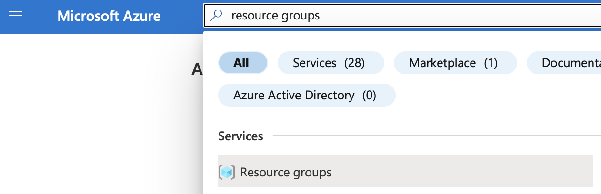
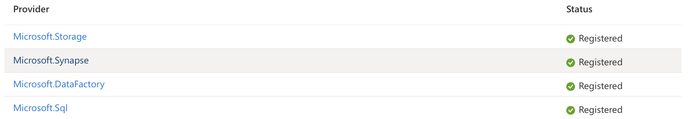
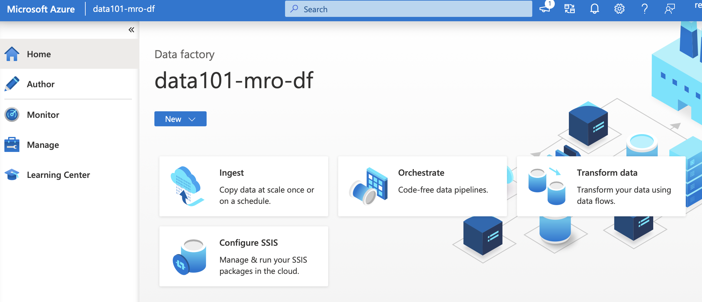
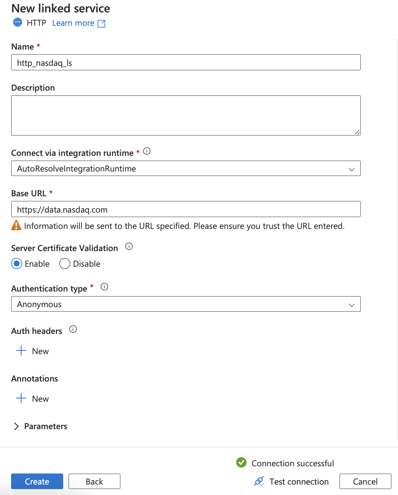
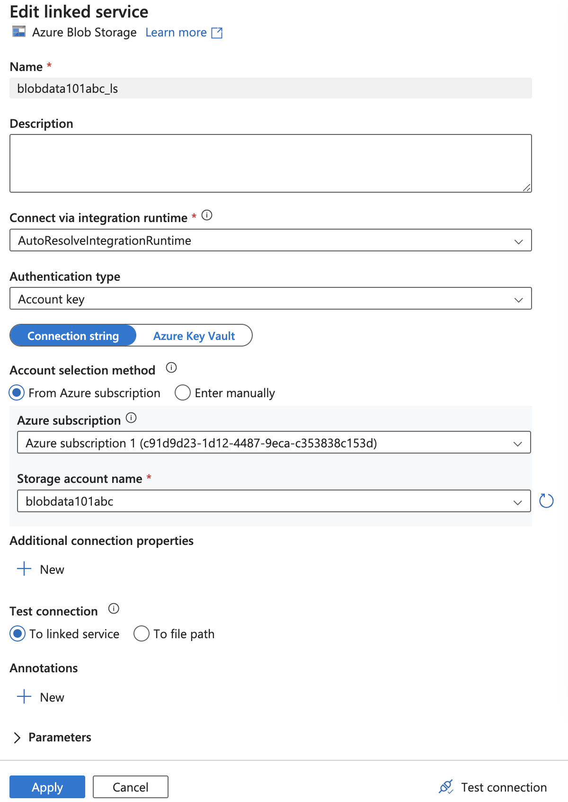
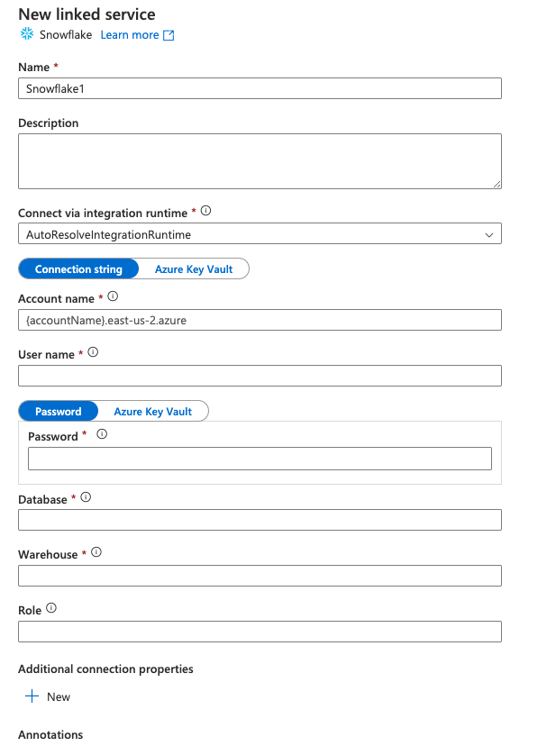

# ELT Environments and Database Integration

In this practice we will setup the environment, tools and resources necesary for the following sessions.

## Prerequisites

* Azure Free Account ([Instructions](Create_Azure_Free_Account.pdf))
* Azure Data Studio or SQL Server Management Studio ([Data Studio for MacOS](https://learn.microsoft.com/en-us/sql/azure-data-studio/download-azure-data-studio?view=sql-server-ver16&tabs=redhat-install%2Credhat-uninstall), [SSMS for Windows](https://learn.microsoft.com/en-us/sql/ssms/download-sql-server-management-studio-ssms?view=sql-server-ver16))
* OpenWeather API key: [Create free account](https://home.openweathermap.org/api_keys)

&nbsp;

## What you will learn

* Overview of Microsoft Azure
* How to create resources on Azure Portal
* How to connect to a Database in Azure with Data Studio or SSMS
* ADF linked services
* Linked service: Snowflake (optional)

&nbsp;

&nbsp;

# Practice

You are a data engineer working for a credit rating agency. You need to get Stock Market Data every day, store it in a Data Warehouse for financial research and analysis for further publication. You work in the team responsible of getting Nasdaq data from different resources or formats.

&nbsp;

&nbsp;

## STEP 1: Set the playground

&nbsp;

### **Resource Group**

* In your Azure portal, type in and select "Resource groups"

  
* Select **+ Create** and follow the instructions. Name suggested similar to "data-eng-101-rg"
* Region: remember that all your resources should be in the same region. In this course, for those in Mexico, South Central US is recommended. Leave the rest with the defaults. Go to **Review + create** and click **Create**.

&nbsp;

### **Resource Providers**

* On the azure portal, type in and Select **Suscriptions**, select yours and then on the left panel **Resource Providers**
* Type in Synapse, select the row and click **Register**
  
  
* Make sure to have the following providers registered
  
  

&nbsp;

### **Blob Storage**

* In the search bar, type in and select "Storage accounts"
* Select **+ Create** and choose the resource group you just created
* Type a name for your storage account. It could be similar to "blobdata101abc"
* Select the same region as your resource group
* Performance: **Standard**
* Redundancy: **Locally-redundant storage (LRS)**
* Leave the rest with the defaults and **Create**
* Go to **All Resources** in your Azure portal and select this storage account
* On the left panel, click on **Containers** and then **+ Create**
* Set any name. Suggested "data"
* Public access level: **Container(...)**
* Then go to the created container and click **Upload** from the tabs section and upload "AAPL.csv" from the blob_data folder in this session (git repo)

&nbsp;

### **Data Lake Storage**

* In the search bar, type in and select "Storage accounts"
* Select **+ Create** and choose the resource group you just created
* Type a name for your storage account. It could be similar to "blobdata101abc"
* Select the same region as your resource group
* Performance: **Standard**
* Redundancy: **Locally-redundant storage (LRS)**
* Go to **Advanced** tab and in the **Data Lake Storage Gen 2** section, check the box **Enable hierarchical namespace**  
* Leave the rest with the defaults and **Create**  
* Go to **All Resources** in your Azure portal and select this storage account
* Create one container: "data"
* Create two folders inside your container: "raw", "processed"

&nbsp;

### **SQL Server**

* Type in and select "SQL servers"
* Select **+ Create** and follow the instructions
* Set a server name. Suggested similar to "data101-srv-abc"
* Select the same region as your resource group
* Authentication: seletc **SQL Authentication** and set an admin username and strong password (remember or write down this info for further use)
* Networking: Select **YES** for **Allow Azure services and resources to access this server**
* Leave the rest with defaults and **Create**

&nbsp;

### **SQL Database**

* Type in and select "SQL databases"
* Select **+ Create** and follow the instructions
* Set a database name. Suggested similar to "data101-db"
* Compute + storage : **Basic 5 DTUs**
* Redundancy: **Locally redundant**
* Networking: Add current IP address set to **YES**
* Leave the rest with the defaults and **Create**
* Type in and select **SQL databases** and select this database
* On the left panel, select **Overview** and then on the upper right side copy the Server name
* Go to SSMS or Azure Data Studio, create a new connection
* Server: paste the Server name you copied
* Use the username and password you created while creating the SQL server above
* Leave the defaults and connect

&nbsp;

### **Dedicated SQL Pool**

* Type in and select "SQL servers"
* Select **+ New dedicated SQL pool (formerly SQL DW)**
* Name: "AdventureWorksDW"
* Performance level: **DW100c**
* Additional settings tab --> Data source: Sample
* Leave the rest with the defaults and **Create**
* Refresh the connection in SSMS or Data Studio and you should see this DW listed

&nbsp;

### **Azure Data Factory (Workspace)**

* Type in and select **Data factories**
* Select **+ Create**
* Select **Resource group** and **Region** the same as all the above
* Set any name. Suggested similar to "data101-abc-df"
* Leave the defaults and **Create**
* Go to **All Resources**, select this data factory and click on **Launch Studio**
* It will open a new page like this:

  

&nbsp;

&nbsp;

## STEP 2: Make your connections

&nbsp;

### **Azure Data Factory (Linked Services)**

* **HTTP**
  * On your ADF workspace, on the left panel select **Manage**, click on **Linked services** and create a new one
  * On the search bar, type in and select **HTTP** and set the following values:

    
  * Base URL: <https://data.nasdaq.com>
  * Test connection and create
  * Nasdaq Data Link API: [info](https://docs.data.nasdaq.com/docs/time-series), [rate/limits](https://docs.data.nasdaq.com/docs/rate-limits)

&nbsp;

* **Azure Blob Storage**
  * On your ADF workspace, on the left panel select **Manage**, click on **Linked services** and create a new one
  * On the search bar, type in and select **Azure Blob Storage** and set the following values:
  
    
  * Test connection and create

&nbsp;

* **Azure Data Lake Storage Gen2**
  * Redo the steps above but type in and select **Azure Data Lake Storage Gen2**, then fill in the corresponding values

&nbsp;

* **Azure SQL Database**
  * On your ADF workspace, on the left panel select **Manage**, click on **Linked services** and create a new one
  * On the search bar, type in and select **Azure SQL Database**, then fill in the corresponding values

&nbsp;

&nbsp;

## STEP 3 (Optional)

&nbsp;

* **Snowflake linked service**
  * On your ADF workspace, on the left panel select **Manage**, click on **Linked services** and create a new one
  * On the search bar, type in and select **Snowflake**
  * Name: "snowflake_ls"
  * Enter your snowflake account ("accountname.southcentral-us.azure")
  * Fill in the values for user, pssw, db, dw and role
  * Test your connection and create
  
    

&nbsp;

NOTE: SQL Server is not available directly for macOS. But you could run it locally with a Docker container:

* SQL Server local instance for macos with Docker: [docker-compose.yml](docker-compose.yml)
