# ELT Environments and Database Integration

In this practice we will setup the environment, tools and resources necesary for the following sessions.

## What you will learn

* Overview of Microsoft Azure
* How to create resources on Azure Portal
* How to connect to a Database in Azure with Data Studio or SSMS
* Azure Data Factory (ADF) linked services

## ETL VS ELT

In general the advantages of ETL are the advantages of ELT

|Feature|ETL| ELT|
|-|-|-|
|Transformations|Non-sql code dedicated stage|Limited to SQL after insert or during query execution|
|Data Quality|Done during transformation, inserted data is clean|Limited to table constraints, data inserted is raw|
|Integration with Other Systems|Requires manual integration, but support what you can code|Limited to Database connectors|
|Pipeline time|Slow: information not available until transformation is done|Real time/near real time: pipeline work as a bridge|
|Scalability|Harder to manage as input increases|Only need more space in the destiny database|
|Costs|Processing|Storage (and processing when doing complex querys)|

>Since ETL performs the transformations during pipeline this means data may not be available ASAP, also it requires additional resources such as intermediate data structures that can increase the complexity of the pipeline, however well managed these structures can be refined to make efficient datamarts in the same step and increase data quality.
>
>ELT on the other side will only do simple transformations, but will give you the data ASAP. It's worth notice that ELT may look like never do the transformation part, but it performs the transformation after being stored or during execution time.

* Article: [ETL vs ELT][etl_vs_elt]
[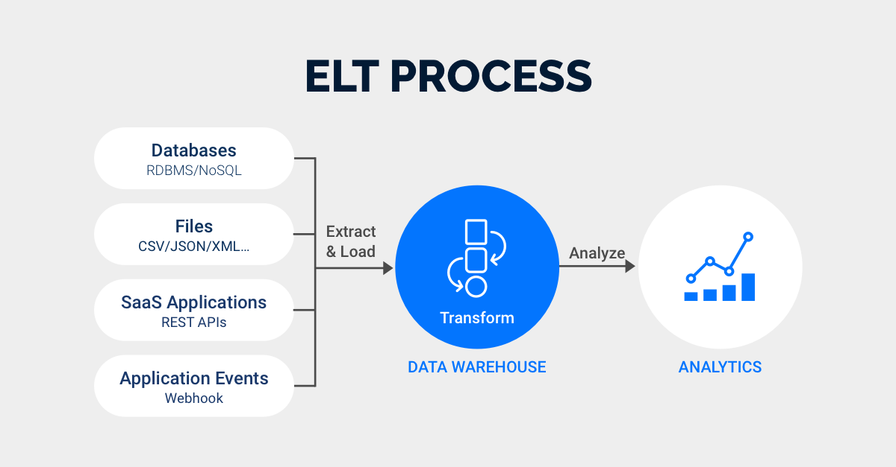][etl_vs_elt]

## Practice

A credit rating agency needs daily stock market data in a queryable structure. Prepare the infrastructure on Azure Cloud and create an Azure Data Factory with all linked services ready to be consumed.

### Requirements

* Create the following Azure Cloud resources:
  * Resource Group
  * Resource Providers
  * SQL Server Datawarehouse Instance
    * Storage account with sample csv given
    * SQL DW connection
    * Azure data factory
  * SQL Server Instance
    * Storage account for datawarehouse
    * SQL DB connection
  * Connect those with SSMS/Azure Data Studio
* Create on Azure Data Studio the following linked services:
  * to both Storage account
  * to customer API `https://data.nasdaq.com`
  * to Azure SQL database

Follow the naming convention and abbreviations suggested by microsoft:

* [Azure Naming convention][azure_naming]
* [Azure Resource abbreviations][azure_abbreviations]

### Step 0 - Azure Portal

* Go to [Azure Portal][azure_portal]
* Then login
  

>You might get a prompt for a tour if this is your first time login, otherwise your view is something similar to the above

### Step 1 - Resources

>When creating resources you need to mantain consistency (this will be helpful in large orgs when multiple projects are active at the same time), this is similar to a library, you get sections, authors, in this case we can imagine a project ("de-101") and based on that we know if we found a drive labeled, user, container... it belongs to that project, but also we ensure if we search globally we can get all related resources (this works for deleting/deprecating areas too) \
>The consistency can be achieved via `Tags`, however for most of the users tags can be not that visual/easy/quick to work with

In this practice we will follow the convention `<Resource Type>-<Workload/Application>`

#### Step 1.1 - Resource Group

>A resource group is a logical container that holds related Azure resources such as virtual machines, databases, storage accounts, virtual networks... \
>If Azure was a library, a resource group will be the sections

* Go to `Resource groups`
  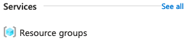
* Click `+ Create`
  * Subscription: Default \
    *Is very likely you have only 1 subscription (free), but if you have more than 1 ensure the subscription is consistent accross the steps*
    * Resource Group: `rg-de101`
  * Region: `(US) South Central US` \
    *You can pick any region as long as all resources will be in that same region, recommended any region close to you*
* Use all other defaults

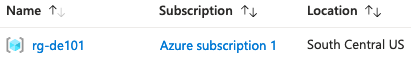

#### Step 1.2 - Resource Providers

>Resource providers enable the provisioning, management, and maintenance of Azure resources or services, such as virtual machines, databases, storage accounts, networking... these are linked to a subscription (AKA: Money provider) that tells the provider what can and can't provide and to what limits \
>Following the if Azure was a library, a Resource provider will be the librarian and the subscription will be the librarian contract

* Go to `Subscriptions`
  * Click your subscription
    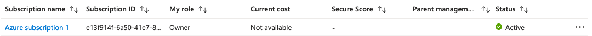
* On the left panel search/scroll
  * Click `Resource Providers`
    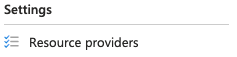
* On the center panel search/scroll
  * Click `Synapse`
    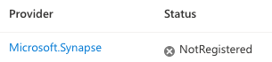
* Click `Register` at the top of the center panel
  

The image will change from these states (we want `registered`)

#### Step 1.3 - Blob Storage Account

>Blob Storage Account is the cloud storage for azure, it allows you to store images, logs. videos, backups... These also contains small subunits Containers (Storage would be an equivalent to a drive and Container to folders) \
>Following the if Azure was a library, Storage would be the shelves and Containers the section dividers (A, B, C...)

* Go to `Storage accounts`
  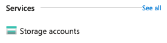
* Click `+ Create`
  * Subscription: Default
    * Resource Group: `rg-de101`
  * Storage account name: `stde101` \
    *In this resource name we cannot use '-' so we omit it*
  * Region: `(US) South Central US`
  * Performance: `Standard`
  * Redundancy: `Locally-redundant storage (LRS)`
* Use all other defaults \
  Once the provider is done, you should be able to see a screen like this
  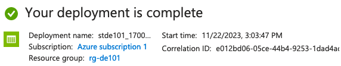
* Click `Go to resource`
  
  *Alternatively you can Go to `Storage accounts` and click on the created resource*
  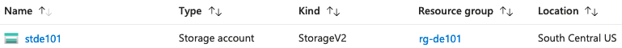
* On the left panel search/scroll
  * Click `Containers`
    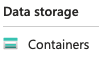
* Click `+ Container`
  * Name: `c-de101-data` \
    *You can use any name, this is an internal container name, however we will follow the name convention for consistency*
  * Use all other defaults
  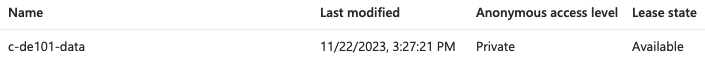
* Click your container
* Click Upload
  
* Upload `./practice_files/aapl.csv`
  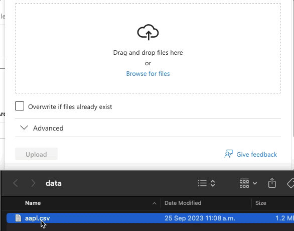

The file should now be listed in the container
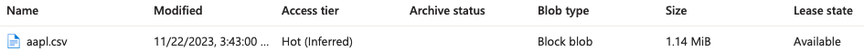

#### Step 1.3 - Data Lake Storage

>This may look like the Storage we create earlier, the difference is how the data is treated, in this case we will enable `Data Lake Storage`
>
>Azure Data Lake Storage is a cloud-based data lake solution provided by Microsoft Azure. It is designed to store and manage large volumes of structured and unstructured data.

* Go to `Storage accounts`
  
* Click `+ Create`
  * Basics
    * Subscription: Default
      * Resource Group: `rg-de101`
    * Storage account name: `stde101datalake`
    * Region: `(US) South Central US`
    * Performance: `Standard`
    * Redundancy: `Locally-redundant storage (LRS)`
  * Advanced
    * Hierarchical Namespace
      * Enable hierarchical namespace: `Checked`
        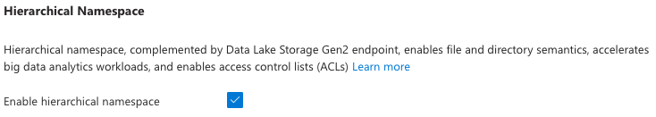
* Use all other defaults \
  Once the provider is done, you should be able to see a screen like this
  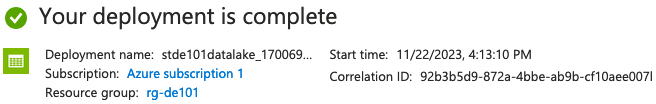
* Click `Go to resource`
  
  *Alternatively you can Go to `Storage accounts` and click on the created resource*
  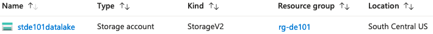
* Click `+ Container`
  * Name: `c-de101datalake-data`
  * Use all other defaults
  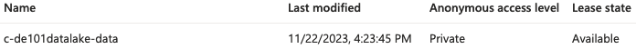
* Click your container
* Create directories `raw`, `processed` and `staging` \
  *Some pipelines required temporary objects (staging area) to work properly*
  * Click Add Directory
    
  * Write the folder name
  * Click Save
    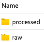

#### Step 1.4 - SQL Server

>SQL Server is the Microsoft approach for RDBMS

* Go to `SQL servers`
  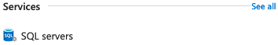
* Click `+ Create`
  * Basics
    * Subscription: Default
      * Resource Group: `rg-de101`
    * Server Name: `sql-de101`
    * Location: `(US) South Central US`
    * Authentication method: `Use SQL authentication`
    * Server admin login: `<username>`*
    * Password: `<password>`*
    * Confirm password: `<password>`* \
      *Fields marked with * are your choice, recommended username: **\<first-name>-\<lastname>***
  * Networking
    * Allow Azure services and resources to access this server: `Yes`
    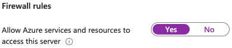
* Use all other defaults \
  Once the provider is done, you should be able to see a screen like this
  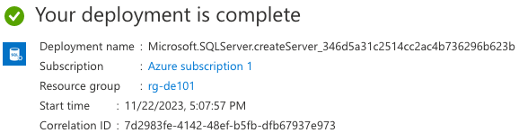

#### Step 1.5 - SQL Database

>SQL Database is the instance of SQL RDBMS

* Go to `SQL Databases`
  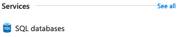
* Click `+ Create`
  * Basics
    * Subscription: Default
      * Resource Group: `rg-de101`
    * Database name: `sqldb-de101`
    * Server: `sql-de101 (South Central US)`
    * Workload environment: `Development`
  * Networking
    * Add current client IP address; `Yes`
    
* Use all other defaults \
  Once the provider is done, you should be able to see a screen like this
  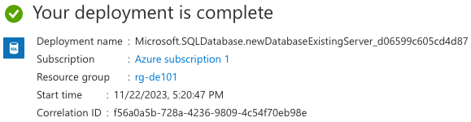
* Click `Go to resource`
  
  *Alternatively you can go to `SQL Databases` and click on the created resource*
  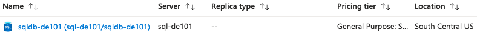
* Click `Overview`
  
  * On the upper right side copy the Server name
  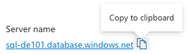

#### Step 1.6 - SSMS/Azure Data Studio

* On your Mac/PC, Open `SSMS` or `Azure Data Studio`
* Click create a new connection
  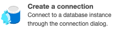
* Connection Details
  * Connection Type: `Microsft SQL Server`
  * Server: `<server>` \
    *Paste the server name you copied from azure portal*
  * Authentication type: `SQL Login`
  * Username: `<username>`
  * Password: `<password>`
* Click Connect
* The first time you connect from this computer/network, you will need to add a firewall rule
  * Click Add an account
  * A web browser page will be opened
    * Select/login azure account
      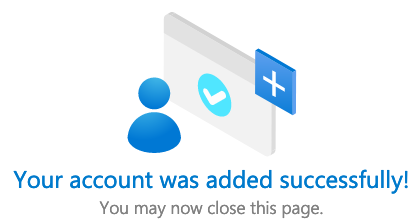
  * Select your account from the dropdown
  * Rulename: `rule-sqldb-<firstnamelastname>` \
    *You can use any name, but we will follow naming convention*
  * Click OK

#### Step 1.7 - Dedicated SQL Pool

>Azure Dedicated SQL Pool, formerly known as SQL Data Warehouse is the datawarehouse solution provided my microsoft

* Go to `SQL Servers`
  
* Click your database `sql-de101`
  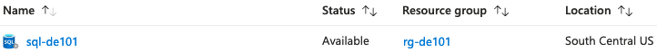
* Click + New dedicated SQL pool (formerly SQL DW)
  
  * Basics
    * SQL pool name: `sqldw-de101`
    * Performance level: `DW100c`
      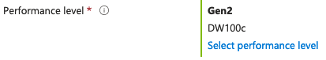
* Use all other defaults \
  Once the provider is done, you should be able to see a screen like this
  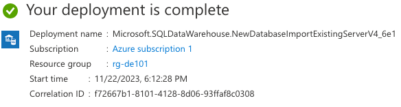

Refresh the connection in SSMS or Data Studio and you should see this DW listed

#### Step 1.8 - Azure Data Factory (Workspace)

>Azure Data Factory is the Data integration by microsoft, this includes create and manage workflows.
>
>Within Azure Data Factory, a "Workspace" is a logical container or environment where you can create and manage data pipelines, datasets, linked services, triggers, and other assets related to your data integration and transformation tasks.

* Go to `Data factories`
  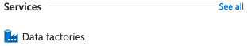
* Click `+ Create`
  * Basics
    * Name: `adf-de101`
    * Subscription: Default
      * Resource Group: `rg-de101`
    * Region: `Central US`
* Use all other defaults \
  Once the provider is done, you should be able to see a screen like this
  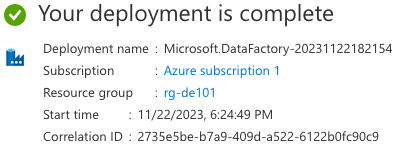
* Click `Go to resource`
  
  *Alternatively you can go to `Data factories` and click on the created resource*
  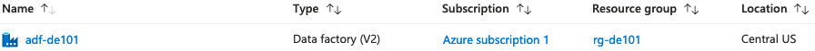
* On the main panel click on `Launch Studio`
  

It will open a new page like this:
  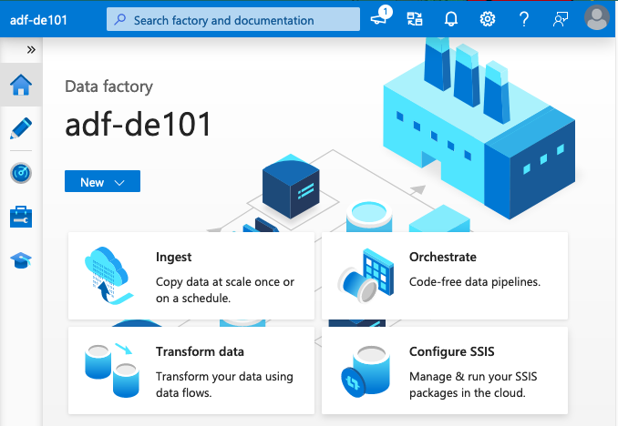

### Step 2 - ADF Linked Services

In this step we will mount all the resources we created on previous step so they can be usable by our ADF

This will be the result:
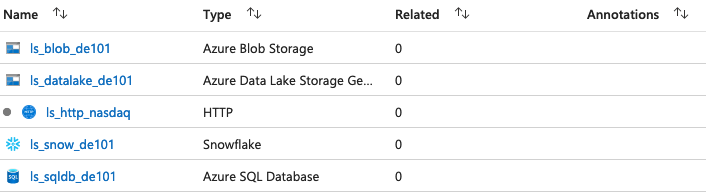

#### 2.1 - HTTP

* On your ADF (Studio) Workspace
* Click Manage
  
* Click Linked services
  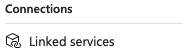
* Click `Create linked service`
* Scroll/Search `http`
  
  * Name: `ls_http_nasdaq` \
    *We can't use `-` so we are using `_` instead*
  * Base URL: `https://data.nasdaq.com`
  * Authentication type: `Anonymous`
* Use all other defaults
* Test connection
  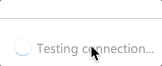
* Create

#### 2.2 - Azure Blob Storage

* On your ADF (Studio) Workspace
* Click Manage
* Click Linked services
* Click `Create linked service`
* Scroll/Search `Azure Blob Storage`
  
  * Name: `ls_blob_de101` \
  * Subscription: `<Select default subscription>`
  * Storage account name: `stde101` \
    *This is the storage where we upload the csv file*
* Use all other defaults
* Test connection
* Create

#### 2.3 - Azure Data Lake Storage Gen2

* On your ADF (Studio) Workspace
* Click Manage
* Click Linked services
* Click `Create linked service`
* Scroll/Search `Azure Data Lake Storage Gen2`
  
  * Name: `ls_datalake_de101` \
  * Subscription: `<Select default subscription>`
  * Storage account name: `stde101datalake`
* Use all other defaults
* Test connection
* Create

#### 2.4 - Azure SQL Database

* On your ADF (Studio) Workspace
* Click Manage
* Click Linked services
* Click `Create linked service`
* Scroll/Search `Azure SQL Database`
  
  * Name: `ls_sqldb_de101` \
  * Subscription: `<Select default subscription>`
  * Server name: `sql-de101`
  * Database name: `sqldb-de101`
  * Username: `<username>`
  * Password: `<password>`
* Use all other defaults
* Test connection
* Create

#### 2.5 - Azure Synapse Analytics

* On your ADF (Studio) Workspace
* Click Manage
* Click Linked services
* Click `Create linked service`
* Scroll/Search `Azure Synapse Analytics`
  
  * Name: `ls_synapse_de101`
  * Subscription: `<Select default subscription>`
  * Server name: `sql-de101`
  * Database name: `sqldw-de101`
  * Authentication type: `SQL Authentication`
  * Username: `<username>`
  * Password: `<password>`
* Use all other defaults
* Test connection
* Create

## Still curious

### ELT Basics

>ELT (Extraction Load Transform) is a data process method where the data is inserted raw or almost raw into the final destination.

* Why should we consider having raw data in our datawarehouse instead of a normalized tailored data?

  Unlike ETL, where we spend some time normalizing and enriching data, this in some cases is not sustainable:
    >As the volume and data complexity increases the time spent executing and mantaining an ETL increases too

  ELT can help us on this topic, since we can process the data faster, but this also means we can split the data load without breaking constraints enabling even faster processing speeds.

* But we still have a problem, the data is still raw and is complex to query

  The data obtained after ELT it's raw, however nowadays we have tools to manage data catalogs and metadata managers. \
  This essentially means the data is not just an unformatted raw file, but instead an structure we can query

* Ok we can query the data, but that doesn't mean is good data (Quality check)

  With today tools we can enable check at various stages of the ELT pipeline to ensure that data meets specific criteria, such as completeness, consistency, and accuracy. Monitoring can be used to track data quality over time and identify trends and issues.

* We can add on top of it

  Machine Learning and AI can be used to identify patterns, reducing the need for manual intervention; also recommend remediation steps in case of data quality issues prediction.

#### ELT pipelines tools

These are some of the tools you can use to mount your ETL process

* Apache Airflow \
  An open-source platform for programmatically authoring, scheduling, and monitoring workflows
* Talend \
  A data integration and management tool that supports ELT workflows
* AWS Glue \
  A fully managed ETL service that supports both ETL and ELT workflows in the cloud
* Microsoft Azure Data Factory \
  A cloud-based data integration service that supports both ETL and ELT workflows
* Google Cloud Dataflow \
  A cloud-based data processing service that supports both batch and stream processing, including ELT workflows.

### ETL Basics

We already have a lesson on this topic on: [session 5][session_5]

### ELT + ELT = ETLT?

As a tendency in the last years and as companies have more and more data, they slowly start to transition ETL into ELT pipelines, however other engineers are doing hybrid ETL/ELT:

ETL part is used to handle complex transformations and data quality checks while the ELT part takes care of the after insert less complex transformations since the SQL engine can run queries faster than custom datasets by code such as python.

Another problem this approach can solve is to address different issues within the same organization

    Ex. Sales department requires data in real time, while the marketing team requires complex transformations for reports at the end of each shift.

>There's nothing written use the tools available to solve the problem and combine technologies in a way that's logical to avoid future problems

* Have you ever heard about ETLT?
  * Article: [What Is ETLT?][etlt]
* Still not sure when to use ETL over ELT?
  * Article: [ETL vs ELT Flowchart][etl_elt_chart]

## Links

### Used during this session

* [Pre-Setup][pre-setup]
* [ETL vs ELT][etl_vs_elt]
* Session 5: [ETL Basics][session_5]
* [Azure Portal][azure_portal]
* [Azure Naming convention][azure_naming]
* [Azure Resource abbreviations][azure_abbreviations]

### Session reinforment and homework help

* [What Is ETLT?][etlt]
* [ETL vs ELT Flowchart][etl_elt_chart]

[pre-setup]: ./pre-setup.md
[session_5]: ../session_5_ETL_Airflow/README.md

[azure_portal]: https://portal.azure.com/
[azure_naming]: https://learn.microsoft.com/en-us/azure/cloud-adoption-framework/ready/azure-best-practices/resource-naming
[azure_abbreviations]: https://learn.microsoft.com/en-us/azure/cloud-adoption-framework/ready/azure-best-practices/resource-abbreviations

[etl_vs_elt]: https://rivery.io/blog/etl-vs-elt/
[etlt]: https://www.integrate.io/blog/what-is-etlt/
[etl_elt_chart]: https://www.pluralsight.com/resources/blog/cloud/etl-vs-elt-flowchart-when-to-use-each
