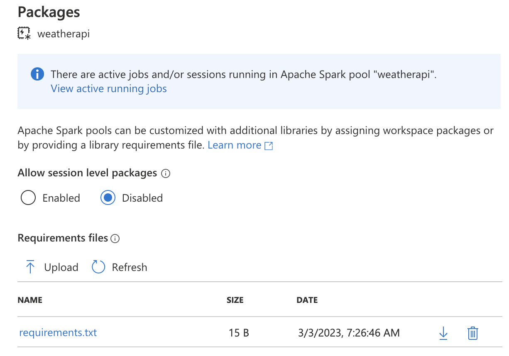
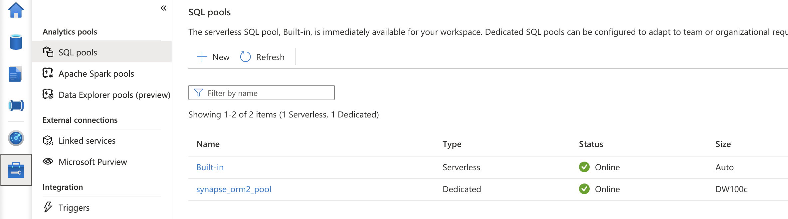
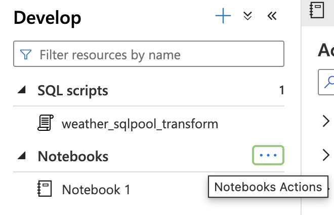
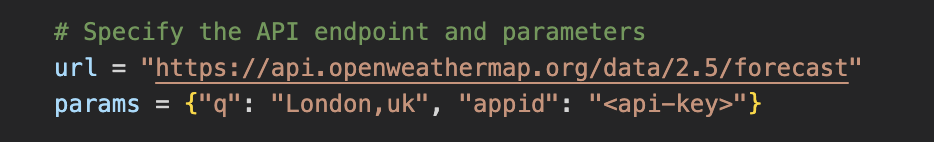
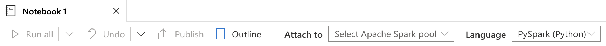
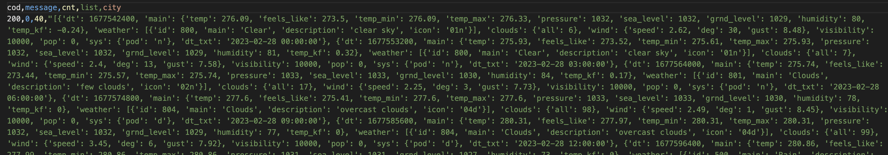

# Transformations: Azure Synapse Analytics

## Prerequisites

* At least ONE HOUR BEFORE, go to your Synapse workspace and create a new spark pool and upload the python requirements. It takes aproximatle 60 min to provision. Here are the [steps](#spark-pool).
* Make sure to have in hand your OpenWeather [API key](https://home.openweathermap.org/api_keys)

&nbsp;

## What you will learn

* Synapse ELT pipeline
* Synapse Analytics workspace and capabilities
* How to LOAD data from a python script (API + Spark dataframe) into a DB
* How to TRANSFORM data using SQL
* Add permission/role for Synapse in ADF

&nbsp;

# Practice

In this practice we will create some transormations that will be executed leveraging the compute power of a cloud Data Warehouse and Spark engine. Synapse Analytics is a powerful service that that brings together data integration, enterprise data warehousing, and big data analytics. It gives you the freedom to query data on your terms, using either serverless or dedicated options at scale. Azure Synapse brings these worlds together with a unified experience to ingest, explore, prepare, transform, manage, and serve data for immediate BI and machine learning needs.

&nbsp;

## Azure Synapse Analytics (SQL, Spark, Python)

&nbsp;

This practice is composed of two parts:

* First, we will EXTRACT and STAGE data from the OpenWeather API with a python script and Spark engine into a csv file
* Second, we will LOAD and TRANSFORM the raw data using SQL in the DW

There are many ways to achieve the same result. For example, the transformation could be done entirely with python and the Spark pool. But for the purpose of this module (ELT) we will execute it as stated above.

Because of time limitations, we will trigger this pipeline manually from Synapse. We could use ADF as orchestrator and make a call to the Synapse pipeline. But, as the scope of the module is ELT, not Azure Cloud, we will focus on the main concepts learned. As optional/advanced feature, you will learn how to connect Synapse and ADF so they can communicate with each other. From that point on, it is for you to explore at your personal convenience. Synapse also has integration capabilities, letting you create and execute pipelines within synapse. It will depend on your business needs what to use and when.

Azure Synapse pools have a higher cost, and since you are working on a free account with 200USD, it is recommended that you create the following resources execute the transformations of this practice, and then delete the SQL pool and Spark pool, so you keep the cost at the minimum. Your published scripts or pipelines and the synapse workspace alone will not generate any cost.

&nbsp;

### **Azure Synapse(Workspace)**

* On the Azure portal, type in and select **Azure Synapse Analytics**
* Select **+ Create**
* Select **Resource group** and **Region** the same as all the above (Leave **Managed resource group** blank)
* Set any name. Suggested similar to "data101-synapse-abc"
* Account name: select the datalake resource created above
* File system name: select "data101_synapse"
* Under security tab, set a new SQL admin user and password (this is a different logical server than the sql databases you create outside synapse workspace). Keep at hand this info, you will use it further down.
* Leave the defaults and **Create**
* Go to **All Resources**, select this synapse resource and click on **Launch Studio**
* It will open a new page similar to ADF workspace
* Note: Synapse Studio does not load on Safari

&nbsp;

#### **Spark pool**

* On your Synapse workspace, go to **Manage** on the left panel, then select **Apache Spark pools** and create a new pool

  
* Set any name (suggested: "weatherapi"). Configure the pool as follows:

  
* Leave the rest with defaults and **Create**
* Wait for 40 minutes until properly provisioned
* Meanwhile you can start editing your python notebook and SQL script. Do not execute anything yet!
* After 40 minutes, under **Manage -> Apache Spark pools** click on **Packages**

  
* Then **Upload** the "requirements.txt" file from this repo

  
* Wait 20 minutes before starting a spark session

&nbsp;

#### **Dedicated SQL pool**

* On your Synapse workspace, go to **Manage** on the left panel, then select **SQL pools** and create a new pool
* Set a name for your DW, select the minimum **Performance level** (DW100C) and **Create**
* Under **Manage --> SQL pools** you will see your new pool
  
  

Note: Your dedicated sql pool will generate cost, even if no transactions are going on. If you select your dedicated pool, there is an option to **Pause** it so you keep cost at minimum while not using it. For the duration of this session, you can leave it running and it will cost you just a few dollars, but if you prefer, you can pause it until we arrive to the execution of the SQL script below.

&nbsp;

#### **SQL pool in SMSS or Data Studio**

* On your Synapse workspace, go to **Manage --> SQL pools** on the left panel, then select your pool
* Copy your workspace endpoint
  
  
* Go to SMSS or Data Studio and create a new connection
* In **Server**, paste the workspace endpoint
* Use the username and password you set up while creating the Azure workspace resource
* Right click this connection and create a new query. You will need this statements further down

      SELECT * FROM Weather_london_landing;
      SELECT * FROM Weather_london;

      -- Troubleshooting
      DROP TABLE Weather_london_landing;
      DROP TABLE Weather_london;

&nbsp;

#### **Python notebook**

* On Synapse Studio, on the left panel go to **Develop** tab and **... --> Import** the notebook from this repo
  
  
* You will need to customize the code with your API key and the path to your datalake container
* API key:
  
  
* Datalake path:
  
  
  
&nbsp;

NOTE: At the bottom of your notebook you will find commented SQL code. Synapse lets you execute different language code using the magic command %%*language*. If we executed this sql code, it will run on the Synapse built-in serverless sql pool and it has some limitations and would throw errors. This is just an overview of the synapse capabilities and of the principles of ELT, in this case, loading data into a landing table in your destination resource, execute your transformation in the DW with SQL and inserting the processed data in a final table.

&nbsp;

* Once your code is customized, you need to attach your python notebook with the spark pool you created
  
  
* Run cells one by one. For the first one, it may take a few minutes to initialize the spark session.
* Your pd_forecast.csv file in your datalake container should look similar to this
  
  
* Now you can go on creating your SQL script

&nbsp;

#### **SQL script**

* On Synapse Studio, on the left panel go to **Develop** tab and **... --> Import** the sql script from this repo
* You will need to customize the code with url to your datalake container
* Datalake URL:

  
* Connect your script to your dedicated sql pool
  
  
* Run each segment separately for better troubleshooting
* If you can view your processed data in "Weather_london" table...
* CONGRATULATIONS! You have successfully run a complete ELT pipeline!

&nbsp;

## Optional: ADF - Synapse pipeline

&nbsp;

### **Access Control: Role for ADF**

* As a general rule, each service that wants to interact with other services should be asigned a role for that purpose. 
* On your Synapse workspace, go to **Manage** on the left panel
* Select **Access control** and click **+ Add**
  
  
* Select the role **Synapse Contributor**
* User: type and select the resource name of your ADF workspace ("data101-abc-df")

&nbsp;

### **ADF - Synapse pipeline**

* You can go now to ADF, create a pipeline, drag a Notebook activity
* Activity configurations: Synapse artifacts --> create new as linked service. Select your synapse notebook, set the spark configurations (ADF, as orchestrator, can launch your spark pool with the same or different configurations)
* Trigger your pipeline. This will only run the python part of this session.
* For running the sql transformations as well to complete the ELT pipeline, you can concatenate two Script activities. One should be for the DDL statements, and the other for the transformations
  
  
