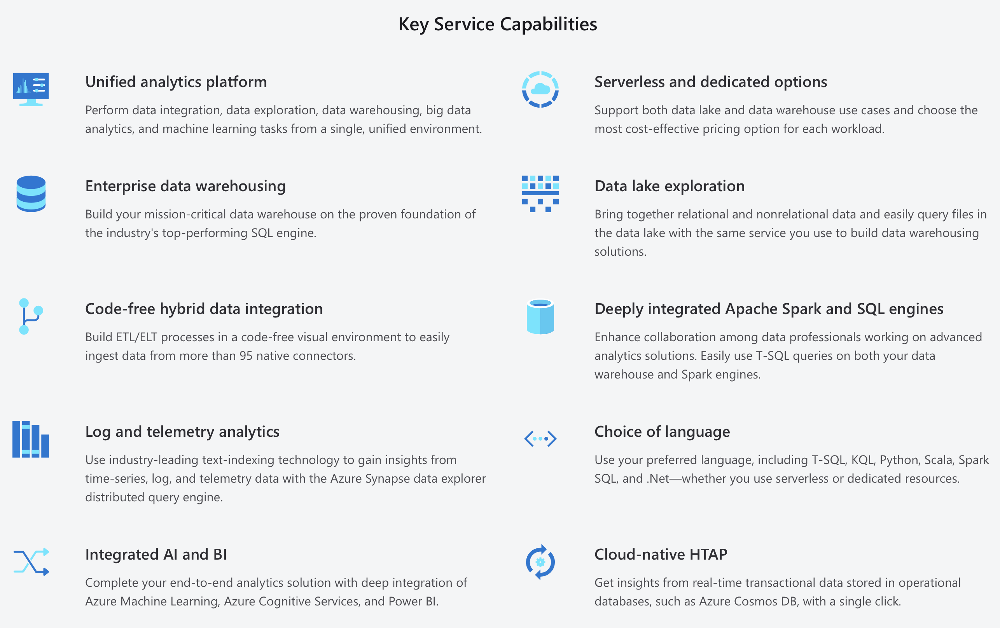
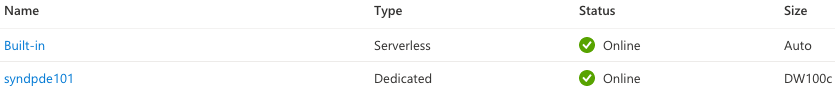
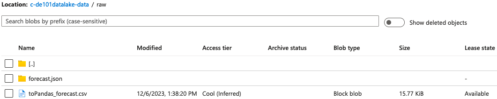
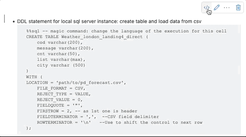
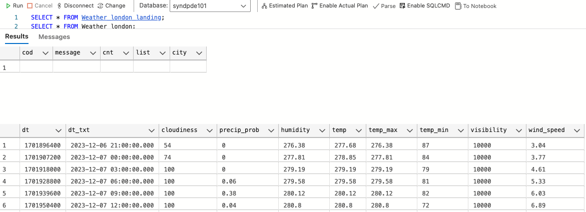

# Transformations: Azure Synapse Analytics

In previous practice we perform the EL (Extraction, Load) part from the ELT.

In this practice we will focus on the T (Transform) of ELT using Azure as Cloud Data Warehouse and Spark Engine, these services are available as 1 single service in Azure called "Synapse"



## Prerequisites

* Follow the [pre-setup guideline][pre-setup]

## Before start

Let's review some concepts we used during the pre-setup:

* Created a Synapse Workspace, similar to Azure Data Studio, this is a virtual environment to perform operations (transformations)
* Created a Spark pool, this is a regular instance of Spark but on Azure.
* Customize the spark pool with a package (dependencies):
  * To interact with the API: `requests`
  * Dataframe processing: `pandas`

## What you will learn

* Synapse ELT pipeline
* Synapse Analytics workspace and capabilities
* How to LOAD data from a python script (API + Spark dataframe) into a DB
* How to TRANSFORM data using SQL
* Add permission/role for Synapse in ADF

## Practice

Use the OpenWeather API and the pre-setup infrastructure to `Extract` (and stage the data), then `Load` to the SQL instance and `Transform` after inserted

>There are many ways to achieve the same result. For example, the transformation could be done entirely with python and the Spark pool. But for the purpose of this module (ELT) we will execute it as stated above.
>
>We will be triggering manually, but on a productive environment; these would be triggered by an orchestrator (ex. ADF)

### Step 1 - Dedicated SQL pool

* Go to `Synapse Studio` > `Manage` > `SQL pools`
* Click `+ New`
  * Dedicated SQL pool name: `syndpde101`
  * Performance level: `DW100c` \
     \
    *The deployment of this resource can take from 5-8 minutes*
* Under **Manage > SQL pools** you will see your new pool \
 

### Step 2 - SMSS/Data Studio

* Click your SQL pool
* Copy the Workspace SQL endpoint \
  *Should be in the shape of `synw-de101.sql.azuresynapse.net`*
* Go to `SMSS` or `Azure Data Studio`
* Create a new connection \
  *Use the credentials from the pre-setup*

### Step 3 - Python notebook

On your Synapse workspace

* Open Synapse Studio \
  *By clicking on the card in the center panel* \
  
* Go to `Develop` \
  
* Click `+` > `Import` \
  
* Select `weather_transform.ipynb`
* Change the `<api-key>` value inside the notebook

  ```py
  # params = {"q": "London,uk", "appid": "<api-key>"}
  params = {"q": "London,uk", "appid": "12abasdf123f3443f45tw45b24545v52"}
  ```

* Change the `<container-name>` and `<datalake-name>` value inside the notebook \
  *These resources were created in the previous session*

  ```py
  # dlpath = 'abfs://<container-name>@<datalake-name>.dfs.core.windows.net'
  dlpath = 'abfs://c-de101datalake-data@stde101datalake.dfs.core.windows.net'
  ```

* Attach to workspace \
  *Before you can run anything, you need to attach a Spark pool as our processor, when not attached you will see a warning* \
  
  * Click `Attach to` and select the pool you just created \
    

* Run your cells 1 by 1 \
  *The first cell will start the spark pool, once it's done you will see a Check mark* \
  

* Verify the json/csv output exists \
  

>At the bottom of your notebook you will find commented SQL code. Synapse lets you execute different language code using the magic command %%*language*.
>
>If we executed this sql code, it will run on the Synapse built-in serverless sql pool and it has some limitations and would throw errors. This is just an overview of the synapse capabilities and of the principles of ELT, in this case, loading data into a landing table in your destination resource, execute your transformation in the DW with SQL and inserting the processed data in a final table.
>
>You will need to use the `Convert to code cell`  in order to execute the SQL code \
>

### Step 4 - SQL script

Now that we have the data in our container we can create a query to transform the data (`synapse_transform.sql`)

On your Synapse Studio

* Go to `Develop` \
  
* Click `+` > `Import` \
  
* Select `synapse_transform.sql`
* Change the `<datalake_name>` \
  *You will may need to adjust the csv file name too*

  ```py
  # FROM 'https://<datalake-name>.blob.core.windows.net/<container-name>/raw/pd_forecast.csv'
  FROM 'https://storagede101datalake.blob.core.windows.net/c-de101datalake-data/raw/pd_forecast.csv'
  ```

* Change the connect to `Dedicated SQL pool` \
   \
  

* Run each segment separately for better troubleshooting
* You should be able to see the results \
  

### Optional - Pause resources

* Pause SQL pool instance
* Apache Spark pool will pause automatically, however the SQL pool instance need to be paused

## Still curious

In today's lesson we mention cost, cost is probably one of the top 5 factors to consider when using any service and is probably the least considered factor on previous lessons.

Here are some articles about cloud pricing:

* [Breaking the bank on Azure: what Apache Spark tool is the most cost-effective?][azure_costs]
* [Cloud Pricing Comparison: AWS vs. Azure vs. Google Cloud Platform in 2023][comparison_1]
* [Cloud Pricing Comparison 2023: AWS vs Azure vs Google Cloud][comparison_2]
* [AWS, Azure and GCP Service Comparison for Data Science & AI][comparison_data]

We need to be careful, consider:

* What services we use?
* What services we may use?
* Which cloud offers best price?
* Which cloud suits best our needs?
* Learning curve and documentation
* Customer Service and Tecnical Support

## Links

### Used during this session

* [Pre-Setup][pre-setup]

### Session reinforment and homework help

* [Breaking the bank on Azure: what Apache Spark tool is the most cost-effective?][azure_costs]
* [Cloud Pricing Comparison: AWS vs. Azure vs. Google Cloud Platform in 2023][comparison_1]
* [Cloud Pricing Comparison 2023: AWS vs Azure vs Google Cloud][comparison_2]
* [AWS, Azure and GCP Service Comparison for Data Science & AI][comparison_data]

[pre-setup]: ./pre-setup.md

[azure_costs]: https://intercept.cloud/en/news/data-costs-en/
[comparison_1]: https://cast.ai/blog/cloud-pricing-comparison-aws-vs-azure-vs-google-cloud-platform/
[comparison_2]: https://www.simform.com/blog/compute-pricing-comparison-aws-azure-googlecloud/
[comparison_data]: https://www.datacamp.com/cheat-sheet/aws-azure-and-gcp-service-comparison-for-data-science-and-ai
