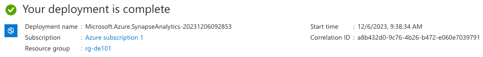
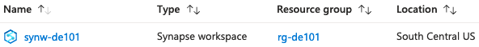
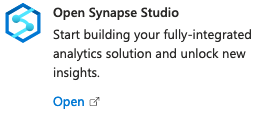
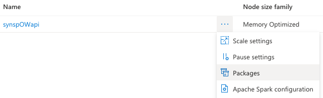
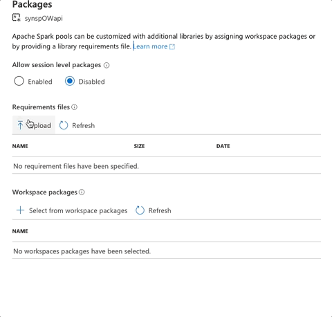
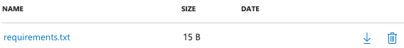

# Pre-setup

## Prerequisites

* Azure account \
  This can be the same account from [session 16][session_16] and [session 17][session_17]
* OpenWeather [API key][ow_apikey]
  *Create an account & verify your email*

## Steps

We will be creating a Spark pool under a synapse workspace, unfortunately this step takes about 1 hour to provision and since it consumes a lot of resources we recommend to start the pool right before the practice, or your credits will may expire before you complete the practice.

### Step 0 - Azure Portal

* Go to [Azure Portal][azure]
* Login

### Step 1 - Synapse Workspace

* Go to `Azure Synapse Analytics` \
  
* Click `+ Create` \
  *Items marked with * are the ones we created on previous sessions*
  * Basics
    * Subscription: `default`*
    * Resource group: `rg-de101`*
    * Workspace name: `synw-de101`
    * Region: `South Central US`*
    * Account name: `stde101datalake`*
    * File system name: `c-de101datalake-data`*
  * Security \
    *Here you will set your credentials, these are different than the credentials used from your SQL Instances on previous session*
    * SQL Server admin login: `sqladminuser`
    * SQL Password: `<New password>`
    * Confirm Password: `<New password>`
  * Use all other defaults \
  Once the provider is done, you should be able to see a screen like this
  
* Click `Go to resource`
  
  *Alternatively you can go to `Azure Synapse Analytics` and click on the created resource*
  

### Step 2 - Spark Pool

On your Synapse workspace

* Open Synapse Studio \
  *By clicking on the card in the center panel* \
  
* Go to `Manage` \
  
* Click `Apache Spark pools` \
  
* Click `+ New`
  * Apache Spark pool name: `synspOWapi` \
    *We are not allowed to use - so instead we are using casing*
  * Node size: `Small (4 vCores / 32 GB)`
  * Number of Nodes: `3 to 3`\
    
  * Use all other defaults
* Go to `Synapse Studio` > `Manage` > `Apache Spark pools`
* On the pool you just created
  * Click `...` > `Packages` \
    
* Click `Upload` 
* Select `requirements.txt` \
  
* Once it's uploaded you will see it listed
  

Note: *Depending on your account settings, deployment could take between 30-60 minutes*

## Links

* [Session 16][session_16]
* [Session 17][session_17]
* [OpenWeather API key][ow_apikey]

* [Azure portal][azure]

[session_16]: ../session_16_elt_environment_adf/README.md
[session_17]: ../session_17_extract_load_adf/README.md
[ow_apikey]: https://home.openweathermap.org/api_keys
[azure]: https://portal.azure.com
