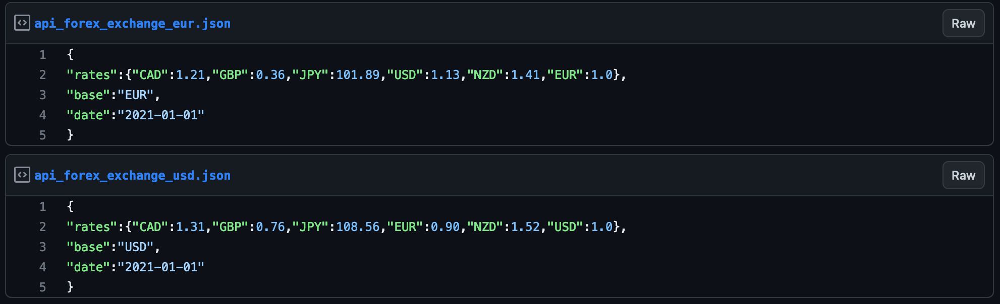
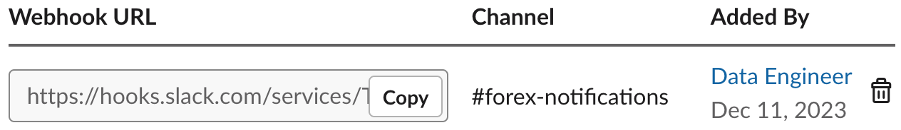
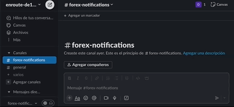
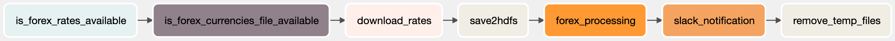
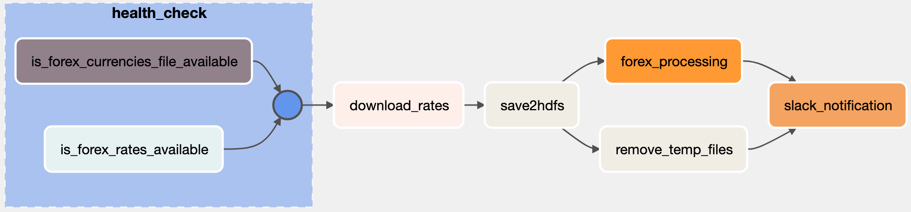

# Batch data pipeline with Airflow, HDFS, Hive and Spark

In this practice you will implement a data pipeline using a batch architecture.

## Prerequisites

* Follow the [pre-setup guideline][pre-setup]

## Before start

Batch architecture refers to trigger a data pipeline based on a metric (time/records...), once triggered it will process all the data gathered since the last time the pipeline was triggered.

Let's review the architecture we created during the pre-setup:

* [HDFS][hdfs] is the data lake where we will store the data.
* [Hive][hive] will make the data in HDFS available for querying.
* [Spark][spark] is a distributed processing engine that will run the processing job.
* [Hue][hue] is a web interface for data warehousing and analytics. It will allow us to query the data in HDFS and Hive.
* [PostgreSQL][postgresql] is a relational database management system that will work as Hive's metastore.
* [Adminer][adminer] is a web interface for Postgres and other databases that we don't need to use in this practice.


## What You Will Learn

* Airflow Spark tasks
* Airflow common operators
* Airflow paralell tasks
* Airflow services as configurations

## Practice

Create a concept demo to:
Save the `daily` currencies relations required on `Currencies CSV` for further analysis, pull the currencies using the [exchange documents][exchange_docs]

### Requirements

Using the infrastructure from setup from the [pre-setup][pre-setup] and the pre-existent files to:

* Verify that the URL that points to the JSON data that holds the forex rates is reachable
* Download the requied currencies (listed in CSV) and save as json
* Upload to HDFS
* If this is the first time running the pipeline, create the Hive table `forex_rates`
* Use the HDFS file to launch a Spark job to save the data
* Send a slack notification once the flow is complete
* Optimize pipeline
* Check every step can run individually

Do not store credentials in your code

>This demo will only list 2 currencies, but pipeline should be prepare to escale to **n** currencies when received daily \
>Since the demo will run daily, any temporary files must be cleaned

### Step 0a - Pre-existent files

>The `dags` directory will be mapped to the airflow `dags` directory, so any changes performed here will be performed on the docker too.

* `dags/data` \
  *This can be used to save any temporary files and the input for the pipeline*
  * `forex_currencies.csv` \
    This file contains the required currencies, if not listed here we will ignore the currencies if given. \
    *On a productive environment this file will change daily*
* `forex_common`
  * `api.py` \
    Constants for the API, we will explore how this values are generated on a further step
  * `path.py` \
    Constants for Docker directory (csv file) and temporary files we will create
  * `utils.py` \
    Extra functions
  * `constants.py` \
    General values and names that does not have children
* `forex_scripts`
  * `download_rates.py` (`save2local` function) \
    Based on the `forex_currencies.csv`, searches for the pairs and saves the required currencies in json formart
  * `upload_hive.py` (spark job) \
    Based on the `json` of `download_rates`, uploads the file to hive as the latest version of the records
* `forex.py` \
  DAG entrypoint (template for the practice)

### Step 0b - Explore the API

* Open the [api][exchange_docs] (URL <https://gist.github.com/marclamberti/f45f872dea4dfd3eaa015a4a1af4b39b>)
* We can split this url in 2
  * Host: `https://gist.github.com`
  * Base path: `/marclamberti/f45f872dea4dfd3eaa015a4a1af4b39b`
* We will be using these 2 files

  
* If you click on the `raw` button next to any file you will get an url
* This url can be splitted \
  Using the values we previously we can add
  * Path : `/raw/556b22b51b75866e853cf9a949df80a70ea541ce`
  * File: `/api_forex_exchange_usd.json` / `/api_forex_exchange_eur.json`

### Step 1 - Resources are reachable

Before we start using the resources to avoid any interruption in the pipeline is good to perform a health check on every resource we will be using, in this case we need to verify the input `csv` exist on the local system and the API URL is reachable, for this purpouse we will be using `HttpSensor` and `FileSensor`

#### 1.1 - Forex API

* On airflow: go to `Admin` > `Connections`
  * `+`
    * Conn Id: `forex_api`
    * Conn Type: `HTTP`
    * Host: `https://gist.github.com`

* Import the libraries

  ```py
  from airflow.providers.http.sensors.http import HttpSensor
  ```

* Health check

  ```py
  is_forex_rates_available = HttpSensor(
    task_id="is_forex_rates_available",
    http_conn_id="forex_api",
    endpoint="marclamberti/f45f872dea4dfd3eaa015a4a1af4b39b",
    response_check=lambda response: "rates" in response.text,
    poke_interval=5,
    timeout=20
  )

  is_forex_rates_available
  ```

#### 1.2 - Testing step

* Open airflwo container terminal

  ```sh
  docker exec -it airflow /bin/bash
  ```

* Test function

  ```sh
  # airflow tasks test <dag_id> <task_id> <execution_date>
  airflow tasks test forex is_forex_rates_available 2023-12-12
  ```

* You will get a log like this

  ```log
  INFO - Marking task as SUCCESS. dag_id=forex, task_id=is_forex_rates_available...
  ```

#### 1.3 - Good practices

From the preexistent files we already have some constants

* Import constants

  ```py
  import forex_common.api as f_api
  ```

* Use constants

  ```py
  ...
  http_conn_id=f_api.CONN_ID,
  endpoint=f_api.BASE_PATH,
  ...
  ```

#### 1.4 - File Sensor

* On airflow: go to `Admin` > `Connections`
  * `+`
    * Conn Id: `forex_path`
    * Conn Type: `File (path)`
    * Extra: `{"path": "/opt/airflow/dags/data"}`
* Import the libraries and constants

  ```py
  from airflow.sensors.filesystem import FileSensor
  import forex_common.path as f_path
  ```

* Health check

  ```py
  is_forex_currencies_file_available = FileSensor(
    task_id="is_forex_currencies_file_available",
    fs_conn_id=f_path.CONN_ID,
    filepath=f_path.CSV,
    poke_interval=5,
    timeout=20
  )

  is_forex_rates_available >> is_forex_currencies_file_available
  ```

* Test the function

### Step 2 - Download rates

* We will be using the `save2local` \
  On `forex_scripts/download_rates.py`
* Import operator and function

  ```py
  from airflow.operators.python import PythonOperator
  import forex_scripts.download_rates as download_rates
  ```

* Call function as task

  ```py
  download_rates = PythonOperator(
    task_id="download_rates",
    python_callable=download_rates.save2local
  )
  ```

* Add to queue on DAG

  ```py
  is_forex_rates_available >> is_forex_currencies_file_available >> download_rates
  ```

* Test the task

You should now see a json file in the `/dags/data/forex_rates.json` folder

### Step 3 - Upload to HDFS

* Create a folder on HDFS

  ```sh
  hdfs dfs -mkdir -p /forex
  ```

* We can upload the file into this directory by using this command \
  *Don't execute it*

  ```sh
  # hdfs dfs -put -f <local_file> <target_folder>
  hdfs dfs -put -f $AIRFLOW_HOME/dags/data/forex_rates.json /forex
  ```

* Import operator

  ```py
  from airflow.operators.bash import BashOperator
  ```

* Create the task

  ```py
  save2hdfs = BashOperator(
    task_id="save2hdfs",
    bash_command="""
      hdfs dfs -put -f $AIRFLOW_HOME/dags/data/forex_rates.json /forex
    """
  )
  ```

* Add to queue on DAG

  ```py
  is_forex_rates_available >> is_forex_currencies_file_available >> download_rates
  download_rates >> save2hdfs
  ```

* Test the task

### Step 4 - Hive Table

* On airflow: go to `Admin` > `Connections`
  * `+`
    * Conn Id: `forex_hive_conn`
    * Conn Type: `Hive Server 2 Thrift`
    * Host: `hive-server`
    * Login: `hive`
    * Password: `hive`
    * Port: `10000`
* Import operator

  ```py
  from airflow.providers.apache.hive.operators.hive import HiveOperator
  ```

* Create the task

  ```py
  create_forex_rates_table = HiveOperator(
    task_id="creating_forex_rates_table",
    hive_cli_conn_id=constants.CONN_ID_HIVE,
    hql="""
      CREATE EXTERNAL TABLE IF NOT EXISTS forex_rates(
        base STRING,
        last_update DATE,
        eur DOUBLE,
        usd DOUBLE,
        nzd DOUBLE,
        gbp DOUBLE,
        jpy DOUBLE,
        cad DOUBLE
        )
      ROW FORMAT DELIMITED
      FIELDS TERMINATED BY ','
      STORED AS TEXTFILE
    """
  )
  ```

* Test the task

We can create the table connecting to Hive server but once we run the task the table is created, so we don't need the task anymore. \
Proceed to delete the `create_forex_rates_table` and remove the import

>Airflow can also be useful when you want to run tasks but you don't have credentials on the database...

If you go to [Hue](http://localhost:32762) and create an account, you should see the table now

### Step 5 - Spark Job

* On airflow: go to `Admin` > `Connections`
  * `+`
    * Conn Id: `forex_spark_conn`
    * Conn Type: `Spark`
    * Host: `spark://spark-master`
    * Port: `7077`
* Import operator

  ```py
  from airflow.providers.apache.spark.operators.spark_submit import SparkSubmitOperator
  ```

* Create the task

  ```py
  forex_processing = SparkSubmitOperator(
    task_id="forex_processing",
    application=constants.PYSPARK_SCRIPT,
    conn_id=constants.CONN_ID_SPARK,
    verbose=False
  )
  ```

* Add to the DAG queue

  ```py
  download_rates >> save2hdfs >> forex_processing
  ```

* Test the task
* Check the rows are inserted by doing a `SELECT *...` on hue

### Step 6 - Slack

We will be using the function `slack_message` on `forex_common/utils.py` and the slack account given by your instructor

* Go to [api slack apps][slack_apps]
* Click `Forex App`

  

* Click `Incoming Webhooks` \
  *On the left panel*
* Click `Copy` \
  *On the center panel*

  

* On airflow: go to `Admin` > `Connections`
  * `+`
    * Conn Id: `forex_slack_conn`
    * Conn Type: `HTTP`
    * Host: <https://hooks.slack.com/services/>
    * Password: `T00000000/B00000000/XXXXXXXXXXXXXXXXXXXXXXXX` (the part of the webhook URL that contains the token)
  *You can use the full URL in the Host field, however as a good practice you want to hide your endpoint hook unless is protected by a login*
* Import operator

  ```py
  from airflow.providers.slack.operators.slack_webhook import SlackWebhookOperator
  from forex_common.utils import slack_message
  ```

* Create the task \
  *Change `<Your name>` value*

  ```py
  send_slack_notification = SlackWebhookOperator(
    task_id="slack_notification",
    http_conn_id=constants.CONN_ID_SLACK,
    message=slack_message('<Your name>')
  )
  ```

* Add to the DAG queue

  ```py
  download_rates >> save2hdfs >> forex_processing >> send_slack_notification
  ```

* Test the task

A message/notification should pop on your slack app



### Step 7 - Temporary files

Since we don't use the json file generated on Step 2, we can delete it

* Create the task

  ```py
  remove_temp = BashOperator(
      task_id='remove_temp_files',
      bash_command="""
        rm $AIRFLOW_HOME/dags/data/forex_rates.json
      """
  )
  ```

* Add to the DAG queue

  ```py
  download_rates >> save2hdfs >> forex_processing >> send_slack_notification >> remove_temp
  ```

* Test the task

### Step 8 - Optimize

At this point you may have the flow like this



* Identify group tasks \
  *These tasks work for the same purpouse, in this case health checks*
  * Group with task group

  ```py
  from airflow.utils.task_group import TaskGroup
  
  ...

  with TaskGroup("health_check", tooltip="Initial Check") as health_check:
    is_forex_rates_available = HttpSensor(
      task_id="is_forex_rates_available",
      http_conn_id=f_api.CONN_ID,
      endpoint=f_api.BASE_PATH,
      response_check=lambda response: "rates" in response.text,
      poke_interval=5,
      timeout=20
    )

    is_forex_currencies_file_available = FileSensor(
      task_id="is_forex_currencies_file_available",
      fs_conn_id=f_path.CONN_ID,
      filepath=f_path.CSV,
      poke_interval=5,
      timeout=20
    )
    is_forex_rates_available >> is_forex_currencies_file_available
  ```

  * Change the queue

    ```py
    health_check >> download_rates
    download_rates >> save2hdfs >> forex_processing >> send_slack_notification >> remove_temp
    ```

    

    *If you click `health_check` it will expand showing the substeps*
* Identify paralell tasks
  * `is_forex_rates_available` and `is_forex_currencies_file_available` can run at the same time
    * Change the queue

      ```py
      # is_forex_rates_available >> is_forex_currencies_file_available
      is_forex_rates_available
      is_forex_currencies_file_available
      # Removing the declarations will also work since they are not dependant tasks in the taskgroup
      ```

  * `remove_temp` can run after `save2hdfs`
    * Change the queue

      ```py
      health_check >> download_rates >> save2hdfs
      save2hdfs >> [remove_temp, forex_processing] >> send_slack_notification
      ```

    

### Step 9 - Re-run

This full flow will be running daily, run it again and verify it works with the specified requirements

## Conclusion

By following this practice, you should now have a solid understanding of how to use Docker to run and manage a container.

## Still curious

* Airflow is one of the most common technologies for data pipelines, if you want to start creating your own pipelines you need to understand, how to pre-made solutions mounts into your instance.

  Since airflow is build modularly it's quite similar to add libraries to your code, these can be:

  * Providers \
    Providers can contain operators, hooks, sensor, and transfer operators to communicate with a multitude of external systems, but they can also extend Airflow core with new capabilities. \
    [Documentation][provider]
  * Core extensions \
    They can be used to extend core by implementations of Core features, specific to certain providers \
    [Documentation][core_ext]
  * Packages \
    This is the library itself for a provider. \
    Ex. Amazon (Provider) -> apache-airflow-providers-amazon (Package) \
    [Documentation][package]
  * Operators
    An Operator is conceptually a template for a predefined Task, that you can just define declaratively inside your DAG. \
    [Documentation][operator]
  * Hooks \
    A Hook is a high-level interface to an external platform that lets you quickly and easily talk to them without having to write low-level code that hits their API or uses special libraries. They’re also often the building blocks that Operators are built out of. \
    [Documentation][conn_and_hook]
  * Connection \
    A Connection is essentially set of parameters - such as username, password and hostname - along with the type of system that it connects to, and a unique name, called the conn_id. \
  [Documentation][conn_and_hook]

* What if the functionality I need does not exists?

  Let's imagine you have a pipeline that receives sales data, but the data you receive only contains customer id and product id, but you need to fill that data from another system such as a CRM like SAP.

  The good practice of airflow says most of the external system interaction should be made either by a hook or by an operator.

  In this case we can create a custom hook or a custom operator that we can later reuse as many times as we want.

  * How we do it?
    * Article: [Airflow — Writing your own Operators and Hooks][custom_hook_and_operator]

* What are airflow best practices?

  Before considering airflow into our pipeline, we need to understand what airflow is for:
  > Airflow is an orchestrator with coding capabilities

  This means, despite the fact airflow can run python and some other code scripts, it does not have the same memory or processing power as a dedicated server.

  * So this means `PythonOperator` is useless?

    No, this means we should not rely 100% in operators to do all the transforming steps, we should optimize memory to trigger tasks in a more powerful environment, then return with the operation results.

  Article: [Airflow Best Practices][airflow_best_practices]

* Want to tlearn how to create a hook?

Article: [Slack hooks message][slack_hook]

## Links

### Used during this session

* [Pre-Setup][pre-setup]

### Session reinforment and homework help

* [HDFS][hdfs]
* [Hive][hive]
* [Spark][spark]
* [Hue][hue]
* [Postgres][postgresql]
* [Adminer][adminer]
* [HTTP Sensor][http_sensor]
* [File Sensor][file_sensor]
* [Python Operator][python_operator]
* [Bash Operator][bash_operator]
* [HiveOperator][hive_operator]
* [SparkSubmitOperator][spark_submit_operator]
* [SlackWebhookOperator][slack_webhook_operator]
* [Airflow — Writing your own Operators and Hooks][custom_hook_and_operator]
* [Airflow Best Practices][airflow_best_practices]
* [Slack hooks message][slack_hook]

[pre-setup]: ./pre-setup.md

[exchange_docs]: https://gist.github.com/marclamberti/f45f872dea4dfd3eaa015a4a1af4b39b
[slack_apps]: https://api.slack.com/apps

[hdfs]: https://aws.amazon.com/es/emr/details/hadoop/what-is-hadoop/
[hive]: https://aws.amazon.com/es/big-data/what-is-hive/
[spark]: https://aws.amazon.com/es/big-data/what-is-spark/
[hue]: https://gethue.com/
[postgresql]: https://www.postgresql.org/
[adminer]: https://www.adminer.org/
[http_sensor]: https://airflow.apache.org/docs/apache-airflow-providers-http/stable/_api/airflow/providers/http/sensors/http/index.html#airflow.providers.http.sensors.http.HttpSensor
[file_sensor]: https://airflow.apache.org/docs/apache-airflow-providers-http/stable/_api/airflow/providers/http/sensors/http/index.html#airflow.providers.http.sensors.http.HttpSensor
[python_operator]: https://airflow.apache.org/docs/apache-airflow/stable/_api/airflow/operators/python/index.html#airflow.operators.python.PythonOperator
[bash_operator]: https://airflow.apache.org/docs/apache-airflow/stable/_api/airflow/operators/bash/index.html#airflow.operators.bash.BashOperator
[hive_operator]: https://airflow.apache.org/docs/apache-airflow/1.10.10/_api/airflow/operators/hive_operator/index.html#airflow.operators.hive_operator.HiveOperator
[spark_submit_operator]: https://airflow.apache.org/docs/apache-airflow/1.10.12/_api/airflow/contrib/operators/spark_submit_operator/index.html#airflow.contrib.operators.spark_submit_operator.SparkSubmitOperator
[slack_webhook_operator]: https://airflow.apache.org/docs/apache-airflow/1.10.12/_api/airflow/contrib/operators/slack_webhook_operator/index.html#airflow.contrib.operators.slack_webhook_operator.SlackWebhookOperator
[slack_hook]: https://api.slack.com/messaging/webhooks

[provider]: https://airflow.apache.org/docs/apache-airflow-providers/
[core_ext]: https://airflow.apache.org/docs/apache-airflow-providers/core-extensions/index.html
[package]: https://airflow.apache.org/docs/apache-airflow-providers/packages-ref.html
[operator]: https://airflow.apache.org/docs/apache-airflow/stable/core-concepts/operators.html
[conn_and_hook]: https://airflow.apache.org/docs/apache-airflow/stable/authoring-and-scheduling/connections.html

[custom_hook_and_operator]: https://medium.com/b6-engineering/airflow-writing-your-own-operators-and-hooks-93fcfbc7bd
[airflow_best_practices]: https://airflow.apache.org/docs/apache-airflow/stable/best-practices.html
