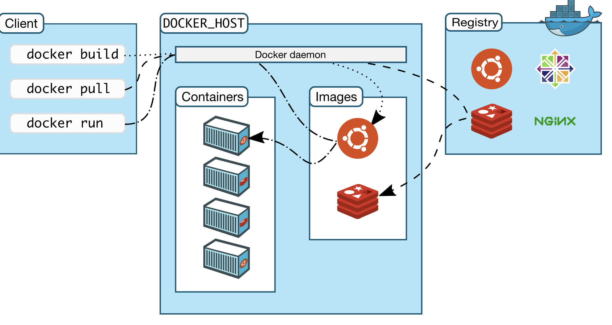
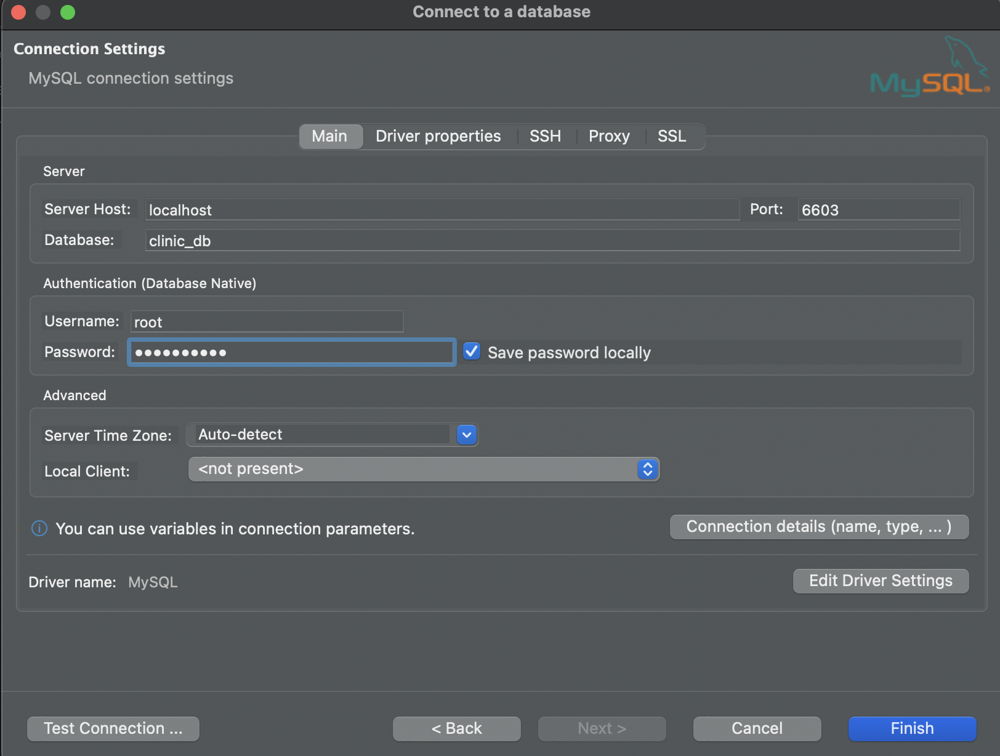
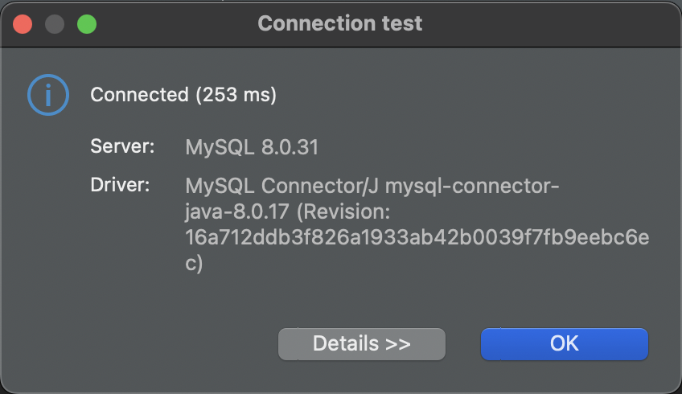
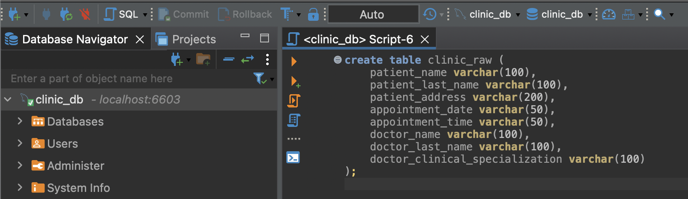
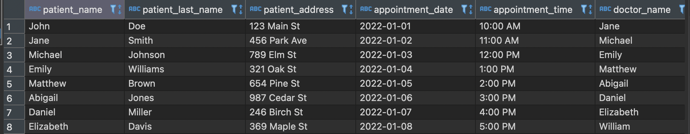

# SQL Overview and Relational DB's on Containers

In this practice we will manipulate data on a Relational Database within a Docker container


## Prerequisites

* Follow the [pre-setup guideline][pre-setup]

## Before start

Let's review some concepts we used during the pre-setup:

* Docker registry \
  The docker registry is the registry of all pre-built available images, this can be used as it is, but also be customized to build on top.

* Dockerfile \
  A Dockerfile is a script that contains instructions for building a Docker image. A Dockerfile is used to create an image, which can then be used to create new containers. A Dockerfile typically includes instructions for setting environment variables, copying files, and running commands.

* Image (Docker Image) \
  A Docker image is a pre-built package that contains all the necessary files and dependencies to run an application or service. You can think of an image as a snapshot of an application or service that can be used to create new containers.

* Container (Docker Container) \
  A Docker container is a running instance of a Docker image. When you start a container, Docker creates a new, isolated environment for the application or service to run in. Containers are lightweight and efficient, and you can run multiple containers on the same host.

* Daemon \
  This is a service that allows to launch commands to the host to control it

>What we did in the pre-setup?
>
>We built a `Dockerfile` specifying we will be basing our new `Image` from an existing one using the clause `FROM mysql`, then we used the command `docker build` against the `Daemon` to start the `Image` creation, the `Daemon` pulled from the `Registry` the mysql `Image` and the our custom image, once this was completed, it build an instance `Container` of what we specified in the `Dockerfile`, the we used the command `docker run` to start our instance of that container.



### Docker commands

List of common docker commands:

* `docker run`: Runs a new container from an image
* `docker ps`: Lists all running containers
* `docker stop`: Stops a running container
* `docker start`: Starts a stopped container
* `docker logs`: Shows the log output of a container
* `docker build`: Builds an image from a Dockerfile
* `docker push`: Upload an image to a registry
* `docker pull`: Pulls an image or a repository from the registry
* `docker rm`: Remove one or more containers
* `docker image rm`: Remove one or more images
* `docker commit`: Create a new image based on changes made to a running container


### Docker VS Virtual Machine

Docker containers are lightweight, portable, and self-sufficient environments that allow you to run applications in isolation from the host system. \
`Containers are built on top of the host operating system` and share the host's kernel. \
They are lightweight because they don't include an operating system, but instead rely on the host's kernel to provide the necessary services.

Virtual machines (VMs) are software-based systems that mimic the hardware of a physical computer. \
`They run on top of a hypervisor`, which is a software layer that sits between the VM and the host operating system. \
VMs are typically used to run multiple operating systems on the same host, each in its own isolated environment.


## What You Will Learn

* How to use a docker container of a relational database
* Docker commands
* Operative System commands and Overview
* How to connect to a Docker Container
* How to connect to a Database by using a DB client
* SQL Overview
* Transactions Overview

## Practice

You're working on a clinic, and the clinic needs a database to have records of the appointments that were made between the patient and the doctor.

The clinic only provides you a CSV file with the historical data of the appointments and they ask you to create the database from it.


### Requirements

Using the docker container setup from the [pre-setup][pre-setup]:

* Create `clinic_db` schema within your database
* Load the [clinic csv](clinic.csv) into a table named `clinic_raw`
* Normalize the database
  * Create as many tables as required
* Fill the data from the `clinic_raw` to the new normalized tables
* Connect the client (Dbeaver) to your schema

>You can use the DBeaver client or MySQL CLI to achive all the previous tasks

### Step 1 - Create Schema in DB

* Connect your terminal with the container terminal

  ```sh
  docker exec -it clinic-container bash
  ```

* Connect to your database instance

  ```sh
  mysql -u root -p
  ```
  
  * This command will ask for your password, the default is `mypassword`

* Create `clinic_db` on mysql

  ```sql
  CREATE DATABASE clinic_db;
  ```

### Step 2 - Connect using the Client

* Open DBeaver IDE

* Click on the New Database Connection Icon
  * Is located on the upper left of the IDE

    

* A pop up window will open
* Select `MySQL` option
  *click on `Next`

  

* Set the parameter as below
  * Server Host: **localhost**
  * Port: **6603**
  * Database: **clinic_db**
  * Username: **root**
  * Password: **mypassword**

    

* On Driver Properties tab
  * Set `allowPublicKeyRetrieval` as `true`

    

* Click on Test connection and should appear as `Connected`

  

### Step 3 - Create the table `clinic_raw` in the Schema

* Examine the csv file
  
  We will be using thie to define the table structure to contain the data
  * In this case the provided [CSV][csv] file contains the following data:

    ```csv
    patient_name,patient_last_name,patient_address,appointment_date,appointment_time,doctor_name,doctor_last_name,doctor_clinical_specialization
    John,Doe,123 Main St,2022-01-01,10:00 AM,Jane,Smith,Pediatrics
    ...
    ```

* Detect the data type of each column

  |Column Name|Data Type|
  |-|-|
  |patient_name|String|
  |patient_last_name|String|
  |patient_address|String|
  |appointment_date|Date|
  |appointment_time|Time|
  |doctor_name|String|
  |doctor_last_name|String|
  |doctor_clinical_specialization|String|

* Create the table
  * Open dbeaver and execute it on a SQL Script tab

    

  * Execute the following script

    ```sql
    CREATE TABLE clinic_raw (
        patient_name VARCHAR(100),
        patient_last_name VARCHAR(100),
        patient_address VARCHAR(200),
        appointment_date VARCHAR(50),
        appointment_time VARCHAR(50),
        doctor_name VARCHAR(100),
        doctor_last_name VARCHAR(100), 
        doctor_clinical_specialization VARCHAR(100)
    );
    ```

To verify the execution you should be able to do the following query:

```sql
SELECT * FROM clinic_raw;
```

If this triggers an error, your script was not executed, if the result is `Selected 0 rows` then you are good.

### Step 4 - Load the csv into the clinic_raw table

* Copy the csv from local to the container

  ```sh
  # Open a new terminal for this
  docker cp practice_files/clinic.csv clinic-container:/tmp/clinic.csv
  ```

* Connect to clinic_db

  ```sh
  docker exec -it clinic-container mysql --local-infile=1 -u root -p
  ```

  * The mysql command option `--local-infile=1` will allow to import local files while executing SQL statements
* Set a global variable that will allow us to use local files from SQL statements

  ```sql
  SET GLOBAL local_infile=1;
  ```

* Switch to use correct schema context

  ```sql
  USE clinic_db;
  ```

* Import csv data to table

  ```sql
  LOAD DATA LOCAL INFILE "/tmp/clinic.csv"
  INTO TABLE clinic_raw
  COLUMNS TERMINATED BY ','
  OPTIONALLY ENCLOSED BY '"'
  ESCAPED BY '"'
  LINES TERMINATED BY '\n'
  IGNORE 1 LINES;
  ```

  * `LOAD DATA LOCAL INFILE`: This specifies that the data to be loaded is in a file, and it should be loaded locally from the client machine, rather than from the server.
  * `"/tmp/clinic.csv"`: This specifies the path to the CSV file that contains the data to be loaded.
  * `INTO TABLE clinic_raw`: This specifies the name of the table in the database where the data should be loaded.
  * `COLUMNS TERMINATED BY ','`: This specifies that the fields in the CSV file are separated by commas.
  * `OPTIONALLY ENCLOSED BY '"'`: This specifies that each field in the CSV file may be enclosed in double quotes.
  * `ESCAPED BY '"'`: This specifies that a double quote character within a field can be escaped by a double quote character.
  * `LINES TERMINATED BY '\n'`: This specifies that each line in the CSV file is terminated by a newline character.
  * `IGNORE 1 LINES`: This specifies that the first line of the CSV file should be ignored, as it typically contains headers or column names and is not part of the actual data to be loaded.

You can verify the data is loaded by running in the terminal or client the following query:

```SQL
SELECT * FROM clinic_raw;
```

The result should look like this



### Step 5 - Normalize

>Normalization: is a process where you apply the 3 Normal Forms (3NF), the 3NF are rules or guidelines used in database design to ensure data integrity and minimize data redundancy within a relational database.
>
>*Note: 4NF and 5NF exists, however as a general standard most enterprises use only 3NF, check the link section for 4NF and 5NF.*

Use as reference the Columns we just define:

|Column Name|Data Type|
|-|-|
|patient_name|String|
|patient_last_name|String|
|patient_address|String|
|appointment_date|Date|
|appointment_time|Time|
|doctor_name|String|
|doctor_last_name|String|
|doctor_clinical_specialization|String|

#### Unnormalized

A table is unnormalized when

* Does not meet the criteria for 1NF

>*The current table does not meet the requirement for 1NF as we will see shortly*

#### First Normal Form (1NF)

A table is in 1NF if it meets the following criteria

* It has a primary key composed of unique values that uniquely identify each row.
* All columns in the table contain atomic (indivisible) values.
* All entries in a column are of the same data type

*The order of rows and columns doesn't matter.*

___

The first step is to identify a primary key that uniquely identifies each row in the table. In this case, it's not explicitly stated, but a combination of `patient_name`, `patient_last_name`, `doctor_name`, `doctor_last_name` and `appointment_date` could serve as a primary key.

However composite primary keys, are not easy to handle by the DBMS, let's add a new field called `appointment_id` to the table, this will work as a replacement for these fields.

|Column Name|Data Type|
|-|-|
|appointment_id|Integer|

>All columns contain atomic values and all entries in the same column are the same data type

#### Second Normal Form (2NF)

A table is in 2NF if it meets the following criteria

* It is in 1NF.
* There are no partial dependencies
  >All non-key attributes are functionally dependent on the entire primary key, not just a part of it.

___

>In this dataset, there are no partial dependencies, so it's already in 2NF.

#### Third Normal Form (3NF)

A table is in 3NF if it meets the following criteria:

* It is in 2NF.
* There are no transitive dependencies
  >Non-key attribute depends on another non-key attribute

___

The `doctor_clinical_specialization` appears to be dependent on the `doctor_name` and `doctor_last_name`. To resolve this, we can create a separate table for doctors and their specializations, eliminating the transitive dependency:

* Let's call this `doctor` table
* Add an `id` column for the table
* Remove the prefix `doctor_` as all the information in this table is from the doctor

|Column Name|Data Type|
|-|-|
|id|Integer|
|name|String|
|last_name|String|
|clinical_specialization|String|

The `patient_address` appears to be dependent on the `patient_name` and `patient_last_name`. To resolve this, we can create a separate table for patients and their address, eliminating the transitive dependency:

* Let's call this `patient` table
* Add an `id` column for the table
* Remove the prefix `patient_` as all the information in this table is from the patient

|Column Name|Data Type|
|-|-|
|id|Integer|
|name|String|
|last_name|String|
|address|String|

Remove the fields from the `clinic_raw` and the result will be the `appointment` table:

* Remove the prefix `appointment_` as all the information in this table is from the appointment
* Add the foreign key `patient_id` to replace the reference to the patient data
* Add the foreign key `doctor_id` to replace the reference to the doctor data

|Column Name|Data Type|
|-|-|
|id|Integer|
|patient_id|Integer|
|doctor_id|Integer|
|date|Date|
|time|Time|

#### SQL scripting

```sql
CREATE TABLE patient
(
  id        INT PRIMARY KEY,
  name      VARCHAR(100),
  last_name VARCHAR(100),
  address   VARCHAR(200)
);
CREATE TABLE doctor
(
  id INT PRIMARY KEY,
  name VARCHAR(100),
  last_name VARCHAR(100),
  clinical_specialization VARCHAR(100)
);
CREATE TABLE Appointment
(
  id INT PRIMARY KEY,
  date DATE,
  time TIME,
  patient_id INT,
  doctor_id INT,
  FOREIGN KEY (patient_id) REFERENCES Patient (id),
  FOREIGN KEY (doctor_id) REFERENCES Doctor (id)
);
```

## Homework

* Fill your new tables using SELECT/INSERT from the clinic_raw to the new tables
  * Make sure to fill the foreign keys properly
* Submit your SQL script on Canvas' Session 2 - Homework

Extra:

* Once you fill the data on the new tables:
  * Create a query to recreate the clinic_raw original table using only the new tables.

## Conclusion

By following this practice, you should now have a solid understanding of how to use Docker to run and manage a container.

## Still curious

### SQL Tips and naming conventions

* Avoid redundancy

  >When naming fields is easy to add unnecessary prefixes, such as `doctor_id` when the table name is `doctor`.

  Ex. Select the id, date and time for all the appointments

  ```sql
  --SELECT using prefixes such as appointment_ and doctor_
  SELECT appointment.appointment_id, appointment.appointment_date, appointment.appointment_time,
  FROM appointment;

  --Select not using prefixes
  SELECT appointment.id, appointment.date, appointment.time,
  FROM appointment;
  ```

  The second option looks clean, and looks even cleaner when joining with other tables:

  ```sql
  --SELECT using prefixes such as appointment_ and doctor_
  SELECT
    appointment.appointment_id,
    doctor.doctor_name,
    patient.patient_name,
    appointment.appointment_date,
    appointment.appointment_time,
  FROM appointment
  LEFT JOIN doctor
    ON appointment.doctor_id = doctor.doctor_id
  LEFT JOIN patient
    ON appointment.patient_id = patient.patient_id;

  --Select not using prefixes
  SELECT
    appointment.id,
    doctor.name,
    patient.name,
    appointment.date,
    appointment.time,
  FROM appointment
  LEFT JOIN doctor
    ON appointment.doctor_id = doctor.id
  LEFT JOIN patient
    ON appointment.patient_id = patient.id;
  ```

* Use lower case

  >SQL is not cased, however naming the tables or fields in upper case, in some DBMS means we need to force the system to recognize the case and match the object, mysql does not perform this by default, however is a good practice to avoid future problems.

  ```sql
  --Casing
  SELECT "Appointment"."AppointmentId", "Appointment"."AppointmentDate", "Appointment"."AppointmentTime",
  FROM "Appointment";

  --Not cased
  SELECT appointment.id, appointment.date, appointment.time,
  FROM appointment;
  ```

* Name your tables singular

  >Use singular for table names (user, role), and not plural (users, roles). The plural could lead to some weird table names later (instead of user_has_role, you would have users_have_roles, etc.)

Want to learn more: [SQL Naming Conventions][sql_conventions]

### Do you want to know what is your SQL level?

>How many of these concepts/topics have you heard/understand or use in a real work environment?

#### Beginner

* WHERE
  * IN
  * BETWEEN
* DELETE
  * CASCADED
* UPDATE
* LEFT/RIGHT INNER/OUTTER/CROSS JOIN
* ALTER
* "Temporary" tables
* CURSOR
* INDEXES ("What" are they?)
* KEY
  * PRIMARY
  * FOREIGN
* TRANSACTION (Basics)
* CONSTRAINTS

#### Intermediate

* INDEXES ("How" they work?)
  * Clustered
  * Non-Clustered
  * Page (Layout)
* Subqueries (Able to use them with JOIN and WHERE)
* Pivot
* JOIN with self table when required
* GROUP BY
  * Aggregate Functions
* Profiling (monitoring/debugging, reading a log)
* OLAP/OLTP (When, Where to use OLAP structures)
* TRIGGERS (How to use or not use them)
* TRANSACTION (Layer them handling failures into the stack)
* Normal Forms (3NF)

#### Advanced

* Execution plan
* Query tuning
  * Parellelism
  * Indexes
  * Loops
* Query statistics
* Data Structures (On disk)
* Performance counters, database load and behaviour (from monitoring)
* OLAP Cube (Execute data mining)
* Risks of triggers usage
* Distributed transactions (Transaction layers)

### Is there a situation where Normal Forms are not optimal?

>Yes, some situations requiere we prioritize query performance over data storage.

Let's imagine a 20 billion record table joining to get the name, how many time will it consume? \
Now if I get some statistics and get 95% of the querys to that table always do that join

Would that make sense to join those 2 tables in disk rather than in query?

It's not always that easy, every situation need to be assesed, here are some resources that might will help you

* [Denormalization: When, Why, and How][denorm_questions]
* [When to Denormalize a Database Design][denorm_db]

## Links

### Used during this session

* [Pre-Setup][pre-setup]
* [Clinic CSV][csv]
* [SQL Naming Conventions][sql_conventions]

### Enroute Reference

* [1 - Database Types and Relational Databases][session_1]
* [2 - Docker for DB Development][session_2]
* [4 - DB Design][session_4]
* [5 - Normalization][session_5]

### Reinforce Lesson and homework help

* Video: [OLAP vs OLTP][olap_oltp]
* Doc: [Docker][docker]
* Doc: [Github with SSH][ssh_gh]
* Article: [Operative Systems Overview][os_overview]
* Video Playlist: [1NF to 5NF][normal_forms]

[pre-setup]: ./pre-setup.md
[csv]: ./practice_files/clinic.csv
[sql_conventions]: https://www.sqlshack.com/learn-sql-naming-conventions/

[denorm_questions]: https://www.vertabelo.com/blog/denormalization-when-why-and-how/
[denorm_db]: https://stackoverflow.com/questions/4301089/when-to-denormalize-a-database-design

[session_1]: https://enrouted.sharepoint.com/:p:/s/DataEngineering/EXc9as6OIdRJj0e64wrPAzMBRjwis40WzWOdaVL9o7ohCQ?e=zYChbp
[session_2]: https://enrouted.sharepoint.com/:p:/s/DataEngineering/EeYUIr-pP9ZFgJePZ_2fnccB3RepOHcmY-lypQ6InmrfLA?e=BT3vrq
[session_4]: https://enrouted.sharepoint.com/:p:/s/DataEngineering/EVmiyBEKrsxKuHktIHwoNiQBzmY1iK289BWWUw1OdSSV4g?e=vBdf48
[session_5]: https://enrouted.sharepoint.com/:p:/s/DataEngineering/Eemvtf9ceWhPjnzhBNHXqyMBSRBs2Sf4Vj4IiOvemmqdzg?e=av5DxK

[olap_oltp]: https://www.youtube.com/watch?v=iw-5kFzIdgY
[docker]: https://docs.docker.com/get-started/
[ssh_gh]: https://docs.github.com/en/authentication/connecting-to-github-with-ssh
[os_overview]: https://www.tutorialspoint.com/operating_system/index.htm
[normal_forms]: https://www.youtube.com/playlist?list=PLLGlmW7jT-nTr1ory9o2MgsOmmx2w8FB3
