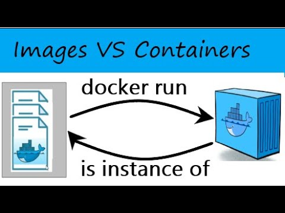
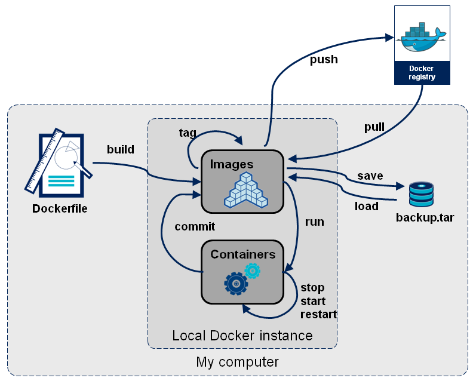

# Pre-setup

Try to read this before the Session, so you can start the session the same time as the teacher   

## Start

First, we are going to create a docker container with a MySQL image to create a clinic Database

Create within this folder a Dockerfile with the following content:

```
FROM mysql
ENV MYSQL_ROOT_PASSWORD=mypassword
ENV MYSQL_DATABASE=mydatabase
ENV MYSQL_USER=myuser
ENV MYSQL_PASSWORD=mypassword
EXPOSE 3306 
```

### Dockerfile

**A Dockerfile is a script that contains instructions for building a Docker image. A Dockerfile is used to create an
image, which can then be used to create new containers. A Dockerfile typically includes instructions for setting
environment variables, copying files, and running commands.**


Now build a docker image with the following command:

```
docker build -t clinic .
```

This command builds a docker image with name as **´clinic´** by using the **´-t´** flag.

Now you can see the images on your docker with following command:

```
docker images
```

### Docker Image

**A Docker image is a pre-built package that contains all the necessary files and dependencies to run an application or
service. You can think of an image as a snapshot of an application or service that can be used to create new containers.
**



You can find and download images from the [Docker Hub](https://hub.docker.com/search), which is a public registry of
Docker images. You can also create your own images by writing a Dockerfile, which is a script that contains instructions
for building an image.

Now let's create a container with the following command:

```
docker run --rm -d -p 6603:3306 --name clinic-container clinic
```

This command will create a docker container named as **´clinic-container´** from **´clinic´** image.

* The **´-d´** option runs the container in detached mode, which allows it to run in the background.
* The **-p** flag helps to publish Publish container's port(s) to the host, in this case `<host-port>:<container-port>`
* The **--rm** flag instructs Docker to also remove the anonymous volumes associated with the container if the container
  is removed

### Docker Container

**A Docker container is a running instance of a Docker image. When you start a container, Docker creates a new, isolated
environment for the application or service to run in. Containers are lightweight and efficient, and you can run multiple
containers on the same host.**


### Docker commands

List of common docker commands:

* **docker run** : Runs a new container from an image
* **docker ps** : Lists all running containers
* **docker stop** : Stops a running container
* **docker start** : Starts a stopped container
* **docker logs** : Shows the log output of a container
* **docker build** : Builds an image from a Dockerfile
* **docker push**: Upload an image to a registry
* **docker pull** : Pulls an image or a repository from the registry
* **docker rm** : Remove one or more containers
* **docker image rm**: Remove one or more images
* **docker commit**: Create a new image based on changes made to a running container



### Docker VS Virtual Machine

Docker containers are lightweight, portable, and self-sufficient environments that allow you to run applications in
isolation from the host system. Containers are built on top of the host operating system and share the host's kernel.
They are lightweight because they don't include an operating system, but instead rely on the host's kernel to provide
the necessary services.

Virtual machines (VMs) are software-based systems that mimic the hardware of a physical computer. They run on top of a
hypervisor, which is a software layer that sits between the VM and the host operating system. VMs are typically used to
run multiple operating systems on the same host, each in its own isolated environment.

