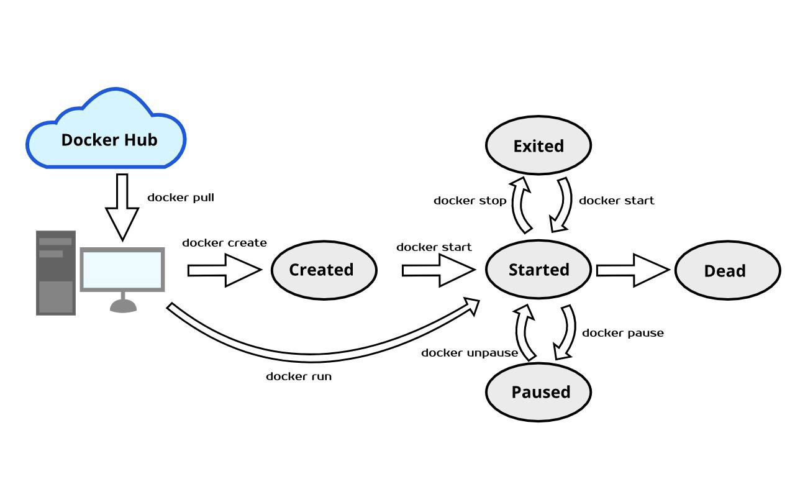
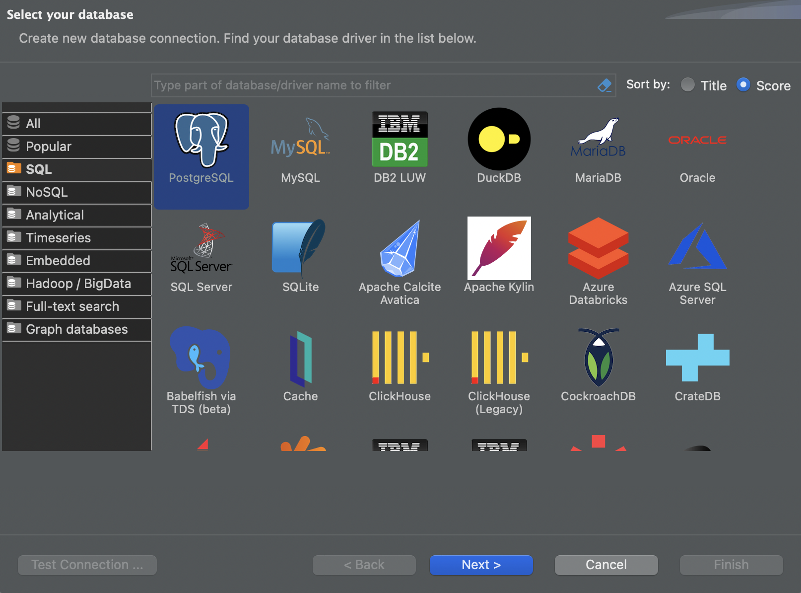
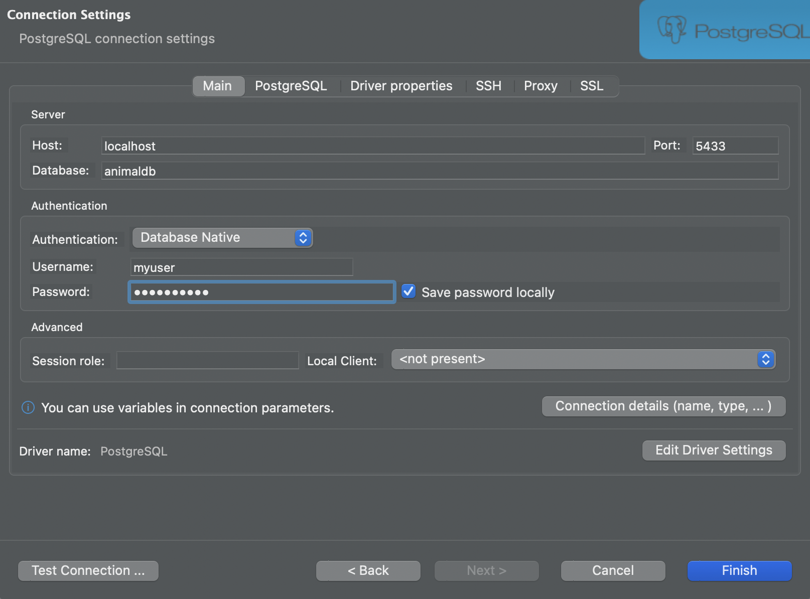
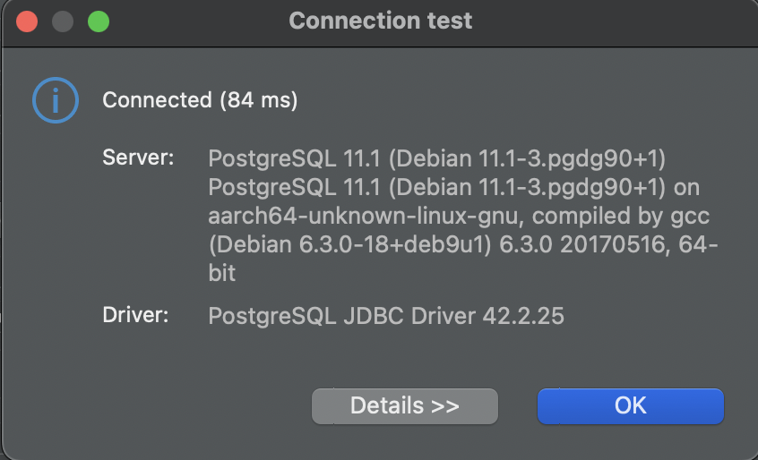

# Python Overview and Running Applications on Containers

In this practice we will develop and use a Python application running on a docker container


## Prerequisites

* Follow the [pre-setup guideline][pre-setup]

## Before start

Let's review some concepts we used during the pre-setup:

* Docker Compose \
  Docker Compose is a tool for defining and running multi-container Docker applications. It allows you to configure your application's services, networks, and volumes in a single docker-compose.yml file, and then start and stop them using a single command.

  >In simple terms, Docker is for managing containers, composer (Docker compose) is to manage multi-container environments

* Docker lifecycle \
  Below you can see some docker commands and how they interact with each other and with the OS
  

## What You Will Learn

* How to use a docker container of a Python Application
* Docker Compose commands
* Operative System commands and Overview
* How to connect to a Docker Container
* How to connect to a Database by using a DB client
* Programming foundations
* Python Overview

## Practice

Given a list of the classification of the animals, create a software that classifies the animals of the Zoo.


### Requirements

Using the infrastructure from setup from the [pre-setup][pre-setup]:

* On the python container, develop classes for the following animal classification:
  * `Mammal:` lions, elephants, monkeys, bears, giraffes
  * `Bird:` parrots, eagles, flamingos, penguins, owls
  * `Fish:` sharks, rays, piranhas, clownfish, salmon
* Use Python's data to deposit on a PostgreSQL Database

### Step 0 - Python test

Create a hello world program

* Open shell inside the Python container

    ```sh
    docker-compose exec python_app bash
    ```

* Use vi to create main.py
  * Start `vi`

    ```sh
    vi main.py
    ```

  * Copy & paste content

    ```py
    print('HELLO WORLD!!')
    ```

  * Use `:wq` to exit vi saving the file

* Run `main.py` program

    ```sh
    python main.py
    ```

And there you go! You should see `HELLO WORLD!!` message on the command prompt

### Step 1 - Classes

* In order to store the data in python let's create some classes:

  

* Create `zoo` folder and navigate to it

  ```sh
  mkdir zoo
  cd zoo
  ```

* Create animal to store the classes

  ```sh
  vi animal.py
  ```

* Add content to the file

  ```py
  from typing import Type

  class Animal:
    def __init__(self, name: str, most_liked_food: str) -> None:
      self.name = name
      self.most_liked_food = most_liked_food

    def __str__(self) -> str:
      return f'{self.name} likes {self.most_liked_food}'

    def make_sound(self) -> None:
      pass

  class Mammal(Animal):
    def __init__(self, name: str, most_liked_food: str, number_of_paws: int) -> None:
      super().__init__(name, most_liked_food)
      self.number_of_paws = number_of_paws

    def walk(self) -> None:
      print(f'{self.name} walks with {self.number_of_paws} paws')

    def make_sound(self) -> None:
      print("Mammal's sound depends the animal")

  class Fish(Animal):
    def __init__(self, name: str, most_liked_food: str, number_of_fins: int) -> None:
      super().__init__(name, most_liked_food)
      self.number_of_fins = number_of_fins

    def swim(self) -> None:
      print(f"{self.name} swims and has {self.number_of_fins} fins")

    def make_sound(self) -> None:
      print("Glu Glu")

  class Bird(Animal):
    def __init__(self, name: str, most_liked_food: str, number_of_wings: int) -> None:
      super().__init__(name, most_liked_food)
      self.number_of_wings = number_of_wings

    def fly(self) -> None:
      print(f"{self.name} flies and has {self.number_of_wings} wings")

    def make_sound(self) -> None:
      print("Chirp chirp")
  ```

* Create `__init__.py` to state this folder will be a module

  ```sh
  touch __init__.py
  ```

### Step 2 - Module usage

* Navigate to `/app` directory

  ```sh
  cd ..
  ```

* Edit `main.py` (Replace the `helloworld` with the classes usage)

  ```sh
  vi main.py
  ```

  ```py
  from zoo.animal import Mammal, Fish, Bird

  print("let's create a Mammal")
  mammal = Mammal('monkey','banana',2)
  print(mammal)
  mammal.walk()
  mammal.make_sound()

  print("let's create a Fish")
  fish = Fish('shark','fish',1)
  print(fish)
  fish.swim()
  fish.make_sound()

  print("let's create a bird")
  bird = Bird('parrot','seeds',2)
  print(bird)
  bird.fly()
  bird.make_sound()
  ```

* Exit editor
  * Type `:wq` to exit and save
* Run `main.py`

  ```sh
  python main.py
  ```

### Step 3 - Database

* Open DBeaver IDE
  * Click on the New Database Connection Icon that is on the upper left of the IDE

    

* A pop up window will open
  * Here selects `PostgreSQL` option
  * Click on `Next`

    

* Then on connection parameters use the following

  * `Server Host`: `localhost`
  * `Port`: `5433`
  * `Database`: `animaldb`
  * `Username`: `myuser`
  * `Password`: `mypassword`

    

* Click on `Test connection`
  * Should appear as `Connected`

    

* Open a sql script by using this connection by clicking `SQL` button
  * That is on the upper left part of the menu

    

* Create the `animal` table
  * Executing the following via SQL script editor

    ```sql
    CREATE TABLE animal(
      id SERIAL PRIMARY KEY,
      name VARCHAR(50),
      most_liked_food VARCHAR(50),
      animal_classification VARCHAR(50)
    );
    ```

    

### Step 4 - Fill data

* Re-edit the file to insert animal data into database
  * Use `rm main.py && vi main.py` to remove the file and get an empty main.py to edit

    ```py
    import psycopg2
    from typing import Type
    from zoo.animal import Mammal, Fish, Bird

    # Define the connection parameters
    conn_params = {
        "host": "postgres_db",
        "port": 5432,
        "database": "animaldb",
        "user": "myuser",
        "password": "mypassword"
    }

    # Connect to the database
    conn = psycopg2.connect(**conn_params)
    cur = conn.cursor()

    # Define the SQL insert statement
    sql = "INSERT INTO animal (name, most_liked_food, animal_classification) VALUES (%s, %s, %s)"

    # Define a list of animals to insert
    animals = [Mammal('monkey', 'banana', 4),
              Fish('shark', 'fish', 2),
              Bird('parrot', 'seeds', 2)]

    # Loop through the animals and insert them into the database
    for animal in animals:
        # Get the animal's classification based on its type
        classification = animal.__class__.__name__
        # Execute the SQL insert statement
        cur.execute(sql, (animal.name, animal.most_liked_food, classification))

    # Commit the changes and close the connection
    conn.commit()
    cur.close()
    conn.close()

    print("Animals were inserted into Database")
    ```
  
* Execute the file

### Step 5 - Query

* Using the Script editor execute the following query

  ```sql
  SELECT * FROM animal;
  ```

  

## Homework

>Writting hardcoded values is most of the time a bad practice, on the previous script we wrote `postgres_db` connection parameters on the code.

* Update `main.py` to grab the connection parameter values from `ENV` variables

  * `POSTGRE_HOST`: `postgres_db`
  * `POSTGRE_PORT`: `5432`
  * `POSTGRE_DB`: `animaldb`
  * `POSTGRE_USER`: `myuser`
  * `POSTGRE_PASSWORD`: `mypassword`

The above environment variables are already set into the `python_app`

## Conclusion

By following this tutorial, you should now have a development environment set up using Docker Compose with Python and PostgreSQL containers. Your Python application should be able to connect to the PostgreSQL container and perform operations on the data stored in it. You can continue to develop your application and use the docker-compose commands to manage your containers.

## Still curious

>Do you want to know what is your Python level?
>
>Can you identify with these descriptions?

### Beginner

* You are able to program and debug your own code, you usually try random changes until one finally works.
* It's very likely you may have used python previously but just for scripts or as part of another tool.

How do I improve?

* Get a python Course
* Learn to read [documentation][python docs]

### Intermediate

* You immediately recognizes the need for a function or procedure, as opposed to just code.
* You have already done this practice previously but with another database
* You use virtual environments with ease and know the difference between pyenv, pyvenv...

How do I improve?

* How many coding principles do you know?
* Have you ever heard about the PEP guidelines?
* Go deep into [documentation][python docs], maybe there are new features you are still not using

### Advanced

* You regularly use map, sort, filter functions...
* You know the difference between a set, map, array and the impact of using one structure over the other.
* You probably are the one doing interviews for new hiring in your area
* You probably are the one that does the setup for initial python projects

How do I improve?

* Go for the CI/CD area
* Take a course on the Architect side

## Links

### Used during this session

* [Pre-Setup][pre-setup]
* [Python Documentation][python docs]

### Reinforce Lesson and homework help

* Article: [Python Object Oriented Programming][python_poo]
* Article: [Python Basics][python_basics]
* Book: [A Whirlwind Tour of Python][python_tour]
* Discussion: [Difference between venv, pyvenv, pyenv, virtualenv...][python_env]
* Article: [Your guide to pyenv][python_pyenv]
* Discussion: [Why is virtualenv necessary?][python_why_pyenv]
* Video: [10 Design Patterns Explained in 10 Minutes][design_patterns_video]
* Article: [Dunder Methods][dunder_methods]

[pre-setup]: pre-setup.md
[python docs]: https://docs.python.org/3/tutorial/index.html

[python_poo]: https://www.programiz.com/python-programming/object-oriented-programming
[python_basics]: http://ai.berkeley.edu/tutorial.html#PythonBasics
[python_tour]: https://jakevdp.github.io/WhirlwindTourOfPython/
[python_env]: https://stackoverflow.com/questions/41573587/what-is-the-difference-between-venv-pyvenv-pyenv-virtualenv-virtualenvwrappe
[python_pyenv]: https://learnpython.com/blog/change-python-versions/
[design_patterns_video]: https://www.youtube.com/watch?v=tv-_1er1mWI
[python_why_pyenv]: https://stackoverflow.com/questions/23948317/why-is-virtualenv-necessary
[dunder_methods]: https://www.codecademy.com/resources/docs/python/dunder-methods
