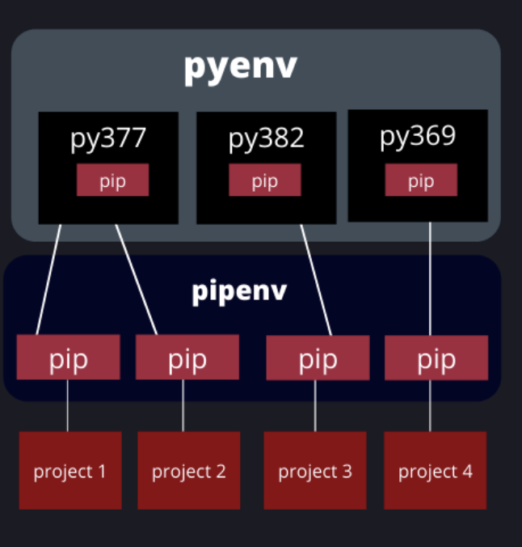
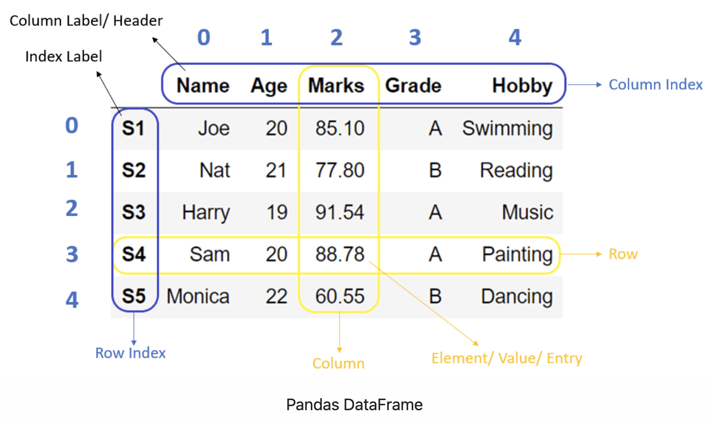

# Python for Data Engineering

In this practice we will develop and use a Python script to process data by using Data Engineering libraries such as Numpy and Pandas


### Prerequisites
* [Install Python on local machine](https://www.python.org/downloads/) 

### What You Will Learn
- Process data on a Python Script
- Usage of Numpy Library
- Usage of Pandas Library

# Practice

You are working on a Census Company, and they asking you to provide insights of the census data made on the population.

The company provides you a census data on csv file and they requested you to gather statistics and information from it.


### Requirements
* Create a Python Script to process the csv file which contains following census data from people:
  * **age:** Age of the person.
  * **workclass:** Private, Self-emp-not-inc, Self-emp-inc, Federal-gov, Local-gov, State-gov, Without-pay, Never-worked.
  * **education:** Bachelors, Some-college, 11th, HS-grad, Prof-school, Assoc-acdm, Assoc-voc, 9th, 7th-8th, 12th, Masters, 1st-4th, 10th, Doctorate, 5th-6th, Preschool.
  * **marital-status:** Married-civ-spouse, Divorced, Never-married, Separated, Widowed, Married-spouse-absent, Married-AF-spouse.
  * **occupation:** Tech-support, Craft-repair, Other-service, Sales, Exec-managerial, Prof-specialty, Handlers-cleaners, Machine-op-inspct, Adm-clerical, Farming-fishing, Transport-moving, Priv-house-serv, Protective-serv, Armed-Forces.
  * **relationship:** Wife, Own-child, Husband, Not-in-family, Other-relative, Unmarried.
  * **race:** White, Asian-Pac-Islander, Amer-Indian-Eskimo, Other, Black.
  * **sex:** Female, Male.
  * **hours-per-week:** Weekly working hours.
  * **native-country:** United-States, Cambodia, England, Puerto-Rico, Canada, Germany, Outlying-US(Guam-USVI-etc), India, Japan, Greece, South, China, Cuba, Iran, Honduras, Philippines, Italy, Poland, Jamaica, Vietnam, Mexico, Portugal, Ireland, France, Dominican-Republic, Laos, Ecuador, Taiwan, Haiti, Columbia, Hungary, Guatemala, Nicaragua, Scotland, Thailand, Yugoslavia, El-Salvador, Trinadad&Tobago, Peru, Hong, Holand-Netherlands.
  * **salary:** >50K,<=50K
* Obtain requested information of the steps when processing the file

# Let's do it!


## Step 1

### Python for Data Engineering

Python is a popular programming language for data engineering due to several reasons:

+ **Easy-to-learn and intuitive syntax**: Python's syntax is straightforward and easy to learn, making it an ideal language for beginners. The code is also easy to read and write, making it more efficient for data engineers to work with complex data pipelines.
+ **Wide range of libraries and frameworks**: Python has a large and growing collection of open-source libraries and frameworks, specifically designed for data engineering tasks. These libraries include Pandas, Numpy, Scikit-learn, TensorFlow, PyTorch, Apache Spark, and many more.
+ **Versatility**: Python is a versatile language that can be used for a wide range of tasks, from data processing and analysis to machine learning and data visualization. This versatility makes it an ideal language for data engineers who need to work with a variety of tools and technologies.
+ **Integration with big data technologies**: Python can be used to integrate with big data technologies like Hadoop, Spark, and Hive. This makes it easy for data engineers to work with large data sets, implement data processing workflows, and create scalable data pipelines.
+ **Community support**: Python has a large and active community of developers and data scientists who contribute to the development of libraries and frameworks. The community provides extensive support, resources, and documentation, making it easy for data engineers to find solutions to their problems.


### Python Virtual Environment
**A virtual environment is a self-contained Python environment that allows you to install and run packages separately from your main Python installation. This is especially useful for projects that have different package requirements.**



First, we are going to set up a virtual environment in Python, you will need to use the following commands:

```
python -m venv myenv
source myenv/bin/activate
```

* **'python -m venv myenv'** - This command creates a virtual environment with the name "myenv" using the venv module in Python. A virtual environment allows you to isolate the dependencies for your project from the rest of your system, making it easier to manage different versions of libraries for different projects.

* **'source myenv/bin/activate'** - This command activates the virtual environment "myenv". When a virtual environment is activated, any packages you install using pip will be installed in that environment, rather than in your system Python installation. This helps ensure that your project has access to the correct version of libraries, without affecting other projects that may have different requirements.

## Step 2

Now let's install numpy and pandas libraries with following command:

```
pip install numpy pandas
```

### Numpy
**NumPy is a library for the Python programming language that provides support for arrays and matrices. It is a fundamental library for scientific computing with Python, including support for a wide variety of mathematical and statistical operations. The main feature of NumPy is its N-dimensional array object, which allows you to perform operations on arrays of any size and shape, including element-wise operations, matrix multiplication, and basic linear algebra.**


### Pandas
**pandas is a library for the Python programming language that provides data structures and functions needed for data analysis and data manipulation. It is particularly well-suited for working with labeled, tabular data in a way that is intuitive and easy to understand. The main data structure in pandas is the DataFrame, which is a two-dimensional table with labeled rows and columns. With pandas, you can perform operations on the data, such as filtering, grouping, aggregating, and transforming, with ease. Additionally, pandas provides built-in support for working with data from a variety of sources, including CSV, Excel, SQL databases, and more.**




## Step 3
### Numpy Arrays
First let's create a python script to start using numpy arrays.

To do so, create a python file as **'numpy_example.py'** and add the following content

```
import numpy as np

# create a single-dimensional NumPy array
arr1 = np.array([1, 2, 3, 4, 5, 6, 6, 4, 3, 4, 2, 4])

# create a two-dimensional NumPy array
arr2 = np.array([[5, 2, 3], [4, 5, 5], [8, 9, 1]])

# calculate the average value of arr1
avg1 = np.mean(arr1)
print("Average value of arr1:", avg1)

# calculate the minimum value of arr2
min2 = np.min(arr2)
print("Minimum value of arr2:", min2)

# calculate the maximum value of arr2
max2 = np.max(arr2)
print("Maximum value of arr2:", max2)

# calculate the sum of the values in arr2
sum2 = np.sum(arr2)
print("Sum of values in arr2:", sum2)
```

The code creates following numpy arrays:
* arr1: It's a single dimension array
* arr2: It's a bi-dimensional array

And with the functions (sum, max, min, mean) will be obtained statistics data from the arrays.

Here are some most commons functions on numpy:
+ **np.array()**: Creates a NumPy array from a Python list or other iterable.
+ **np.arange()**: Creates a NumPy array with evenly spaced values between a start and end point.
+ **np.zeros()**: Creates a NumPy array of all zeros with a given shape.
+ **np.ones()**: Creates a NumPy array of all ones with a given shape.
+ **np.linspace()**: Creates a NumPy array with a specified number of evenly spaced values between a start and end point.
+ **np.reshape()**: Reshapes a NumPy array to a specified shape.
+ **np.concatenate()**: Concatenates two or more NumPy arrays along a specified axis.
+ **np.mean()**: Calculates the mean of a NumPy array.
+ **np.median()**: Calculates the median of a NumPy array.
+ **np.var()**: Calculates the variance of a NumPy array.
+ **np.std()**: Calculates the standard deviation of a NumPy array.
+ **np.min()**: Finds the minimum value of a NumPy array.
+ **np.max()**: Finds the maximum value of a NumPy array.
+ **np.argmin()**: Finds the index of the minimum value in a NumPy array.
+ **np.argmax()**: Finds the index of the maximum value in a NumPy array.
+ **np.sort()**: Sorts the values in a NumPy array.
+ **np.unique()**: Finds the unique values in a NumPy array.
+ **np.dot()**: Computes the dot product of two NumPy arrays.
+ **np.transpose()**: Transposes a NumPy array.
+ **np.random()**: Generates random numbers or arrays in a NumPy array.

Now let's run this file on the terminal with:
```
python numpy_example.py
```

## Step 4
### Reading Data with Numpy

Now we will use the CSV data source to read the data from it by using numpy.

Let's create now **'numpy_census.py'** python file with following content:

```
import numpy as np
import csv

# Load the CSV file into a NumPy array
with open('./resources/census_data.csv') as csvfile:
    data = np.genfromtxt(csvfile, delimiter=',', skip_header=1)

# Extract the hours-per-week and age columns
hours = data[:, 12] # extracts hours_per_week values on an array
age = data[:, 0] # extracs age values on an array

# Calculate the average hours-per-week
avg_hours = np.mean(hours)

# Find the maximum and minimum age
max_age = np.max(age)
min_age = np.min(age)
avg_age = np.mean(age)

# Print the results
print("Average hours-per-week:", avg_hours)
print("Maximum age:", max_age)
print("Minimum age:", min_age)
print("Average age:", avg_age)
```

In this example, we use the NumPy **genfromtxt()** function to load the given CSV file into a NumPy array. We then extract the hours-per-week, and age columns from the array and use various NumPy functions to perform calculations on these columns, such as calculating the average hours-per-week, and finding the maximum, minimum and average age.

As note:

+ In **data[:, 12]**, the colon **:** before the comma specifies that we want to select all rows of the data array. The number **12** after the comma specifies that we want to select the 12th column of the data array. So **data[:, 12]** selects all rows and the 12th column of the data array, which corresponds to the **"hours-per-week"** column in the given CSV file.

To run this file, do the following command:

```
python numpy_census.py
```

## Step 5
### Using Pandas Dataframes

Pandas dataframes are a two-dimensional data structure that allows you to store and manipulate tabular data. It's like a "table" data structure on Python.

Now let's create a **'pandas_example.py'** file with following content:

```
import pandas as pd

# Create a sample DataFrame
data = {'Name': ['Alice', 'Bob', 'Charlie', 'David', 'Eva'],
        'Age': [25, 30, 35, 40, 45],
        'Salary': [50000, 60000, 70000, 80000, 90000],
        'Experience': [3, 5, 7, 9, 11]}

df = pd.DataFrame(data)

# Calculate the average salary
avg_salary = df['Salary'].mean()

# Find the maximum and minimum age
max_age = df['Age'].max()
min_age = df['Age'].min()

# Use apply() to create a new columns ('Salary plus Experience' and 'Name with Age')
df['Salary plus Experience'] = df.apply(lambda row: row['Salary'] + row['Experience'], axis=1)
df['Name with Age'] = df.apply(lambda row: f"{row['Name']} is having {row['Age']} years old", axis=1)

# Print the results
print("Average salary:", avg_salary)
print("Maximum age:", max_age)
print("Minimum age:", min_age)
print(df)
```

In this example, we create a sample DataFrame using a Python dictionary and the Pandas DataFrame() constructor. We then perform some simple operations on the DataFrame, such as calculating the average salary, finding the maximum and minimum age, and using the **apply()** method to create a new column that has the sum of two existing columns.

The **apply()** method takes a function as an argument and applies that function to each row or column of the DataFrame. In this example, we use a lambda function to add the "Salary" and "Experience" columns together and create a new column called "Salary plus Experience".

Here are some most commons functions on Pandas Dataframes:
+ **pd.DataFrame()**: Creates a new Pandas DataFrame from a Python dictionary, list, or other data structure.
+ **df.head()**: Returns the first n rows of a DataFrame, where n is the argument passed to the function (defaults to 5).
+ **df.tail()**: Returns the last n rows of a DataFrame, where n is the argument passed to the function (defaults to 5).
+ **df.shape**: Returns a tuple with the number of rows and columns in a DataFrame.
+ **df.columns**: Returns a list of column names in a DataFrame.
+ **df.dtypes**: Returns a Series with the data type of each column in a DataFrame.
+ **df.describe()**: Generates a summary of descriptive statistics for the columns of a DataFrame, such as count, mean, standard deviation, minimum, maximum, and quartiles.
+ **df.info()**: Provides a concise summary of a DataFrame, including the number of non-null values, data types, and memory usage.
+ **df.isnull()**: Returns a DataFrame with the same shape as the original, where each element is a Boolean value indicating whether it is a null value (i.e., NaN).
+ **df.dropna()**: Returns a new DataFrame with all rows that contain null values removed.
+ **df.fillna()**: Returns a new DataFrame with all null values filled with a specified value or method.
+ **df.sort_values()**: Sorts a DataFrame by one or more columns, either in ascending or descending order.
+ **df.groupby()**: Groups a DataFrame by one or more columns and returns a DataFrameGroupBy object that can be used to perform further operations.
+ **df.apply()**: Applies a function to each row or column of a DataFrame.
+ **df.merge()**: Combines two or more DataFrames into a single DataFrame based on a common key or index.

Now let's run this file on the terminal with:
```
python pandas_example.py
```

## Step 6
### Reading and Writing Data with Pandas Dataframes
Now we will use the CSV data source to read the data from it by using pandas dataframes.

Let's create now **'pandas_census.py'** python file with following content:

```
import pandas as pd

# read the CSV file into a pandas DataFrame
df = pd.read_csv('resources/census_data.csv')

# calculate the average hours-per-week
avg_hours = df['hours-per-week'].mean()
print('Average hours-per-week:', avg_hours)

# calculate the minimum and maximum age
min_age = df['age'].min()
max_age = df['age'].max()
print('Minimum age:', min_age)
print('Maximum age:', max_age)

# create a new DataFrame with the specified columns
new_df = df[['age', 'education', 'native-country', 'salary']]

# save the new DataFrame to a CSV file
new_df.to_csv('census_demographics.csv', index=False)
print('DataFrame saved to census_demographics.csv')
```

In this script, we first read the **census_data.csv** file into a Pandas DataFrame using the **read_csv()** function. We then calculate the average hours-per-week, minimum and maximum age, and most common occupation using various DataFrame functions.

Then the script creates a new DataFrame with only the columns we are interested in (age, education, native-country, and salary) and save it to a new CSV file using the **to_csv()** function

Now let's run this file with the following command:

```
python pandas_census.py
```

And a new **'census_demographics.csv'** file will be created on current directory.

## HOMEWORK TIME !!!

**By using same pandas_census.py, modify the code to store on csv file the following:**

+ **age**: age
+ **education**: education
+ **native-country**: native-country
+ **salary**: salary
+ **age-is-above-21**: this column will contain 'true' in case the age is above 21, if not, then will have 'false'
+ **education-salary**: this column will have 'A person with {education} is having {salary}', where {education} refers to row's education, and {salary} refers to row's salary.

# Conclusion

This course has covered the basics of Numpy and Pandas, including setting up a virtual environment, reading in data, and performing transformations on that data. With these tools and techniques, you can begin working with large datasets and performing data analysis in Python.