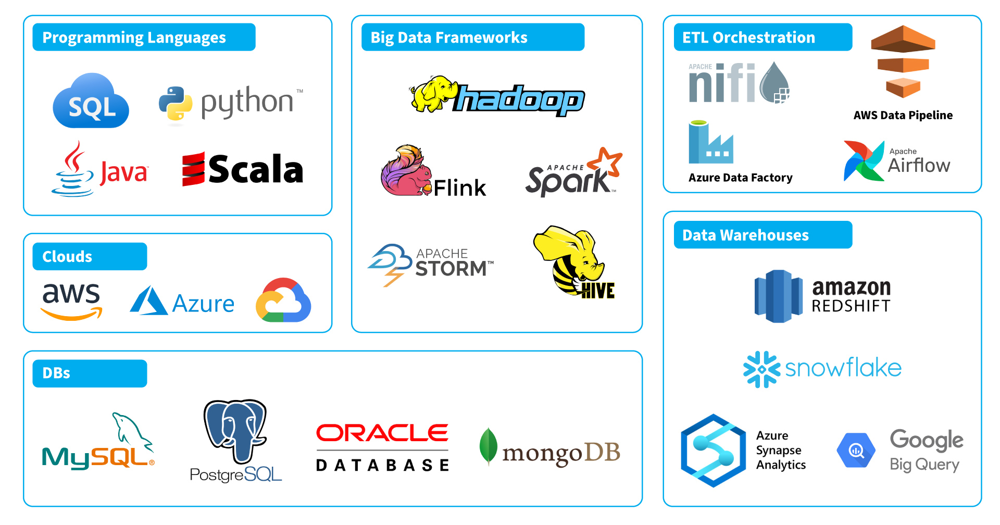

# Python for Data Engineering

In this project we will use some Data Engineering libraries (numpy and pandas) to create a python script to process data-


## Before start

### Why Python?

* `Easy-to-learn and intuitive syntax` \
  Beginner friendly syntax (easy to write and easy to read)
* `Wide range of libraries and frameworks` \
  Wide range of open-source libraries and frameworks for data engineering (Pandas, Numpy, Scikit-learn, TensorFlow, PyTorch, Apache Spark...)
* `Versatility` \
  Easy to write tasks for data processing, machine learning or a wide range of data utilities
* `Integration with big data technologies` \
  Easy integration with big data technologies (Hadoop, Spark, and Hive...)
* `Community support` \
  Extensive support, resources, and documentation

    

### Pre-setup concepts

Let's review some concepts and technologies we used during the pre-setup:

* `Virtual environment` \
  In python, a virtual environment a self-contained environment that allows you to install and run packages separately from your main Python installation. This means you can change with ease different python versions and different set of libraries depending your project purpouse.

* `Numpy` \
  The main NumPy feature is its N-dimensional array object, which allows you to perform operations on arrays of any size and shape, including element-wise operations, matrix multiplication, and basic linear algebra.

* `Pandas` \
  Provides data structures and functions needed for data analysis and data manipulation. Pandas also provides the type DataFrame, which is a two-dimensional table with labeled rows and columns. \
  With this type comes new operations, such as filtering, grouping, aggregating, and transforming.

  Additionally, pandas provides built-in support for working with data from a variety of sources, including CSV, Excel, SQL databases, and more.

  

## Prerequisites

* Follow the [pre-setup guideline][pre-setup]

## What You Will Learn

* Process data on a Python Script
* Usage of Numpy Library
* Usage of Pandas Library

## Practice

>Explore the numpy and pandas libraries then, provide insights of the census data made on the population.

### Requirements

Examine the contents on csv file then:

#### 1 Numpy array operations

Create a script that meet the following criteria named `numpy_example.py`

* Create a single dimension numeric array
* Create a 2 dimensions numericarray
* Print the average of the first array
* Print the minimum value of the second array
* Print the maximum value of the second array
* Print the sum of the values in arr2

#### 2 Numpy with files

Create a script that meet the following criteria named `numpy_census.py`

* Load the data from the csv file to python using `genfromtxt` function
* Extract `hours-per-week` values on an array
* Extract `age` values on an array
* Calculate the average `hours-per-week`
* Find the maximum, minimum and average `age`
* Print the results

#### 3 Pandas Dataframe

Create a script that meet the following criteria named `pandas_example.py`

* Create a sample dataframe with the following data:

  ```py
  {'Name': ['Alice', 'Bob', 'Charlie', 'David', 'Eva'],
  'Age': [25, 30, 35, 40, 45],
  'Salary': [50000, 60000, 70000, 80000, 90000],
  'Experience': [3, 5, 7, 9, 11]}
  ```

* Calculate the average salary
* Find the maximum and minimum age
* Create new column `Salary plus Experience` using the following function:

  ```py
  def myfunc(row):
    return row['Salary'] + row['Experience']
  ```

* Create new column `Name with Age` using a `lambda` function to create the follwing string

  ```py
  f"{row['Name']} is having {row['Age']} years old"
  ```

* Print the results

#### 4 Pandas with files

Create a script that meet the following criteria named `pandas_census.py`

* Load the data from the csv file to python using `read_csv` function
* Calculate the average hours-per-week
* Calculate the minimum and maximum age
  * Print the results
* Create a new DataFrame with the columns: `age`, `education`, `native-country` and `salary`
* Save the new DataFrame to a CSV file named `census_demographics.csv`

### Step 1: Numpy Arrays

Create a script that meet the following criteria named `numpy_example.py`

* Create a single dimension numeric array

  ```py
  import numpy as np

  arr1 = np.array([1, 2, 3, 4, 5, 6, 6, 4, 3, 4, 2, 4])
  ```

* Create a 2 dimensions numericarray

  ```py
  arr2 = np.array([[5, 2, 3], [4, 5, 5], [8, 9, 1]])
  ```

* Print the average of the first array

  ```py
  avg1 = np.mean(arr1)
  print("Average value of arr1:", avg1)
  ```

* Print the minimum value of the second array

  ```py
  min2 = np.min(arr2)
  print("Minimum value of arr2:", min2)
  ```

* Print the maximum value of the second array

  ```py
  max2 = np.max(arr2)
  print("Maximum value of arr2:", max2)
  ```

* Print the sum of the values in arr2

  ```py
  sum2 = np.sum(arr2)
  print("Sum of values in arr2:", sum2)
  ```

* Run the file

  ```sh
  python numpy_example.py
  ```

### Step 2: Reading Data with Numpy

Create a script that meet the following criteria named `numpy_census.py`

* Load the data from the csv file to python using `genfromtxt` function

  ```py
  import numpy as np

  with open('./census_data.csv') as csvfile:
    data = np.genfromtxt(csvfile, delimiter=',', skip_header=1)
  ```

* Extract `hours-per-week` and `age` values on an array

  ```py
  hours = data[:, 12]
  age = data[:, 0]
  ```

* Calculate the average `hours-per-week`

  ```py
  avg_hours = np.mean(hours)
  ```

* Find the maximum, minimum and average `age`

  ```py
  max_age = np.max(age)
  min_age = np.min(age)
  avg_age = np.mean(age)
  ```

* Print the results

  ```py
  print("Average hours-per-week:", avg_hours)
  print("Maximum age:", max_age)
  print("Minimum age:", min_age)
  print("Average age:", avg_age)
  ```

* Run the file

  ```sh
  python numpy_census.py
  ```

### Step 3: Using Pandas Dataframes

Create a script that meet the following criteria named `pandas_example.py`

* Create a sample dataframe with the following data...

  ```py
  import pandas as pd

  data = {'Name': ['Alice', 'Bob', 'Charlie', 'David', 'Eva'],
          'Age': [25, 30, 35, 40, 45],
          'Salary': [50000, 60000, 70000, 80000, 90000],
          'Experience': [3, 5, 7, 9, 11]}

  df = pd.DataFrame(data)
  ```

* Calculate the average salary

  ```py
  avg_salary = df['Salary'].mean()
  ```

* Find the maximum and minimum age

  ```py
  max_age = df['Age'].max()
  min_age = df['Age'].min()
  ```

* Create new column `Salary plus Experience` using the following function..

  ```py
  def myfunc(row):
    return row['Salary'] + row['Experience']
  
  df['Salary plus Experience'] = df.apply(myfunc, axis=1)
  ```

* Create new column `Name with Age` using a `lambda` function to create the following string...

  ```py
  df['Name with Age'] = df.apply(lambda row: f"{row['Name']} is having {row['Age']} years old", axis=1)
  ```

* Print the results

  ```py
  print("Average salary:", avg_salary)
  print("Maximum age:", max_age)
  print("Minimum age:", min_age)
  print(df)
  ```

* Run the file

  ```sh
  python pandas_example.py
  ```

### Step 4: Reading and Writing Data with Pandas Dataframes

Create a script that meet the following criteria named `pandas_census.py`

* Load the data from the csv file to python using `read_csv` function

  ```py
  import pandas as pd

  df = pd.read_csv('./census_data.csv')
  ```

* Calculate the average hours-per-week

  ```py
  avg_hours = df['hours-per-week'].mean()
  print('Average hours-per-week:', avg_hours)
  ```

* Calculate the minimum and maximum age and print the results

  ```py
  min_age = df['age'].min()
  max_age = df['age'].max()
  print('Minimum age:', min_age)
  print('Maximum age:', max_age)
  ```

* Create a new DataFrame with the columns: `age`, `education`, `native-country` and `salary`

  ```py
  new_df = df[['age', 'education', 'native-country', 'salary']]
  ```

* Save the new DataFrame to a CSV file named `census_demographics.csv`

  ```py
  new_df.to_csv('census_demographics.csv', index=False)
  ```

* Run the file

  ```sh
  python pandas_census.py
  ```

## Homework

Using as base `pandas_census.py`, add the following columns

* `age`: age
* `education`: education
* `native-country`: native-country
* `salary`: salary
* `age-is-above-21`: this column will contain 'true' in case the age is above 21, if not, then will have 'false'
* `education-salary`: this column will have 'A person with {education} is having {salary}', where {education} refers to row's education, and {salary} refers to row's salary.

## Conclusion

`Numpy` and `Pandas` libraries are one of the most common for data engineering tasks, including data processing, analysis, and manipulation.

## Still curious

Do you wnat to know more about Numpy and Pandas?

* Why is Numpy so popular?

  1. Array Operations: Numpy base object is called **ndarray**, this stands for *nth dimension Array*, this allows operations with the same generic object, making processing simpler.
  2. Low level coding: Under the hood **ndarray** along with other functions, are implemented in C and Fortran, which allows faster operations than Python
  3. Wide operation range: Numpy implements a large set of methods (operations), giving most of the time the need of not requiring other tools for data processing
  4. Interoperability: Usually you will find Numpy related libraries for integration with other libraries, such as SciPy, MatplobLib, Pandas...
  5. Open source: Community is always on top and you can make your own modiffications

* You may also want to consider some disadvantages:

  1. Limited Support for Non-Numerical Data: NumPy is primarily designed for numerical computations. It is less suitable for handling non-numeric data or structured data like strings, dates, and categorical variables.
  2. Single Data Type: NumPy arrays are homogeneous, meaning all elements must have the same data type. This can be limiting when working with mixed data types or structured data.
  3. Memory Usage: NumPy can consume a significant amount of memory, especially when dealing with large arrays. For certain memory-constrained applications, this can be a drawback.
  4. Not Built for Data Manipulation: While NumPy provides basic array manipulation capabilities, it lacks some of the advanced data manipulation features available in libraries like Pandas.
  5. Less User-Friendly for Beginners: NumPy's syntax can be less intuitive for beginners.

* Why is Pandas so popular?

  1. Tabular Data Handling: Pandas provides easy-to-use data structures like DataFrames and Series, which are well-suited for working with structured, tabular data.
  2. Data Cleaning: Pandas offers robust tools for data cleaning and preprocessing, including handling missing values, data imputation, and removing duplicates.
  3. Data Transformation: You can easily reshape and transform data using operations like merging, pivoting, and aggregating, making it ideal for data wrangling.
  4. Data Exploration: Pandas allows for quick data exploration and summary statistics, helping users gain insights into their datasets.
  5. Time Series Analysis: It has extensive support for time series data, including date and time parsing, resampling, and rolling calculations.
  6. Integration with Other Libraries: Pandas seamlessly integrates with other Python libraries, such as NumPy, Matplotlib, and Scikit-Learn, creating a powerful ecosystem for data analysis and machine learning.
  7. I/O Operations: Pandas supports a wide range of file formats for reading and writing data, including CSV, Excel, SQL databases, and JSON.
  8. Customization: You can customize and extend Pandas' functionality by creating custom functions and applying them to your data.

* You may also want to consider some disadvantages:

  1. Memory Usage: Pandas can be memory-intensive, especially when working with large datasets. It may not be suitable for very large datasets that do not fit into memory.
  2. Learning Curve: While Pandas is powerful, its syntax and functionality can be complex for beginners. It may take some time to become proficient in using the library effectively.
  3. Performance: Some operations in Pandas can be slower than equivalent operations in low-level languages like C++. For highly performance-critical tasks, specialized libraries may be more suitable.
  4. Limited Non-Tabular Data Handling: Pandas is designed for tabular data, so it may not be the best choice for handling non-tabular data or unstructured data.
  5. Compatibility: Minor version updates of Pandas can sometimes lead to compatibility issues with existing code and dependencies.
  6. Parallel Processing: Pandas lacks built-in support for parallel processing, which can be a limitation when working with large datasets that could benefit from parallelization.
  7. Global State: Pandas modifies global settings, and users may encounter issues when working with multiple Pandas-based projects in the same environment.

What alternatives exists to Numpy and Pandas? In which scenarios we want to use those alternatives?

* [What is Numpy used for in Python][numpy_uses_python]
* [Numpy: Getting started][numpy_docs]
* [When not to use Numpy][no_use_numpy]

* [Pandas: Docs][pandas_docs]
* [Benchmark: Pandas Alternatives][pandas_alt]

## Links

### Used during this session

* [Pre Setup][pre-setup]

* [What is Numpy used for in Python][numpy_uses_python]
* [Numpy: Getting started][numpy_docs]
* [When not to use Numpy][no_use_numpy]

* [Pandas: Docs][pandas_docs]
* [Benchmark: Pandas Alternatives][pandas_alt]

### Reinforce Lesson and homework help

* [NumPy Tutorial][py_numpy]
* [NumPy and Pandas Tutorial – Data Analysis with Python][py_numpy_pandas]
* [Python Pandas Tutorial][py_pandas]
* [How to get started with scripting in Python][py_scripting]
* [Guide to Arrays in Python][guide_arrays]
* [How slicing in Python works][slicing]
* [Python: Array Exercises, Practice, Solution][array_exercises]

[pre-setup]: ./pre-setup.md

[numpy_uses_python]: https://www.activestate.com/resources/quick-reads/what-is-numpy-used-for-in-python/
[numpy_docs]: https://numpy.org/doc/stable/user/absolute_beginners.html
[no_use_numpy]: https://medium.com/@abhi16.2007/when-i-should-not-use-numpy-1e00aafb231b

[pandas_docs]: https://pandas.pydata.org/docs/ç
[pandas_alt]: https://www.datacamp.com/tutorial/benchmarking-high-performance-pandas-alternatives

[py_numpy_pandas]: https://cloudxlab.com/blog/numpy-pandas-introduction/
[py_numpy]: https://www.tutorialspoint.com/numpy/index.htm
[py_pandas]: https://www.tutorialspoint.com/python_pandas/index.htm
[py_scripting]: https://www.redhat.com/sysadmin/python-scripting-intro
[guide_arrays]: https://stackabuse.com/guide-to-arrays-in-python/
[slicing]: https://stackoverflow.com/questions/509211/how-slicing-in-python-works
[array_exercises]: https://www.w3resource.com/python-exercises/array/
