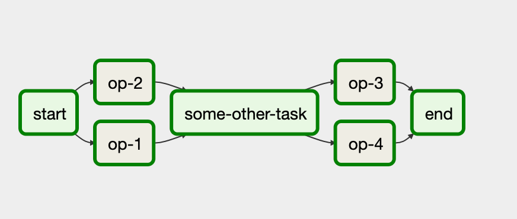
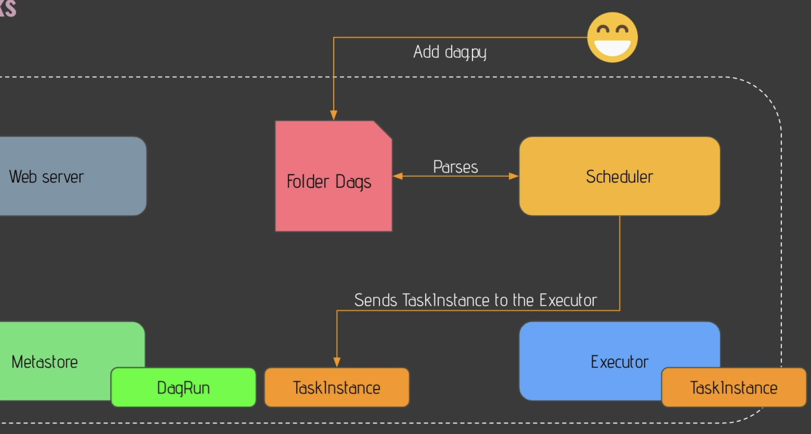
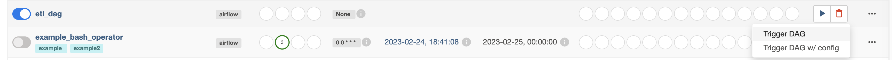
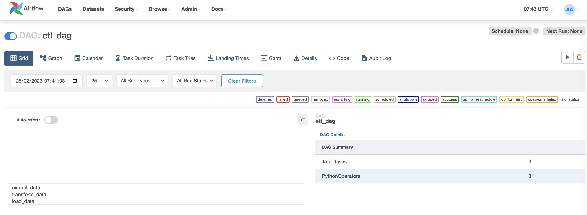
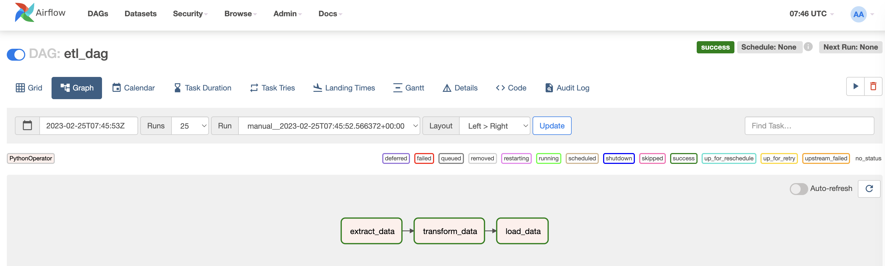

# ETL Introduction and Airflow

In this practice we will develop a simple ETL pipeline on Airflow to understand each part of the ETL process

## Prerequisites

* [Pre Setup][pre_setup]
* [Install Docker][install_docker]

## What You Will Learn

* ETL Concepts
* Airflow Components
* Airflow DAGs

## Practice

Suppose you are working on an Ad Company that process data from the users to then know what is the best suitable ad to give them when they are navigating on the internet.

The company is receiving JSON files from the user events, and they want you to transform them to CSV format because later they want to load it into a Database.

### Requirements

* Use Airflow to create an ETL pipeline to process JSON file into a CSV file

### Step 1 - Creating Your First DAG

DAGs (Directed Acyclic Graphs) are a collection of tasks that define a workflow in Apache Airflow. Each DAG defines a series of tasks and their dependencies, which the scheduler uses to determine the order of execution.

> DAG's are a series of steps that are executed when triggered by the scheduler.

For this docker compose environment, the DAGs for Apache Airflow are stored in the **./dags** directory, which is mapped to the /opt/airflow/dags directory in the Airflow Web Server and Airflow Scheduler containers.

Follow the [file_dag.py](dags/file_dag.py), so you can know the process that a DAG follows for it to work.

The DAG reads the files that are into /opt/airflow/dags/files/input and passes them with a new UUID name
in the folder /opt/airflow/dags/files/raw but now in parquet type (which is a row-based filesystem).
Then it's transformed from [...]/raw to [...]/clean with new columns and the required transformations.
And finally moved from [...]/clean/ to [...]/output/

### Step 2 - Check Your New DAG on Airflow UI

Now let's go back to Airflow UI and trigger your DAG to run it.

To do so, on the Airflow UI, enable your **etl_dag** on the left part by clicking the button, and on the right side click the Play button and select 'Trigger DAG' to run it:

Then your DAG will be start running, so in this case a Task Instance will be start executing, and to see the execution, click on **etl_dag** label and you will see the following screen:

Now to see the Graph of the latest execution, you can click on the **'Graph'** section and you will see the state of the execution of each task

In this case all the tasks are green, so that means the Tasks were executed succefully.

## Conclusion

In this practice, you learned how to configure Apache Airflow using Docker Compose and how to create DAGs and ETL workflows in Apache Airflow. By using Apache Airflow and Docker Compose, you can build robust and scalable ETL workflows that can be easily monitored and maintained.

## Still curious

>Airflow is the most common open source orchestrator for data pipelinesm, however it has more uses, some additional uses of airflow may include:

*DevOps and Infrastructure Automation
*ETL (Extract, Transform, Load)
*Content Management
*Finance and Billing
*Healthcare and Medical Data
*Manufacturing and Supply Chain
*IoT (Internet of Things)
*Compliance and Regulatory Reporting
*Business Process Automation
*Educational Institutions

***Note**As a general measure, if you can use a CRON like service, airflow can help you to do the same. But be careful, there are additional tools that may suite better your needs depending on what you are planning to use.*

>

## Links

* [Pre Setup][pre_setup]
* [Install Docker][install_docker]

[pre_setup]: pre-setup%20README.md

[install_docker]: https://docs.docker.com/engine/install/
