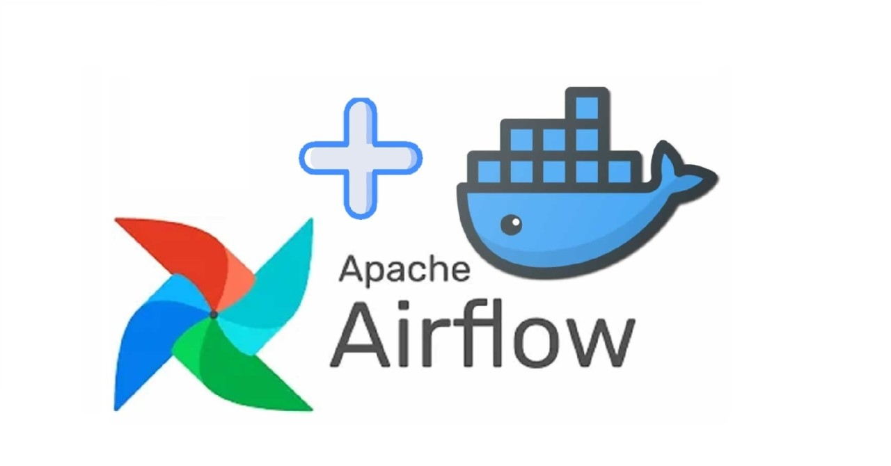

# ETL Introduction and Airflow

In this practice we will develop a simple ETL pipeline on Airflow to understand each part of the ETL process


### Prerequisites
* [Install docker](https://docs.docker.com/engine/install/)
### What You Will Learn
- ETL Concepts
- Airflow Components
- Airflow DAGs

# Practice

You are working on a Tech Company that process high volume of data from historical weather telemetry, and they requested you to create a ETL pipeline to process the information




### Requirements
* Use Airflow to create the ETL pipeline

# Let's do it!


## Step 1

Run the docker-compose yml that start docker containers for Airflow:
```
docker-compose up -d
```

### Understanding the Docker Compose file
The provided Docker Compose file is a YAML file that describes the services required for Apache Airflow to run. The file consists of several services, each of which is defined as a container:

* Postgres: A relational database that stores metadata for Apache Airflow.
* Redis: An in-memory data structure store used for Apache Airflow's Celery Executor.
* Airflow Web Server: The web server for Apache Airflow's web interface.
* Airflow Scheduler: The scheduler for Apache Airflow that runs DAGs and monitors task execution.
* Airflow Worker: The worker that executes tasks assigned by the scheduler.

The version field defines the version of Docker Compose that this file uses. The x-airflow-common section is an anchor that is reused by other services to specify common configurations. The environment section defines the environment variables used by Apache Airflow, such as the database connection string and Celery configurations. The volumes section maps the local directories to directories within the containers, and the user field specifies the user and group that run the container.

### Creating DAGs
DAGs (Directed Acyclic Graphs) are a collection of tasks that define a workflow in Apache Airflow. Each DAG defines a series of tasks and their dependencies, which the scheduler uses to determine the order of execution. The DAGs for Apache Airflow are stored in the ./dags directory, which is mapped to the /opt/airflow/dags directory in the Airflow Web Server and Airflow Scheduler containers.

To create a new DAG, create a new Python script in the ./dags directory. In the script, you can use the Python API provided by Apache Airflow to define your workflow.

## ETL in Apache Airflow
ETL (Extract, Transform, Load) is a process that involves extracting data from various sources, transforming the data into a desired format, and loading the transformed data into a destination database. Apache Airflow provides a flexible platform to build ETL workflows by allowing you to define tasks, dependencies, and execution order.

For example, to create an ETL workflow to extract data from a source database, transform the data, and load it into a destination database, you can define tasks for each of these steps using the Apache Airflow API and then specify the dependencies between the tasks.

# Conclusion

In this practice, you learned how to configure Apache Airflow using Docker Compose and how to create DAGs and ETL workflows in Apache Airflow. By using Apache Airflow and Docker Compose, you can build robust and scalable ETL workflows that can be easily monitored and maintained.