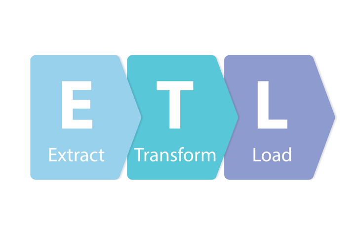
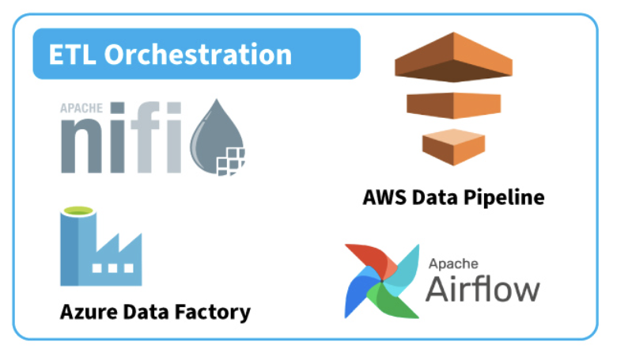
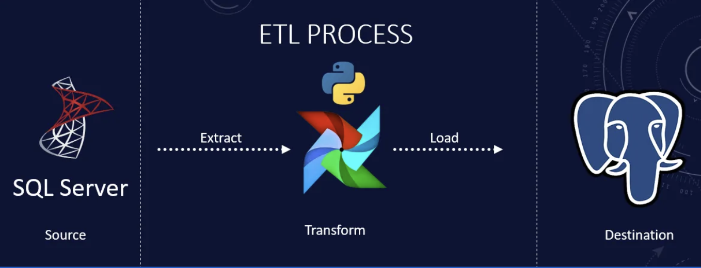
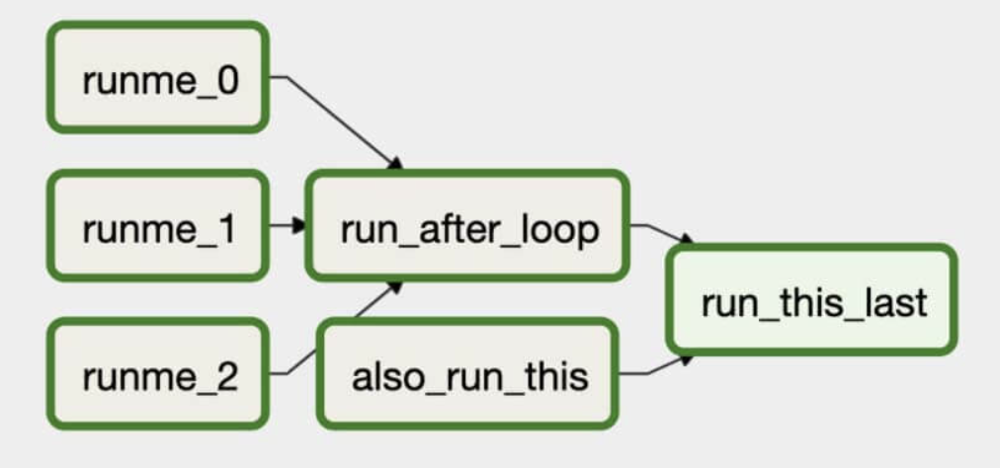
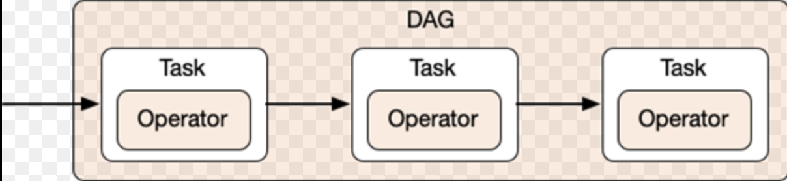
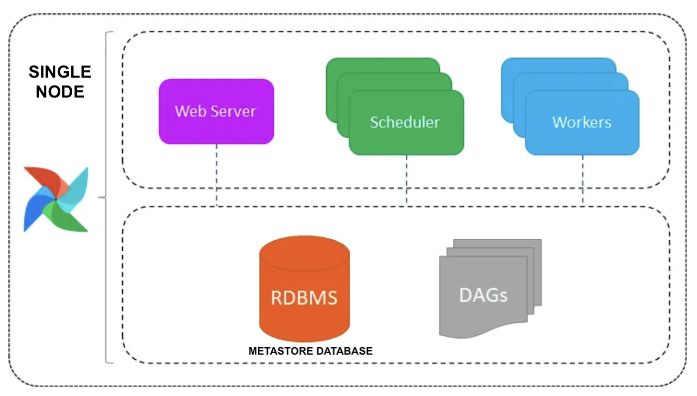
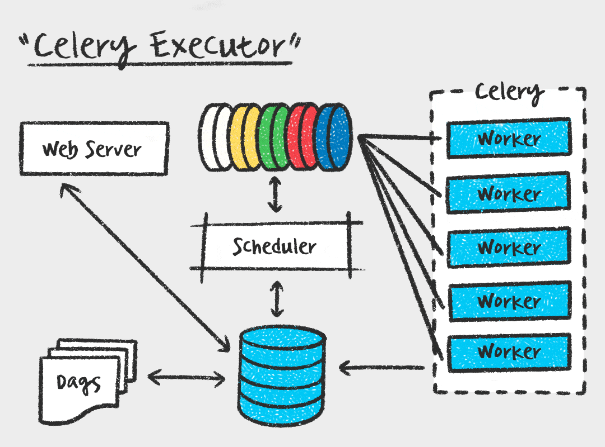
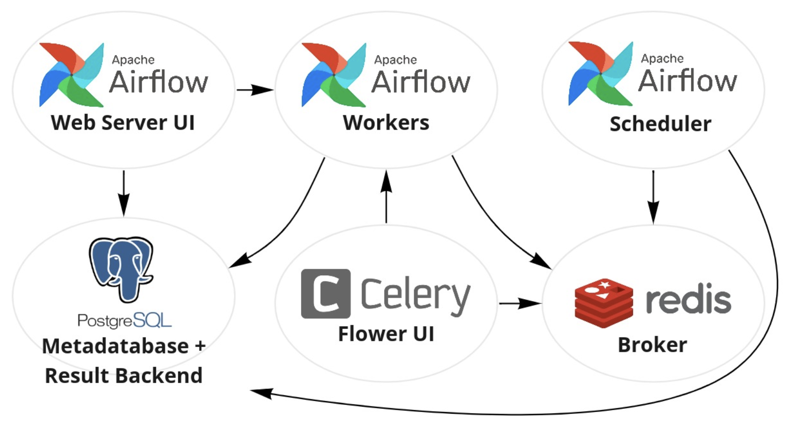
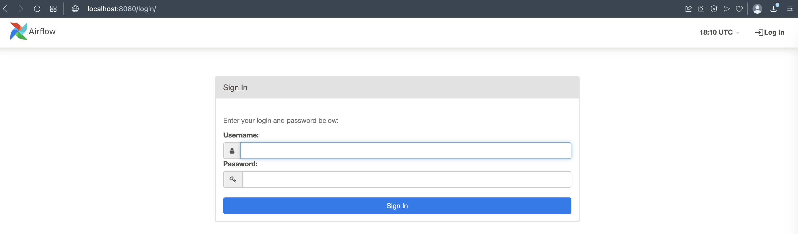
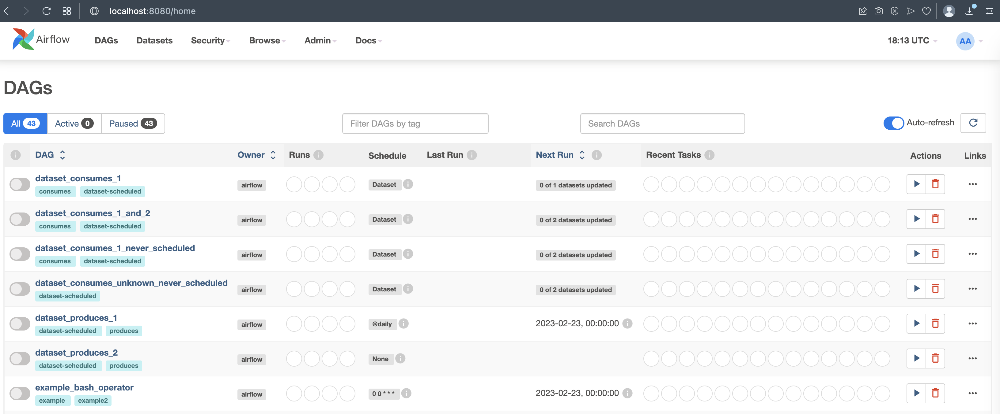

# ETL Introduction and Airflow

In this practice we will develop a simple ETL pipeline on Airflow to understand each part of the ETL process



### Prerequisites
* [Install docker](https://docs.docker.com/engine/install/)
### What You Will Learn
- ETL Concepts
- Airflow Components
- Airflow DAGs

# Practice

Suppose you are working on an Ad Company that process data from the users to then know what is the best suitable ad to give them when they are navigating on the internet

The company is receiving JSON files from the user events, and they want you to transform them to CSV format because later they want to load it into a Database


### Requirements
* Use Airflow to create an ETL pipeline to process JSON file into a CSV file

# Let's do it!


## Step 1

### ETL
ETL stands for **Extract, Transform, Load**, and it refers to the process of extracting data from one or more sources, transforming the data into a suitable format, and loading it into a target destination for storage or analysis.


The ETL process can be broken down into three main stages:

+ **Extract**: In this stage, data is extracted from one or more sources. The sources can be databases, files, APIs, or any other data source that contains the data you need. The data is typically extracted using some form of query language or API, and it may be necessary to perform some data cleaning or filtering to ensure that only the relevant data is extracted.
+ **Transform**: In this stage, the extracted data is transformed into a suitable format for analysis or storage. This may involve cleaning the data, reformatting it, combining it with other data sources, or performing other data transformations. The data may be transformed using a programming language, a specialized tool, or a combination of both.
+ **Load**: In this stage, the transformed data is loaded into a target destination. The target destination may be a database, a data warehouse, a data lake, or any other storage solution that is suitable for the specific use case. The data may be loaded using a database connection, an API, or a specialized tool, depending on the destination.

The ETL process is critical for many data-driven businesses and organizations, as it allows them to extract, transform, and load large volumes of data from multiple sources into a centralized location for analysis and reporting


For ETL, there are many platforms, tools and frameworks that can be used to implement an ETL Pipeline, such as: **NiFi, Airflow, AWS Data Pipeline, Azure Data Factory** and many others



### Airflow

**Airflow** is an open-source platform that is an **Orchestrator** and can be used to orchestrate an **ETL pipeline**. Apache Airflow is a well-known open-source workflow management system that provides data engineers with an intuitive platform for designing, scheduling, tracking, and maintaining their complex data pipelines on **Python Code**.



Here are some important concepts to understand about Airflow:

+ **DAG**: A Directed Acyclic Graph is the main unit of work in Airflow. It represents a workflow as a set of tasks that are connected by dependencies, and the dependencies define the order in which tasks must be executed.



+ **Operator**: An Operator is a specific type of job in Airflow, and represents an atomic unit of work. It can be a BashOperator that runs a shell command, a PythonOperator that runs a Python function, or any other type of operator.
+ **Task**: A Task is class that has one or more operators with a specific set of parameters. Tasks are created as nodes in the DAG and can be thought of as the building blocks of a workflow.



+ **Task Instance**: A Task Instance is a specific execution of a task in a DAG. Each time a task is scheduled and run, a new task instance is created.
+ **Scheduler**: The Scheduler is a core component of Airflow that is responsible for scheduling and executing tasks based on the dependencies specified in the DAG.
+ **Executor**: The Executor is responsible for actually executing the tasks that have been scheduled by the scheduler. There are several types of executors available in Airflow, including the **LocalExecutor, CeleryExecutor, and KubernetesExecutor**.
+ **Metastore/Metadata Database**: The Metastore Database is a component of Airflow that stores metadata about DAGs, tasks, task instances, and other Airflow components. By default, Airflow uses an SQLite database for the Metastore, but it can be configured to use other databases such as MySQL, Postgres, or Oracle.
+ **Web Server**: The Airflow Web Server is a component that provides a **web-based interface for interacting with Airflow**.

### Airflow's Executor Modes

Airflow supports multiple executor modes, which determine how tasks are executed across a cluster of worker nodes. Some Executor modes are:

+ **Local Executor**: The Local Executor is a **single-node executor** that executes tasks sequentially on the same machine as the Airflow scheduler. In this mode, each task is executed one at a time, which limits concurrency and scalability. However, it is a simpler executor to set up and maintain, making it a good option for smaller deployments or testing environments.



+ **Celery Executor**: The Celery Executor is a distributed executor that uses Celery as the message queue and worker management system. In this mode, **tasks are executed on one or more worker nodes in parallel**, which allows for high scalability and concurrency. Each task is sent as a message to the Celery message queue, and a worker picks up the message and executes the task. The Celery Executor is recommended for large-scale deployments where high concurrency is needed.




Now let's get started with the practice!

First, we are going to run the docker-compose.yml that start docker containers that has Airflow Celery Components, to run it execute following command:
```
docker-compose up -d
```

### Understanding the Docker Compose file
The provided Docker Compose file is a YAML file that describes the services required for Apache Airflow to run. The file consists of several services, each of which is defined as a container:

* **Postgres**: A relational database that stores metadata for Apache Airflow (It's the Metastore Database).
* **Redis**: An in-memory data structure store used for Apache Airflow's Celery Executor.
* **Airflow Web Server**: The web server for Apache Airflow's web interface.  It can be accessed at **http://localhost:8080**
* **Airflow Scheduler**: The scheduler for Apache Airflow that runs DAGs and monitors task execution.
* **Airflow Worker**: The worker that executes tasks assigned by the scheduler.
* **Airflow Triggerer**: Component that is responsible for triggering the scheduling of DAG runs.
* **Airflow CLI**: Component that provides an interface for interacting with the Airflow command-line interface (CLI).
* **Airflow Flower UI**: Component that provides a web-based monitoring tool for Celery workers. It can be accessed at **http://localhost:5555**
* **Airflow Init**: This Service sets up initial configuration parameters when the containers are started. It also runs database migrations and creates the administrator account.

The version field defines the version of Docker Compose that this file uses. The x-airflow-common section is an anchor that is reused by other services to specify common configurations. The environment section defines the environment variables used by Apache Airflow, such as the database connection string and Celery configurations. The volumes section maps the local directories to directories within the containers, and the user field specifies the user and group that run the container.



## Step 2

Now let's start exploring Airflow Web UI.

Once docker-compose runs all the Airflow Celery component containers, now let's open a web browser and open following URL to access to Airflow Web UI:

http://localhost:8080

Once opened you will see following screen:



Once there, the UI will ask username and password, and type **airflow** for both of them:


Now you will see the Airflow UI console with some example default DAGs:



## Step 3

### Creating DAGs
DAGs (Directed Acyclic Graphs) are a collection of tasks that define a workflow in Apache Airflow. Each DAG defines a series of tasks and their dependencies, which the scheduler uses to determine the order of execution. The DAGs for Apache Airflow are stored in the ./dags directory, which is mapped to the /opt/airflow/dags directory in the Airflow Web Server and Airflow Scheduler containers.

To create a new DAG, create a new Python script in the ./dags directory. In the script, you can use the Python API provided by Apache Airflow to define your workflow.


# Conclusion

In this practice, you learned how to configure Apache Airflow using Docker Compose and how to create DAGs and ETL workflows in Apache Airflow. By using Apache Airflow and Docker Compose, you can build robust and scalable ETL workflows that can be easily monitored and maintained.