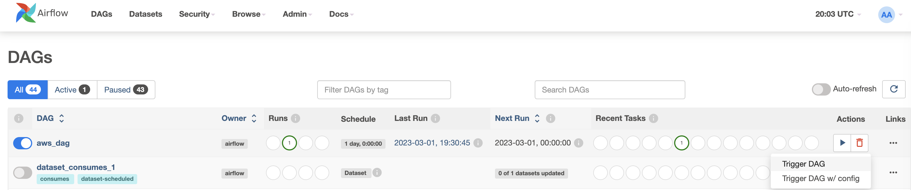
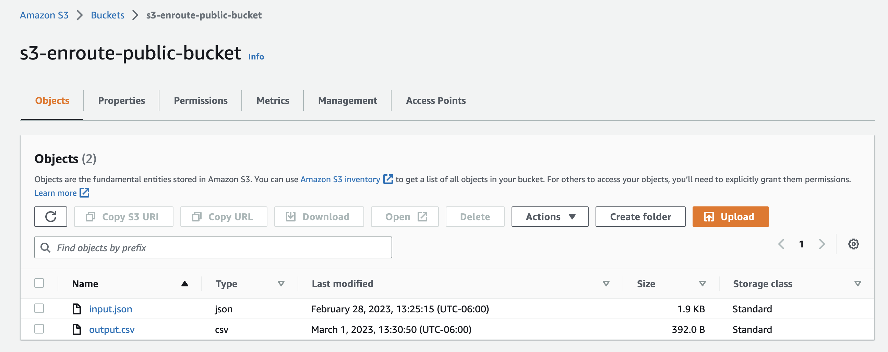

# Airflow and Cloud Introduction

In this practice we will develop a simple ETL pipeline on Airflow and start using cloud services on them.

### Prerequisites

* [Install docker](https://docs.docker.com/engine/install/)

### What You Will Learn

- Airflow Components
- Airflow DAGs
- Cloud Concepts
- AWS Introduction

# Practice

Suppose you are working on an Ad Company that process data from the users to then know what is the best suitable ad to
give them when they are navigating on the internet.

The company is receiving JSON files from the user events and those are stored on S3, and they want you to transform them
to CSV format at S3 because later they want to load it into a Database.

### Requirements

* Use Airflow to create an ETL pipeline to process JSON file into a CSV file at S3

# Let's do it!

## Step 2

Now let's create an S3 Public Bucket on AWS.

Creating a Public S3 Bucket with Public Access:

1. Log in to the AWS Management Console and navigate to the S3 service.
2. Click on "Create Bucket" and follow the prompts to create a new S3 bucket.
3. During the creation process, choose "Public" for the bucket access control.
4. After the bucket is created, go to the Permissions tab and select "Bucket Policy".
5. Enter a policy that grants public read access to the bucket.

Note: Be aware of the security implications of creating a public S3 bucket, as anyone on the internet will be able to
access the files in the bucket.

## Step 3

### Airflow Hooks

An Airflow Hook is an interface to external systems or databases that allows Airflow tasks to interact with those
systems. Hooks abstract away the details of the system's API or protocol and provide a consistent interface for tasks to
use.

Now let's create an AirflowDAG

Follow the [aws_dag.py](dags/aws_dag.py), so you can know the process that a DAG follows for it to work.

## Step 4

### Check Your New DAG on Airflow UI

Now let's go back to Airflow UI and trigger your DAG to run it.

To do so, on the Airflow UI, enable your **aws_dag** on the left part by clicking the button, and on the right side
click the Play button and select 'Trigger DAG' to run it:

Now let's review the S3 Bucket and check that output.csv is on the bucket:

## Homework Time!!

Now modify **aws_dag.py** code, to have 3 tasks instead of 1 task, the tasks will be the following:

+ **extract_data**: Task that has as a parameters (**s3_bucket_name, s3_key_name, aws_conn_id**) and this task reads
  from the JSON data file from S3Hook and the output is the **input_json** string
+ **transform_data**: Task that has as a parameters the **input_json** string, and it transforms the JSON string into
  CSV string similar as **csv_string** and the output is **csv_string**
+ **load_data**: Task that has as a parameters (**aws_conn_id, s3_bucket_name, csv_string**) and this task put the CSV
  file into the bucket, also the CSV file should be named as '**your_name_lastnamame.csv**'

And the DAG flow should be: **extract_data >> transform_data >> load_data**

# Conclusion

In conclusion, using AWS and Airflow together with S3 Hooks can provide a highly scalable and flexible platform for
automating data workflows in the cloud. With AWS, you have access to a wide range of powerful services and tools, such
as S3, EC2, and RDS, that can help you store, process, and analyze data. Airflow provides a flexible and easy-to-use
platform for defining, scheduling, and monitoring workflows, while S3 Hooks allow you to seamlessly integrate S3 with
your workflows.
