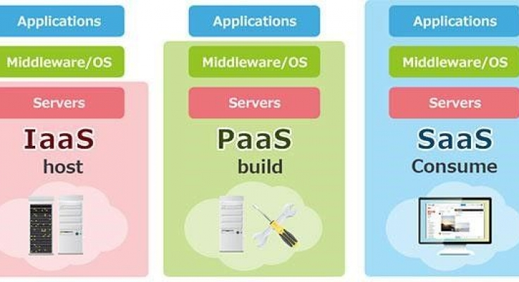
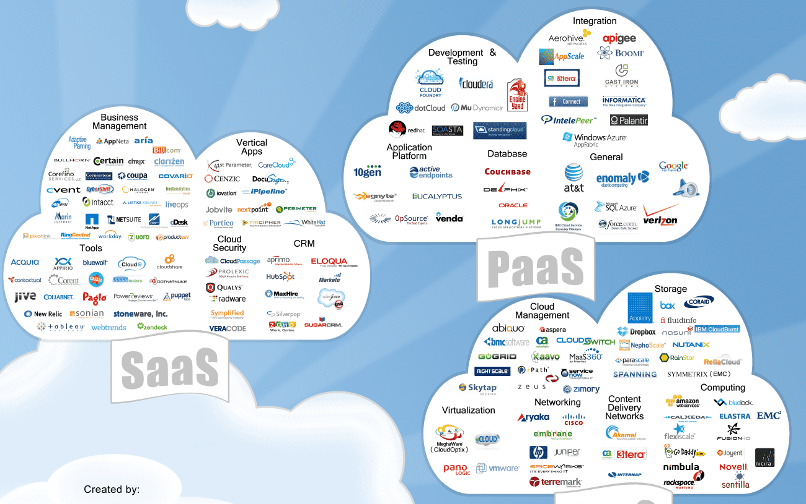
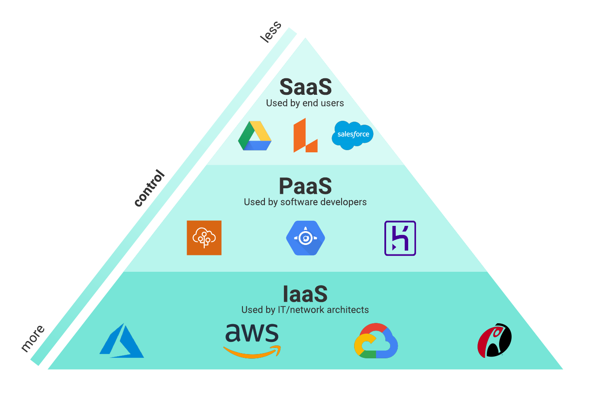
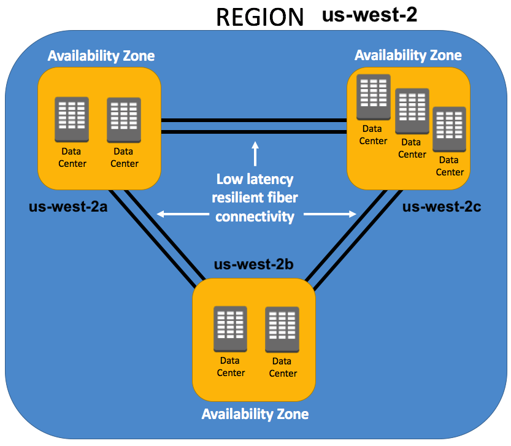
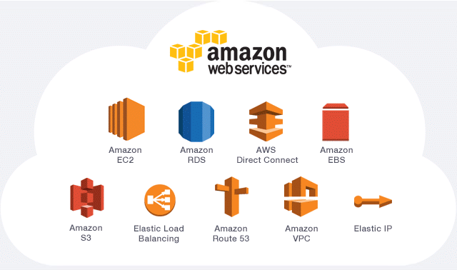
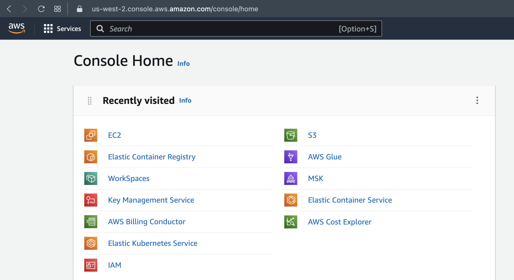

# Airflow and Cloud Introduction

In this practice we will develop a simple ETL pipeline on Airflow and start using cloud services on them.


### Prerequisites
* [Install docker](https://docs.docker.com/engine/install/)

### What You Will Learn
- Airflow Components
- Airflow DAGs
- Cloud Concepts
- AWS Introduction

# Practice

Suppose you are working on an Ad Company that process data from the users to then know what is the best suitable ad to give them when they are navigating on the internet.

The company is receiving JSON files from the user events and those are stored on S3, and they want you to transform them to CSV format at S3 because later they want to load it into a Database.


### Requirements
* Use Airflow to create an ETL pipeline to process JSON file into a CSV file at S3

# Let's do it!

## Step 1

### Cloud Computing
Cloud computing is the delivery of on-demand computing resources, such as servers, storage, databases, software, and analytics, over the internet. Rather than owning and maintaining physical servers and infrastructure, users can access these resources from cloud service providers like Amazon Web Services (AWS), Microsoft Azure, or Google Cloud Platform.

Cloud service providers offer several benefits, including **scalability, flexibility, cost-effectiveness, and enhanced security**, making cloud computing an attractive option for businesses of all sizes.


### Software as a Service (SaaS)

SaaS is a software delivery model where the software application is hosted by the service provider and made available to the users over the internet. Users can access the software through a web browser or app, and the provider handles all the maintenance and updates.

AWS offers several SaaS solutions, including Amazon Chime, a communication and collaboration service, and Amazon WorkDocs, a secure content creation, storage, and collaboration service.



### Platform as a Service (PaaS)

PaaS is a cloud computing model that provides developers with a platform to build, deploy, and manage applications without having to worry about infrastructure. The provider handles the underlying infrastructure, including servers, storage, and network, while the developer can focus on building and deploying their application.

AWS offers several PaaS solutions, including AWS Elastic Beanstalk, a service that makes it easy to deploy and run applications, and AWS Lambda, a serverless computing service.



### Infrastructure as a Service (IaaS)

IaaS is a cloud computing model that provides users with access to virtualized computing resources over the internet. The provider offers virtualized servers, storage, and network infrastructure that users can provision and manage.

AWS offers several IaaS solutions, including Amazon Elastic Compute Cloud (EC2), a service that provides resizable compute capacity in the cloud, and Amazon Simple Storage Service (S3), a scalable object storage service.



### Amazon Web Services (AWS)

AWS is a cloud computing platform that offers a wide range of services to help businesses and individuals build, deploy, and manage their applications and infrastructure in the cloud.

Here are some most important concepts about AWS:

+ **AWS Regions**: An AWS Region is a physical location where AWS has multiple data centers. AWS currently has over 25 Regions around the world. Each Region is identified by a code name, such as us-east-1 (North Virginia), eu-west-1 (Ireland), and ap-southeast-2 (Sydney).
+ **AWS Availability Zones**: Within each Region, AWS has multiple Availability Zones (AZs). An AZ is a distinct data center with its own power, networking, and connectivity.




Here are some most important services on AWS:

+ **IAM (Identity and Access Management)**: IAM is a service that enables you to manage access to AWS resources securely. You can create and manage users, groups, and roles and assign permissions to them using IAM policies.
+ **RDS (Relational Database Service)**: RDS is a managed database service that makes it easy to set up, operate, and scale a relational database in the cloud. With RDS, you can choose from several popular database engines, such as MySQL, PostgreSQL, and Oracle, and run them on scalable and highly available infrastructure.
+ **CloudWatch**: CloudWatch is a monitoring service that provides real-time metrics and logs for AWS resources and applications.
+ **DynamoDB**: DynamoDB is a fully managed NoSQL database service that provides low-latency, high-throughput access to structured and unstructured data.
+ **EC2 (Elastic Compute Cloud)**: EC2 is a scalable virtual machine service that enables you to launch and manage virtual servers in the cloud.
+ **S3 (Simple Storage Service)**: S3 is an object storage service that provides durable, scalable, and secure storage for any type of data. It's like a Filesystem Cloud Service.
+ **VPC (Virtual Private Cloud)**: VPC is a networking service that enables you to create a virtual private network in the cloud. With VPC, you can control your network environment, including IP addresses, subnets, and routing tables, and securely connect to other AWS resources or on-premises infrastructure.



Other AWS important concepts are:

+ **IAM User**: IAM user is an entity within AWS that represents a person or an application that needs to access AWS resources
+ **AWS Roles**: AWS roles are entities that you can create in IAM to define a set of permissions for a specific task or job function. Roles can be assigned to AWS services or AWS users to grant permissions to access AWS resources.
+ **IAM Policies**: IAM policies are documents that define permissions for a specific user, group, or role. They specify which AWS resources can be accessed and what actions can be taken on those resources.
+ **AWS CLI**: AWS CLI is a command-line tool that enables you to interact with AWS services using commands in your terminal or shell.
+ **AWS Console**: The AWS console is a web-based user interface that allows users to interact with AWS services and manage their AWS resources.



First we are going to start Airflow dockerized Environment.

Run the docker-compose yml that start docker containers for Airflow:
```
docker-compose up -d
```

### Understanding the Docker Compose file
The provided Docker Compose file is a YAML file that describes the services required for Apache Airflow to run. The file consists of several services, each of which is defined as a container:

* **Postgres**: A relational database that stores metadata for Apache Airflow (It's the Metastore Database).
* **Redis**: An in-memory data structure store used for Apache Airflow's Celery Executor.
* **Airflow Web Server**: The web server for Apache Airflow's web interface.  It can be accessed at **http://localhost:8080**
* **Airflow Scheduler**: The scheduler for Apache Airflow that runs DAGs and monitors task execution.
* **Airflow Worker**: The worker that executes tasks assigned by the scheduler.
* **Airflow Triggerer**: Component that is responsible for triggering the scheduling of DAG runs.
* **Airflow CLI**: Component that provides an interface for interacting with the Airflow command-line interface (CLI).
* **Airflow Flower UI**: Component that provides a web-based monitoring tool for Celery workers. It can be accessed at **http://localhost:5555**
* **Airflow Init**: This Service sets up initial configuration parameters when the containers are started. It also runs database migrations and creates the administrator account.

## Step 2

Now let's create an S3 Public Bucket on AWS.

Creating a Public S3 Bucket with Public Access:

1. Log in to the AWS Management Console and navigate to the S3 service.
2. Click on "Create Bucket" and follow the prompts to create a new S3 bucket.
3. During the creation process, choose "Public" for the bucket access control.
4. After the bucket is created, go to the Permissions tab and select "Bucket Policy".
5. Enter a policy that grants public read access to the bucket.

Note: Be aware of the security implications of creating a public S3 bucket, as anyone on the internet will be able to access the files in the bucket.

## Step 3

### Airflow Hooks

An Airflow Hook is an interface to external systems or databases that allows Airflow tasks to interact with those systems. Hooks abstract away the details of the system's API or protocol and provide a consistent interface for tasks to use.

Now let's create an AirflowDAG

Now to create a new DAG, create a new Python script named as **'aws_dag.py'** (as note, you can also name the python file with any name to create a dag) in the **./dags** directory. And add the following code to dag.py:

```
from airflow import DAG
from airflow.operators.python_operator import PythonOperator
from airflow.providers.amazon.aws.hooks.s3 import S3Hook
from datetime import datetime, timedelta
import json
import csv

# Define the DAG parameters
default_args = {
    'owner': 'your-name',
    'depends_on_past': False,
    'start_date': datetime(2022, 3, 1),
    'retries': 0,
}

# Define the function to read the JSON file from S3, convert it to CSV, and write it back to S3
def json_to_csv(s3_bucket_name, s3_key_name, aws_conn_id):
    # Instantiate the S3Hook with your AWS credentials
    hook = S3Hook(aws_conn_id=aws_conn_id)

    # Read the JSON file from S3
    json_obj = hook.get_key(s3_key_name, s3_bucket_name).get_contents_as_string()
    data = json.loads(json_obj)

    # Convert the JSON data to CSV format
    csv_data = []
    for row in data:
        csv_data.append([row["col1"], row["col2"], row["col3"]])
    csv_string = ""
    csv_writer = csv.writer(csv_string)
    for row in csv_data:
        csv_writer.writerow(row)

    # Write the CSV data back to S3
    hook.load_string(
        csv_string,
        key=s3_key_name[:-5] + ".csv",
        bucket_name=s3_bucket_name,
        replace=True
    )

# Define the DAG
with DAG('aws_dag', default_args=default_args, schedule_interval=timedelta(days=1)) as dag:
    # Define the task that calls the json_to_csv function
    json_to_csv_task = PythonOperator(
        task_id='json_to_csv',
        python_callable=json_to_csv,
        op_kwargs={
            's3_bucket_name': 'your-s3-bucket-name',
            's3_key_name': 'your-s3-key-name.json',
            'aws_conn_id': 'your-aws-connection-id'
        }
    )

# Set the task dependencies
json_to_csv_task
```

## Step 4
### Check Your New DAG on Airflow UI

Now let's go back to Airflow UI and trigger your DAG to run it.

To do so, on the Airflow UI, enable your **aws_dag** on the left part by clicking the button, and on the right side click the Play button and select 'Trigger DAG' to run it:

# Conclusion

In conclusion, using AWS and Airflow together with S3 Hooks can provide a highly scalable and flexible platform for automating data workflows in the cloud. With AWS, you have access to a wide range of powerful services and tools, such as S3, EC2, and RDS, that can help you store, process, and analyze data. Airflow provides a flexible and easy-to-use platform for defining, scheduling, and monitoring workflows, while S3 Hooks allow you to seamlessly integrate S3 with your workflows.