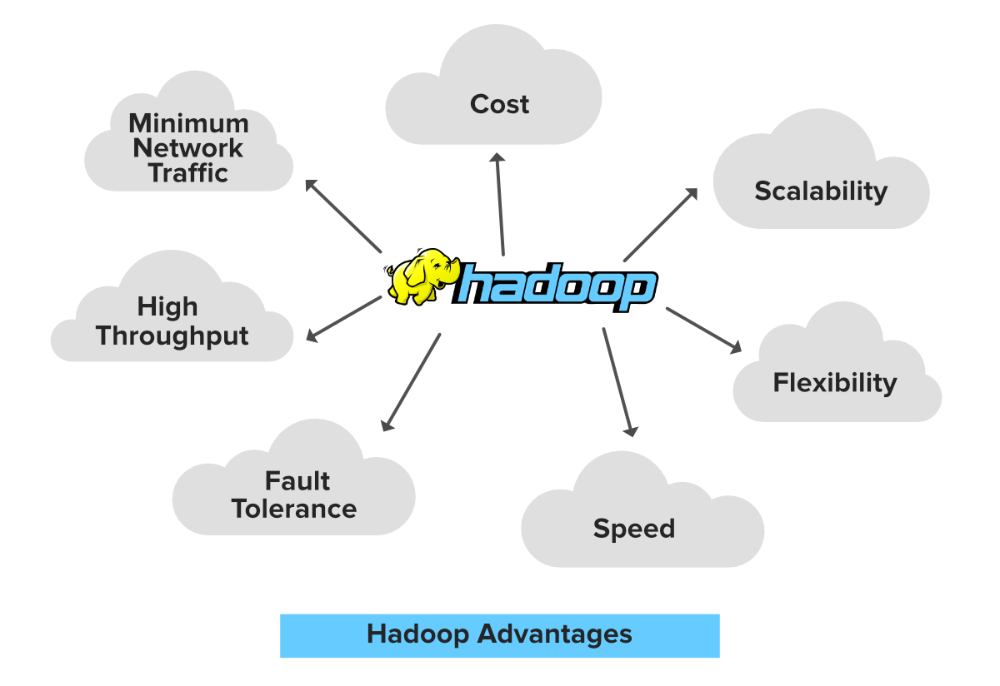
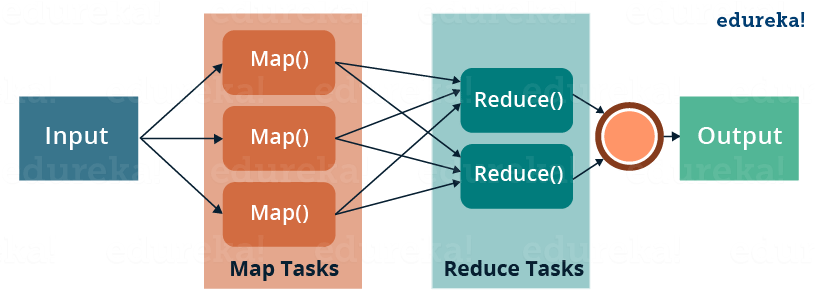
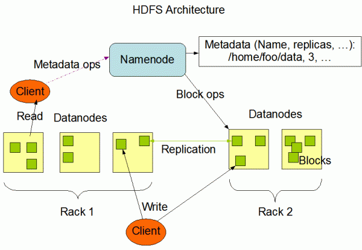
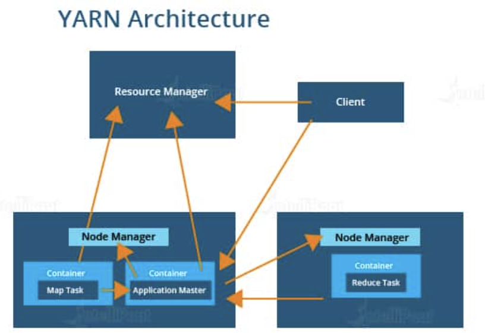

# Hadoop Ecosystem

In this practice we will learn about Hadoop and how is integrated on Data Engineering environment.


### Prerequisites
* [Install docker](https://docs.docker.com/engine/install/)

### What You Will Learn
- Hadoop Ecosystem
- Map Reduce

# Practice

Suppose you are working for a News company that is needing to know the most trending news, and they want you to retrieve an analysis of Tweets by making a word count to know which are the most used words that are trending right now.


### Requirements
* Process text files that are tweets texts to have a word count of them by using Hadoop Ecosystem.

## Step 1

### Hadoop

Hadoop is an open-source framework built on Java and was designed for distributed storage and processing of large data sets across clusters of commodity computers.



### Hadoop Ecosystem

The Hadoop ecosystem is a collection of tools and technologies built on top of Hadoop that extend its functionality to provide a more comprehensive data processing and analytics platform. Some of the popular components of the Hadoop ecosystem include:

+ **Apache Hive**: A data warehouse system that allows you to query and analyze large datasets stored in Hadoop using a SQL-like language.
+ **Apache Pig**: A high-level scripting language that enables developers to create complex data transformations for Hadoop.
+ **Apache Spark**: A fast and flexible processing engine that can handle batch, streaming, and interactive workloads.
+ **Apache HBase**: A NoSQL database that provides real-time read/write access to Hadoop data.
+ **Apache Storm**: A real-time stream processing system that can process large volumes of data in real-time.
+ **HDFS (Hadoop Distributed File System)**: A distributed file system that provides a way to store and access large amounts of data across a cluster of computers.


### How Does Hadoop works?

Hadoop works by distributing data processing tasks across a cluster of commodity computers. It consists of two main components: the Hadoop Distributed File System (HDFS) and the MapReduce processing framework.


Here's how it works:

1. **Data is stored in HDFS**: When a user uploads data to HDFS, it is broken down into smaller blocks and distributed across multiple nodes in the cluster. The HDFS architecture ensures that data is replicated to ensure fault-tolerance and high availability.
2. **MapReduce jobs are submitted**: To process data stored in HDFS, a user submits a MapReduce job. The job consists of two parts: a map function and a reduce function. The map function processes the input data and produces intermediate key-value pairs, while the reduce function aggregates the results and produces a final output.
3. **Map tasks are distributed across the cluster**: The MapReduce framework distributes the map tasks across the nodes in the cluster. Each node processes a portion of the input data and produces intermediate key-value pairs.
4. **Reduce tasks are distributed across the cluster**: Once the map tasks are completed, the framework distributes the reduce tasks across the nodes in the cluster. Each node receives a portion of the intermediate key-value pairs and aggregates them to produce a final output.
5. **Results are stored in HDFS**: Once the MapReduce job is completed, the final output is stored in HDFS. The user can then access the results and analyze the data as needed.



## Hadoop Components

Hadoop is formed by following components:

+ **Namenode**: The Namenode is the central node in the HDFS architecture. It manages the file system namespace and regulates access to files by clients. It stores the metadata of files and directories, such as the names, permissions, and file hierarchy. The Namenode also keeps track of the location of data blocks across the datanodes in the cluster.
+ **Datanode**: The Datanode is responsible for storing the actual data blocks of files in the HDFS. Each Datanode stores a portion of the file data and communicates with the Namenode to ensure data replication and availability. The Datanodes also perform periodic health checks and report back to the Namenode if there are any issues with the stored data.
+ **Resourcemanager**: The Resourcemanager is the central authority for resource allocation in a Hadoop cluster. It manages the allocation of available resources (such as memory and CPU) to different applications running on the cluster. The Resourcemanager communicates with the NodeManagers to allocate resources and monitor the status of running applications.
+ **Nodemanager**: The NodeManager is responsible for managing resources on individual nodes in the cluster. It is responsible for launching and monitoring container processes for running applications, managing the allocation of resources on the node, and reporting back to the Resourcemanager about the node's status.
+ **Historyserver**: The Historyserver is responsible for maintaining a history of completed MapReduce jobs and YARN applications. It provides a web interface for users to access and analyze past job runs and their associated statistics, such as the amount of data processed and the time taken to complete the job.



In summary, the Namenode and Datanodes manage the storage and retrieval of data in HDFS, while the Resourcemanager and Nodemanager manage resource allocation and job scheduling on the cluster. The Historyserver provides a way for users to access and analyze the results of past job runs.


## Hadoop's Running Modes

### Standalone mode

Standalone mode is the default mode of Hadoop and is used primarily for testing and development purposes. In this mode, Hadoop runs on a single machine, and both the HDFS and MapReduce daemons run in the same JVM. This means that all the processing and storage happens on a single machine, which limits the amount of data that can be processed and the scalability of the system.

### YARN mode

YARN mode (short for Yet Another Resource Negotiator) is a more advanced mode of Hadoop that allows for distributed processing of data across a cluster of machines. YARN separates the resource management and job scheduling functions of MapReduce, enabling Hadoop to support more complex data processing workloads. In YARN mode, the resource management is done by the ResourceManager and the job scheduling is handled by the ApplicationMaster.




Now, first start the containers that will create a Yarn's Hadoop Environment on containers:

```
docker-compose up -d
```

Now, to have a look at your current running Docker containers, use the command to list all active containers:

```
docker-compose ps
```

The docker-compoe file configured a Yarn's Hadoop Environment on containers. Here are the list of the URL Access for each component:

* Namenode: http://localhost:9870/dfshealth.html#tab-overview
* History server: http://localhost:8188/applicationhistory
* Datanode: http://localhost:9864/
* Nodemanager: http://localhost:8042/node
* Resource manager: http://localhost:8088/

### Step 2

Now let's copy necessary JAR and Input files.

Now we need to copy the jar files which contains our map-reduce jobs and copy them inside the namenode (which will be running your jobs) in HDFS using the following Docker commands:

```
# Copy the Word Count with the Map Reduce instructions to the container
docker cp submit/WordCount.jar hadoop_namenode:/tmp/

# Copy the file in order to use it with Word Count program
docker cp submit/my_input.txt hadoop_namenode:/tmp/
```

## 3. Interact with the namenode

Enter inside namenode and open bash:
```
docker-compose exec namenode bash
```

Once you enter the name node in an interactive terminal, use
the following HDFS commands to interact with the namenode:
```
# Move to /tmp directory
cd /tmp

# HDFS list commands to show all the directories in root "/"
hdfs dfs -ls /

# Create a new directory inside HDFS using mkdir tag.
hdfs dfs -mkdir -p /user/root

# Copy the files to the input path in HDFS.
hdfs dfs -put my_input.txt /user/root 

# Have a look at the content of your input file.
hdfs dfs -cat /user/root/my_input.txt
```

## 4. Run Hadoop Map Reduce Jobs
Now you can run your map-reduce job using the following command:
```
## Run map reduce job from the path where you have the jar file.
hadoop jar WordCount.jar org.apache.hadoop.examples.WordCount input my_output
```

## 5. Check Your Output

Once the job is executed successfully, you can check your output using the cat command in HDFS:
```
# Check the content of the output file after running the job
hdfs dfs -cat my_output/*
```

You can access the HDFS namenode’s UI dashboard on your localhost at port 9870. Use the following link:
```
http://localhost:9870
```


## Notes

## Configure Environment Variables

The configuration parameters can be specified in the hadoop.env file or as environmental variables for specific services (e.g. namenode, datanode etc.):
```
  CORE_CONF_fs_defaultFS=hdfs://namenode:8020
```

CORE_CONF corresponds to core-site.xml. fs_defaultFS=hdfs://namenode:8020 will be transformed into:
```
  <property><name>fs.defaultFS</name><value>hdfs://namenode:8020</value></property>
```
To define dash inside a configuration parameter, use triple underscore, such as YARN_CONF_yarn_log___aggregation___enable=true (yarn-site.xml):
```
  <property><name>yarn.log-aggregation-enable</name><value>true</value></property>
```

The available configurations are:
* /etc/hadoop/core-site.xml CORE_CONF
* /etc/hadoop/hdfs-site.xml HDFS_CONF
* /etc/hadoop/yarn-site.xml YARN_CONF
* /etc/hadoop/httpfs-site.xml HTTPFS_CONF
* /etc/hadoop/kms-site.xml KMS_CONF
* /etc/hadoop/mapred-site.xml  MAPRED_CONF

If you need to extend some other configuration file, refer to base/entrypoint.sh bash script.

## Conclusion

In conclusion, Hadoop is an open-source framework that has revolutionized the field of big data processing and analytics. Its distributed storage and processing capabilities allow organizations to store, manage, and analyze massive amounts of data across clusters of commodity computers. The Hadoop ecosystem provides a wide range of tools and technologies built on top of Hadoop, extending its functionality and making it a comprehensive data processing and analytics platform. With its fault-tolerant and scalable architecture, Hadoop is used by organizations of all sizes to process and analyze data in real-time, enabling them to make better decisions and gain insights that were previously impossible to obtain.
