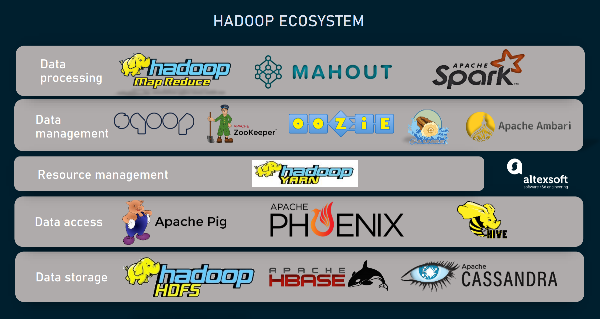
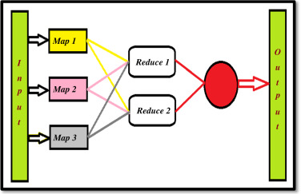
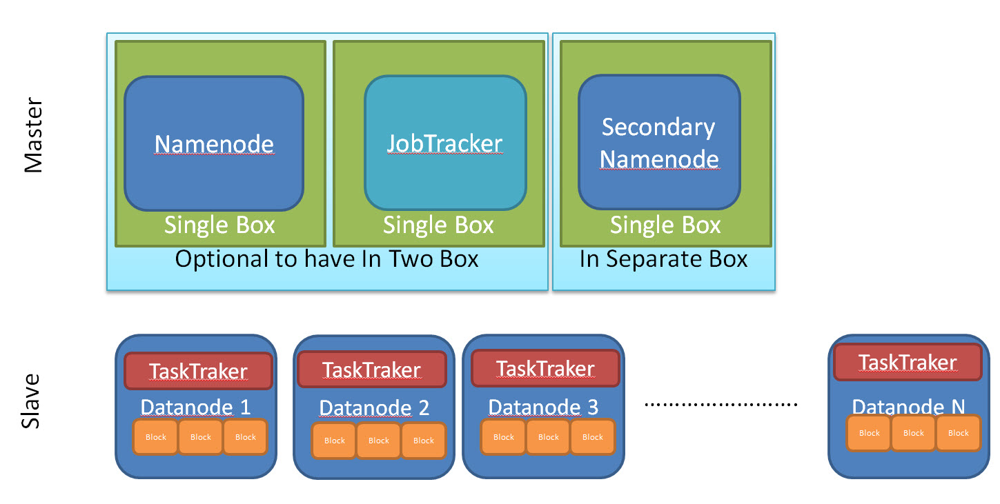
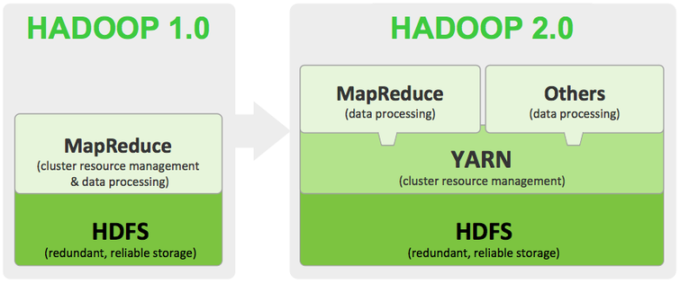
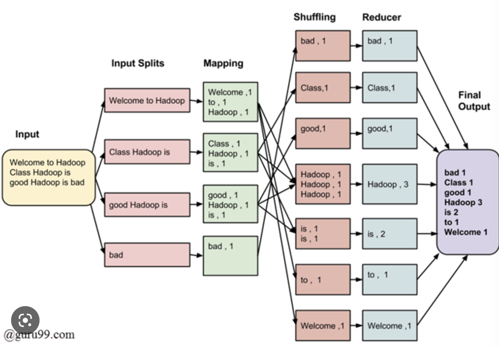
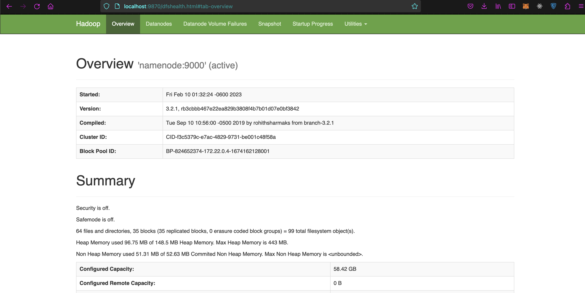

# Hadoop Ecosystem

In this practice we will learn about Hadoop and how is integrated on Data Engineering environment.


## Prerequisites

* Follow the [pre-setup guideline][pre-setup]

## Before start

Let's review some concepts and technologies we used during the pre-setup:

### Hadoop

>`Hadoop` is a framework that allows for the distributed processing of large data sets across clusters of computers using simple programming models
>
>`Apache Hadoop Ecosystem` refers to the various components of the Apache Hadoop software library

* `Apache Hive` \
  Datawarehouse, uses SQL-like language
* `Apache Pig` \
  A high-level scripting language to perform data transformations
* `Apache Spark` \
  Processing engine that can handle batch, streaming, and interactive workloads
* `Apache HBase` \
  A NoSQL database that provides real-time read/write access to Hadoop data.
* `Apache Storm` \
  A real-time stream processing system that can process large volumes of data in real-time.
* `HDFS (Hadoop Distributed File System)` \
  A distributed file system that provides a way to store and access large amounts of data across a cluster of computers.



#### How Does Hadoop works?

1. `Data is stored in HDFS` \
  Stores data into smaller blocks then is distributed into multiple nodes, data is replicated to ensure fault-tolerance and high availability.
2. `MapReduce jobs are submitted`
    * `Map function`: processes the input data and produces intermediate key-value pairs
    * `Reduce function`: aggregates the results and produces a final output
3. `Map tasks are distributed across the cluster`: The MapReduce framework distributes the map tasks across the nodes in the cluster. Each node processes a portion of the input data and produces intermediate key-value pairs.
4. `Reduce tasks are distributed across the cluster`: Once the map tasks are completed, the framework distributes the reduce tasks across the nodes in the cluster. Each node receives a portion of the intermediate key-value pairs and aggregates them to produce a final output.
5. `Results are stored in HDFS`: Once the MapReduce job is completed, the final output is stored in HDFS. The user can then access the results and analyze the data as needed.



### HDFS Hadoop Components

* `Namenode` \
  Central node, manage access to files by clients. Stores metadata and directories tacks the location of data blocks accross the datanodes in the cluster
* `Datanode` \
  Stores the data block, perform periodic health checks and report back to the Namenode if there are any issues with the stored data.
* `Resourcemanager` \
  Central authority for resource allocation (memory and CPU), communicates with the NodeManagers to allocate resources and monitor the status of running applications.
* `Nodemanager` \
  Managing resources on individual nodes in the cluster. Launches and monitoring container processes for running applications
* `Historyserver` \
  Maintaining a history of completed MapReduce jobs and YARN applications. Provides a web interface for users to access and analyze past job runs and their associated statistics, such as the amount of data processed and the time taken to complete the job.



### Hadoop's Running Modes

* `Standalone mode`
  * Default mode
  * Primarily for testing and development purposes
  * Hadoop runs on a single machine
    * `Both the HDFS and MapReduce daemons run in the same JVM`
* `YARN mode` (Yet Another Resource Negotiator)
  * Advanced mode of Hadoop
  * Distributed processing of data across a cluster of machines
    * `The resource management is done by the ResourceManager and the job scheduling is handled by the ApplicationMaster`



The docker-compose file configured a Yarn's Hadoop Environment on containers. Here are the list of the URL Access for each component:

* Namenode: <http://localhost:9870/dfshealth.html#tab-overview>
* History server: <http://localhost:8188/applicationhistory>
* Datanode: <http://localhost:9864/>
* Nodemanager: <http://localhost:8042/node>
* Resource manager: <http://localhost:8088/>

## What You Will Learn

* Hadoop Ecosystem
* Map Reduce

## Practice

Perform a tweet analysis making word count to know which are the most used words (AKA trending), your solution must be scalable to 1 million rows batches.


### Requirements

Using the infrastructure from setup from the [pre-setup][pre-setup]:

* Process text files ("tweets")
* Get  word count of them by using Hadoop Ecosystem

>Test your solution using the file `tweet.txt`

### Step 1 - Input Files

* Copy necessary Java Word Count file and Input Twitter files

  ```shell
  # Copy the Word Count with the Map Reduce instructions to the container
  docker cp submit/WordCount.java hadoop_namenode:/tmp

  # Copy the file in order to use it with Word Count program
  docker cp submit/tweet.txt hadoop_namenode:/tmp
  ```

### Step 2 - Namenode

* Open bash in the Namenode

  ```shell
  docker-compose exec namenode bash
  ```

* Create directory and put the input file on the hdfs system

  ```shell
  # Move to /tmp directory
  cd /tmp

  # HDFS list commands to show all the directories in root "/"
  hdfs dfs -ls /

  # Create a new directory inside HDFS using mkdir tag.
  hdfs dfs -mkdir -p /user/root/input

  # Copy the files to the input path in HDFS.
  hdfs dfs -put tweet.txt /user/root/input

  # Have a look at the content of your input file.
  hdfs dfs -cat /user/root/input/tweet.txt
  ```

### Step 3 - Map Reduce Job

* Build and run your map-reduce job

  ```shell
  # Making necessary environment variables setup
  export PATH=${JAVA_HOME}/bin:${PATH}
  export HADOOP_CLASSPATH=${JAVA_HOME}/lib/tools.jar

  # Generating Java Classes
  hadoop com.sun.tools.javac.Main WordCount.java

  # Generating Java Jar file
  jar cf wc.jar WordCount*.class

  ## Run map reduce job from the path where you have the jar file.
  hadoop jar wc.jar WordCount /user/root/input /user/root/output
  ```



### Step 4 - Output

* Check the output

  ```shell
  # Check the content of the output file after running the job
  hdfs dfs -cat output/*
  ```

You can access the HDFS namenode’s UI dashboard on your localhost at port 9870. Use [this link](http://localhost:9870)



## Notes

### Configure Environment Variables

The configuration parameters can be specified in the hadoop.env file or as environmental variables for specific services (e.g. namenode, datanode etc.):

```shell
  CORE_CONF_fs_defaultFS=hdfs://namenode:8020
```

CORE_CONF corresponds to core-site.xml. fs_defaultFS=hdfs://namenode:8020 will be transformed into:

```xml
  <property><name>fs.defaultFS</name><value>hdfs://namenode:8020</value></property>
```

To define dash inside a configuration parameter, use triple underscore, such as YARN_CONF_yarn_log___aggregation___enable=true (yarn-site.xml):

```xml
  <property><name>yarn.log-aggregation-enable</name><value>true</value></property>
```

The available configurations are:

* /etc/hadoop/core-site.xml CORE_CONF
* /etc/hadoop/hdfs-site.xml HDFS_CONF
* /etc/hadoop/yarn-site.xml YARN_CONF
* /etc/hadoop/httpfs-site.xml HTTPFS_CONF
* /etc/hadoop/kms-site.xml KMS_CONF
* /etc/hadoop/mapred-site.xml  MAPRED_CONF

If you need to extend some other configuration file, refer to base/entrypoint.sh bash script.

## Conclusion

Hadoop is an open-source framework that has revolutionized the field of big data processing and analytics. Its distributed storage and processing capabilities allow organizations to store, manage, and analyze massive amounts of data across clusters of commodity computers.

The Hadoop ecosystem provides a wide range of tools and technologies built on top of Hadoop, extending its functionality and making it a comprehensive data processing and analytics platform. With its fault-tolerant and scalable architecture, Hadoop is used by organizations of all sizes to process and analyze data in real-time, enabling them to make better decisions and gain insights that were previously impossible to obtain.

## Still curious

Check the timeline below to know the history behind Hadoop and why it is a big deal

>Some context:
>
>There are 2 big problems related to big data: How to store it and how to query it. RDBMS is not enough when you have large amount of same type data (Since you don't need relations check or PK/FK checks)

* 2002: Doug Cutting & Mike Cafarella are preparing Apache Nutch, an indexer engine for thousand of millions of pages, after some investigation the costs were too much to develop and mantain. So they decide to check other architectures
* 2003: A google article is released, describing Google File System (GFS), to store big data.
* 2004:
  * A google article is published about MapReduce technique to process big data files.
  * Apache Nutch project is started to being implemented as open source (to reach broader audience)
* 2005: Doug found some problems:
  * Limited to 20-40 Nodes
  * Required bigger clusters
  * Engineering required a team, not just 2 people (starting to search companies)
* 2006: Yahoo joined the team, project is renamed to Hadoop (Hadoop name is taken from Doug children which was a yellow elephant)
  * New scope work onthousands nodes
* 2007: First 1000 nodes hadoopr cluster
* 2008: Hadoop is released as open source project for Apache Souftware Foundation
* 2009: First Petabyte testing for hadoop, ordering in less than 17 hours
* 2011 (Dec): Apache Release V1.0
* 2013: Release V2.0.6
* 2017: Release V3.0 (current)

>Despite google being the owner of the articles, GFS and MapReduce were never implemented by google, that's the reason why Google does not own a hadoop equivalent.

In general lines, Hadoop is today the most wide used technology for big data, the reason is very simple, hadoop is not just Java anymore, it can be integrated with another languages and tools.

However this is not the only reason, discover additional reasons here:

Article: [Why hadoop?][why_hadoop]

## Links

### Used during this session

* [Pre-Setup][pre-setup]
* Article: [Why hadoop?][why_hadoop]

### Session reinforment and homework help

* [Hadoop Tutorial for Beginners: Hadoop Basics][hadoop_intro]
* [Hadoop Tutorial][hive_tutorial]
* [What is MapReduce in Hadoop? Big Data Architecture][map_reduce]
* [HDFS Architecture Guide][hdfs_guide]
* [Difference Between HDFS and HBase][hdfs_hbase]

[pre-setup]: ./pre-setup.md

[why_hadoop]: https://data-flair.training/blogs/why-hadoop/
[hadoop_intro]: https://www.bmc.com/blogs/hadoop-introduction/
[hive_tutorial]: https://cwiki.apache.org/confluence/display/hive/tutorial
[map_reduce]: https://www.guru99.com/introduction-to-mapreduce.html
[hdfs_guide]: https://hadoop.apache.org/docs/r1.2.1/hdfs_design.html
[hdfs_hbase]: https://www.geeksforgeeks.org/difference-between-hdfs-and-hbase/
