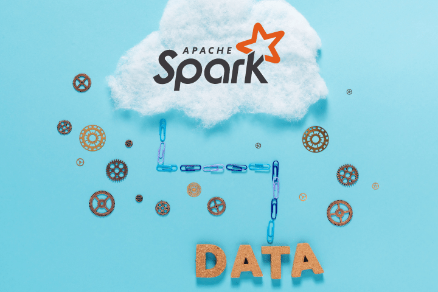
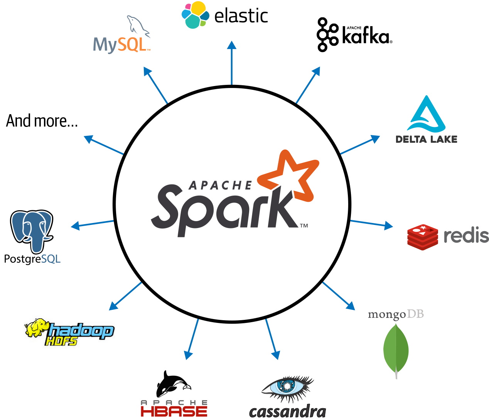

# Apache Spark

In this practice we will develop a simple ETL pipeline on Apache Spark.



## Prerequisites

* Follow the [pre-setup guideline][pre-setup]

## Before start

Let's review some concepts we used during the pre-setup:

### Spark

>Apache Spark is an open-source distributed computing framework built on `Scala` and it's used for big data processing and analytics. \
>Spark now supports `Java`, `Scala`, `Python`, and `R`and sources such as `databases`, `hdfs`, `files`, `cloud services`.



### How Does Spark Work?

Apache Spark uses a distributed `in-memory` computing model that allows it to process large amounts of data in parallel. Such memory can be RAM memory or GPU memory that allows spark to be fast while extracting, processing and loading the data.


### Spark Components

* `Driver` \
  Run on the client machine and creates the `SparkContext` (main entrypoint).
  >The driver program is responsible for dividing the tasks into smaller tasks and sending them to the executors.
* `Executors` \
  Worker nodes.
* `Master` \
  Manges allocation of resources to the workers.
  >It communicates with the workers to allocate resources and monitor their performance.
* `Worker` \
  Runs the tasks assigned by the driver program.
  >It communicates with the master to receive tasks and allocate resources.

### Spark Job Execution

* A Spark job is submitted
* The `driver` program breaks the job into smaller tasks
* Task are sent to the `executors`
  >Each executor runs tasks in parallel
* The result is sent back to the driver program
* The `driver` program collects the results and combines them to produce the final output

  

### Spark Run Modes

* `Standalone` \
  This mode is used to run Spark on a single machine or cluster without using any other cluster manager.
* `YARN` \
  This mode is used to run Spark on a Hadoop cluster managed by YARN.
* `Apache Mesos` \
  Apache Mesos is a distributed systems kernel that provides efficient resource isolation and sharing across distributed applications. Spark can run on Mesos to take advantage of its resource management capabilities.
* `Kubernetes` \
  Kubernetes is a container orchestration platform that automates the deployment, scaling, and management of containerized applications
* `Amazon EMR` \
  Amazon EMR (Elastic MapReduce) is a managed Hadoop service offered by Amazon Web Services.
* `Databricks` \
  Databricks is a cloud-based big data processing and analytics platform built on top of Apache Spark.

  

### Spark Libraries

* `Spark RDDs (Spark Core)` \
  RDDs (Resilient Distributed Datasets) are immutable distributed collections of objects that can be processed in parallel. Serve as the building blocks for all other libraries and APIs.
* `Spark DataFrames` \
  Spark DataFrames are a distributed collection of data organized into named columns. They are similar to tables in a relational database and can be manipulated using SQL-like queries.
* `Spark SQL` \
  Spark SQL is a Spark module that provides support for structured data processing (JDBC, Avro, and Parquet)
* `Spark Streaming` \
  Spark Streaming is a library used for real-time stream processing (data sources Kafka, Flume, and Twitter) With Spark Streaming, you can perform real-time analytics on live data streams.
* `GraphX` \
  Graph processing in Apache Spark (PageRank and connected components)
* `MLlib` \
  MLlib is a library for machine learning in Apache Spark. (Algorithms like classification, regression, clustering, and collaborative filtering)

  

### What You Will Learn

* Apache Spark Concepts and Components
* Spark RDDs (Resilent Distributed Datasets)
* Spark Dataframes
* Spark SQL

## Practice

You're working on a clinic, and the clinic has a database of the appointments that were made between the patient and the doctor.

The clinic provides you CSV files with historical data of the appointments and they ask you to load the data to the database.


### Requirements

Using the infrastructure from setup from the [pre-setup][pre-setup]:

* Analyze the SQL script
* Analyze the scripts: `clinic_rdd.py`, `clinic_dataframes.py` and `clinic_sparksql.py`
* Run the scripts and verify the data is loaded successfully into database
* Answer the following questions:
  * Which method you will choose over the other 2?
  * How is this similar to pandas?
  * What will happen if we delete the jar in the file?
    * Why we need to use a jar if we are programming in python?

### Step 0 - Common

* The 3 scripts we will be analyzing share the same structure:
  * `Initializing` \
    We will be using `PostgreSQL` and `Spark`, and from there we will use different libraries to transform and load the csv file content, the following code pull the parameters to connect to postgres and initialize the spark client

      ```py
      conn_params = utils.pg_params
      spark = utils.get_spark_session()
      ```

  * `Read`
  * `Transform`
  * `Load`
    * `save_to_postgres` function \
      (the save to postgres will use the `utils.df_write` function)

>If this scenario was a production we would have environment variables for the connection and additional security in the cluster, however this a local cluster for testing. To simplify the practice we didn't add environment variables.

### Step 1 - SQL

The SQL scripts creates 4 tables: `patient`, `clinical_specialization`, `doctor`, `appointment`

>If these structures seem familiar is because this is the postgres version of `session_2` \
>Also in this session we will be doing the Load part into a database, but this time we will be using Spark intead of pandas

The most relevant topic here would be that the `appointment` table contains fields that are *not string*, so they need to be *manually casted*.

### Step 2 - RDD

#### 2.1 - RDD Analize

As we mention previously on the [Spark Libraries][spark_libraries] section RDD are the core of Spark, but they can also be used to set up jobs.
>If we use this RDD  the process will be faster than using libraries that build on top of RDD library, but we will also need to do additional programming that other libraries already do

* Analize the code
  * If we remove the `print` and the common headers the code would be something like this

    ```py
    # READ
    file_rdd = spark.sparkContext.textFile('./clinic_1.csv')

    # TRANSFORM
    header = file_rdd.first()
    rows_rdd = file_rdd.filter(lambda row: row != header)

    mapped_rdd = rows_rdd.map(lambda row: row.split(','))

    patient_rdd = mapped_rdd.map(lambda row: [row[0], row[1], row[2]])
    clinical_specialization_rdd = mapped_rdd.map(lambda row: [row[7]])
    doctor_rdd = mapped_rdd.map(lambda row: [row[5], row[6]])
    appointment_rdd = mapped_rdd.map(lambda row: [row[3], row[4]])

    # LOAD
    def save_to_postgres(rdd, columns, table_name, spark):
        df = spark.createDataFrame(rdd, columns)
        if table_name == 'appointment':
            df = df.select(
                to_date(df.date, 'yyyy-MM-dd').alias('date'),
                to_timestamp(df.time, 'HH:mm a').alias('time'))
        utils.df_write(df, table_name)

    save_to_postgres(patient_rdd, ['name', 'last_name', 'address'], 'patient', spark)
    save_to_postgres(clinical_specialization_rdd, ['name'], 'clinical_specialization', spark)
    save_to_postgres(doctor_rdd, ['name', 'last_name'], 'doctor', spark)
    save_to_postgres(appointment_rdd, ['date', 'time'], 'appointment', spark)
    ```

  * Read \
    When we use `sparkContext` we are calling a method in the main node (Check [Spark Components][spark_components] section) to tell spark what task type we will be sending taks of.

    ```py
    file_rdd = spark.sparkContext.textFile('./clinic_1.csv')
    ```

    In this case we will be sending task based on a `csv` file (rows)

    * Since we are using `.textFile` method the resulting object will be the same as if we read from a txt instead of a csv (later in the code we can split to make it more *csv like*)
    * Each line of the file will be treated as a threadable task

    Documentation: [Spark Context][spark_context]
  
  * Transform
    * We have the file now in memory, but the first line is not useful, since is just the headers, let's remove it

      ```py
      # Get the first row (header)
      header = file_rdd.first()
      # Get new structure with all that is not 'header'
      rows_rdd = file_rdd.filter(lambda row: row != header)
      ```

    * With only data split based on comma (since the file is csv)

      ```py
      mapped_rdd = rows_rdd.map(lambda row: row.split(','))
      ```

    * Let's create the table on rdd structures \
      Remember the index must match with the header and with the SQL script

      ```py
      # 0: patient_name, 1: patient_last_name, 2: patient_address
      patient_rdd = mapped_rdd.map(lambda row: [row[0], row[1], row[2]])

      # 7: doctor_clinical_specialization
      clinical_specialization_rdd = mapped_rdd.map(lambda row: [row[7]])

      # 5: doctor_name, 6: doctor_last_name
      doctor_rdd = mapped_rdd.map(lambda row: [row[5], row[6]])

      # 3: appointment_date, 4: appointment_time
      appointment_rdd = mapped_rdd.map(lambda row: [row[3], row[4]])
      ```

  * Load
    * Function (`save_to_postgres(rdd, columns, table_name, spark)`)
      * We have the rdd structure which is not `insertable` to a database, instead let's create a dataframe based on the `rdd` and the `columns` names

        ```py
        df = spark.createDataFrame(rdd, columns)
        ```

      * As we mention in [Step 1][step_1] the appointment table need manual casting, let's add the exception \
        This will allow insertion type match expected type into database

          ```py
          if table_name == 'appointment':
            df = df.select(
                to_date(df.date, 'yyyy-MM-dd').alias('date'),
                to_timestamp(df.time, 'HH:mm a').alias('time'))
          ```

      * Finally, insert the dataframe

          ```py
          utils.df_write(df, table_name)
          ```

#### 2.2 - RDD Run

* Run `clinic_rdd.py`

```sh
# Create a bash session to `python_app`
docker-compose exec python_app bash
# Move to code directory
cd code
# Run clinic_rdd
python clinic_rdd.py
```

### Step 3 - Spark Dataframes

#### 3.1 - Spark Dataframes Analize

* Analize the code
  * If we remove the `print` and the common headers the code would be something like this

    ```py
    # READ
    csv_df = spark.read.csv("./clinic_2.csv", header=True, inferSchema=True)

    # TRANSFORM
    patient_df = csv_df.select("patient_name", "patient_last_name", "patient_address") \
        .withColumnRenamed("patient_name", "name") \
        .withColumnRenamed("patient_last_name", "last_name") \
        .withColumnRenamed("patient_address", "address")
    clinical_specialization_df = csv_df.select("doctor_clinical_specialization").distinct() \
        .withColumnRenamed("doctor_clinical_specialization", "name")
    doctor_df = csv_df.select("doctor_name", "doctor_last_name") \
        .withColumnRenamed("doctor_name", "name") \
        .withColumnRenamed("doctor_last_name", "last_name")
    appointment_df = csv_df.select("appointment_date", "appointment_time") \
        .withColumnRenamed("appointment_date", "date") \
        .withColumnRenamed("appointment_time", "time")
    appointment_df = appointment_df.select(to_date(appointment_df.date, 'yyyy-MM-dd').alias('date'), to_timestamp(appointment_df.time, 'HH:mm a').alias('time'))

    # LOAD
    utils.df_write(patient_df, "patient")
    utils.df_write(clinical_specialization_df, "clinical_specialization")
    utils.df_write(doctor_df, "doctor")
    utils.df_write(appointment_df, "appointment")
    ```

  * Read \
    We will use `spark.read.csv`, so no need to call context, this also will return a dataframe instead of an RDD object
  * Transform \
    Based on main dataframe let's query each table and save it to a new dataframe
    * `select()` works as a SQL select
    * `.withColumnRenamed()` will rename a column

      ```py
      patient_df = csv_df.select("patient_name", "patient_last_name", "patient_address") \
      .withColumnRenamed("patient_name", "name")
      ...
      ```

    * As we mention in [Step 1][step_1] the appointment table need manual casting, cast in the same data frame

      ```py
      appointment_df = appointment_df.select(to_date(appointment_df.date, 'yyyy-MM-dd').alias('date'), to_timestamp(appointment_df.time, 'HH:mm a').alias('time'))
      ```

  * Load
    * Function (`utils.df_write(df, table_name)`) \
      Since we already did all the transformation and dataframe is a structure that can be handled by the connection, let's call the insert for each table

      ```py
      utils.df_write(patient_df, "patient")
      utils.df_write(clinical_specialization_df, "clinical_specialization")
      utils.df_write(doctor_df, "doctor")
      utils.df_write(appointment_df, "appointment")
      ```

#### 1.2 - Spark Dataframes Run

* Run `clinic_dataframes.py`

```sh
python clinic_dataframes.py
```

### Step 4 - Spark SQL

#### 4.1 - Spark SQL Analize

* Analize the code
  * If we remove the `print` and the common headers the code would be something like this

    ```py
    # READ
    spark.read.csv("./clinic_3.csv", header=True, inferSchema=True).createOrReplaceTempView("clinic")

    # TRANSFORM
    patient_df = spark.sql('select patient_name as name, patient_last_name as last_name, patient_address as address from clinic')
    clinical_specialization_df = spark.sql('select doctor_clinical_specialization as name from clinic')
    doctor_df = spark.sql('select doctor_name as name, doctor_last_name as last_name from clinic')
    appointment_df = spark.sql("select to_date(appointment_date, 'yyyy-MM-dd') as date, to_timestamp(appointment_time, 'HH:mm a') as time from clinic")

    # LOAD
    utils.df_write(patient_df, "patient")
    utils.df_write(clinical_specialization_df, "clinical_specialization")
    utils.df_write(doctor_df, "doctor")
    utils.df_write(appointment_df, "appointment")
    ```

  * Read \
    We are using the same read method as in previous step (final object: dataframe)
  * Transform \
    Based on main dataframe let's query each table and save it to a new dataframe \
    Notice instead of using `select()` and `.withColumnRenamed()` we are using `SQL like` instruction

      ```py
      patient_df = spark.sql('select patient_name as name, patient_last_name as last_name, patient_address as address from clinic')
      clinical_specialization_df = spark.sql('select doctor_clinical_specialization as name from clinic')
      doctor_df = spark.sql('select doctor_name as name, doctor_last_name as last_name from clinic')
      ```

    * As we mention in [Step 1][step_1] the appointment table need manual casting, cast in the same SparlSQL instruction

      ```py
      appointment_df = spark.sql("select to_date(appointment_date, 'yyyy-MM-dd') as date, to_timestamp(appointment_time, 'HH:mm a') as time from clinic")
      ```

  * Load
    * Function (`utils.df_write(df, table_name)`) \
      Since we already did all the transformation and dataframe is a structure that can be handled by the connection, let's call the insert for each table

      ```py
      utils.df_write(patient_df, "patient")
      utils.df_write(clinical_specialization_df, "clinical_specialization")
      utils.df_write(doctor_df, "doctor")
      utils.df_write(appointment_df, "appointment")
      ```

#### 1.2 - Spark SQL Run

* Run `clinic_sparksql.py`

```sh
python clinic_sparksql.py
```

## Homework

* Create a new python script that:
  * Read all the csv files in the folder
    * Don't use the individual file names, just the folder name
  * Read the data from the postgre clinic_db tables
    * Do necessary comparisons/transformations/joins to obtain and load the missing ids
      * `doctor_id` and `patient_id` on **appointment** table
      * `clinical_specialization_id` on **doctor** table.

Then to validate your solution, you can run following query and data should be retrieved:

```sql
SELECT
  a.id AS appointment_id,
  a.date,
  a.time,
  p.id AS patient_id,
  p.name AS patient_name,
  p.last_name AS patient_last_name,
  p.address AS patient_address,
  d.id AS doctor_id,
  d.name AS doctor_name,
  d.last_name AS doctor_last_name,
  cs.name AS doctor_clinical_specialization
FROM
  appointment a
  JOIN patient p ON p.id = a.patient_id
  JOIN doctor d ON d.id = a.doctor_id
  JOIN clinical_specialization cs ON cs.id = d.clinical_specialization_id;
```

## Conclusion

Overall, Apache Spark is a powerful open-source distributed computing framework used for big data processing and analytics.

It is built for speed and supports multiple languages including Java, Scala, Python, and R. Spark provides a wide range of libraries and APIs for data processing, machine learning, graph processing, and stream processing.

## Still curious

* Spark as many other frameworks make use of best practices, which include executions plans, checkpoints, use of multithread..

  Documentation: [Official Spark Best Practices][spark_best_practices]

* So, now you might be thinking why would I use Spark over other technologies such as Pandas

  * Article: [Difference Between Spark DataFrame and Pandas DataFrame][spark_vs_pandas]
  * Article: [Which library should I use? Apache Spark, Dask, and Pandas Performance Compared(With Benchmarks)][spark_pandas_dask]
  * Article: [Pandas, Spark, and Polars — When To Use Which?][spark_vs_pandas_2]
  * Article: [Pandas vs PySpark..!][pandas_vs_pyspark]

## Links

### Used during this session

* [Pre-Setup][pre-setup]

* Documentation: [Spark Context][spark_context]
* Documentation: [Official Spark Best Practices][spark_best_practices]
* Article: [Difference Between Spark DataFrame and Pandas DataFrame][spark_vs_pandas]
* Article: [Which library should I use? Apache Spark, Dask, and Pandas Performance Compared(With Benchmarks)][spark_pandas_dask]
* Article: [Pandas, Spark, and Polars — When To Use Which?][spark_vs_pandas_2]
* Article: [Pandas vs PySpark..!][pandas_vs_pyspark]

### Session reinforment and homework help

* Article: [Advanced Spark Concepts for Job Interviews: Part 1][advanced_spark]
* Article: [Top 10 Spark Interview Questions][spark_questions]
* Article: [What Is a Data Lake? Types, Elements & Best Practices][data_lake]
* Mini course: [Hive Tutorial for Beginners: Learn with Examples in 3 Days][hive_tutorial]
* Article: [What Is Data Processing: Cycle, Types, Methods, Steps and Examples][data_processing]
* Exercises: [Spark SQL Explained with Examples][sparks_examples]

### Enroute reference

* [Raw vs. Pre-processed data][raw_vs_proprocessed]

[spark_libraries]: #spark-libraries
[spark_components]: #spark-components
[step_1]: #step-1---sql

[pre-setup]: ./pre-setup.md

[spark_context]: https://spark.apache.org/docs/latest/api/python/reference/api/pyspark.SparkContext.html
[spark_best_practices]: https://spark.apache.org/docs/latest/api/python/user_guide/pandas_on_spark/best_practices.html
[spark_vs_pandas]: https://www.geeksforgeeks.org/difference-between-spark-dataframe-and-pandas-dataframe/
[spark_pandas_dask]: https://censius.ai/blogs/apache-spark-vs-dask-vs-pandas
[spark_vs_pandas_2]: https://betterprogramming.pub/pandas-spark-and-polars-when-to-use-which-f4e85d909c6f
[pandas_vs_pyspark]: https://medium.com/geekculture/pandas-vs-pyspark-fe110c266e5c

[advanced_spark]: https://medium.com/data-engineering-on-cloud/advance-spark-concepts-for-job-interview-part-1-b7c2cadffc42
[spark_questions]: https://medium.com/@gunjansahu/top-10-spark-interview-questions-853349f86790
[data_lake]: https://www.netsuite.com/portal/resource/articles/data-warehouse/data-lake.shtml
[hive_tutorial]: https://www.guru99.com/hive-tutorials.html
[data_processing]: https://www.simplilearn.com/what-is-data-processing-article
[sparks_examples]: https://sparkbyexamples.com/spark/spark-sql-explained/

[raw_vs_proprocessed]: https://enrouted.sharepoint.com/:p:/s/DataEngineering/EQ7JryKi-xRBgyjm0DbLJKUBy3d1Hg1e6BL7xwZiDtgxqg?e=KFiAvI
