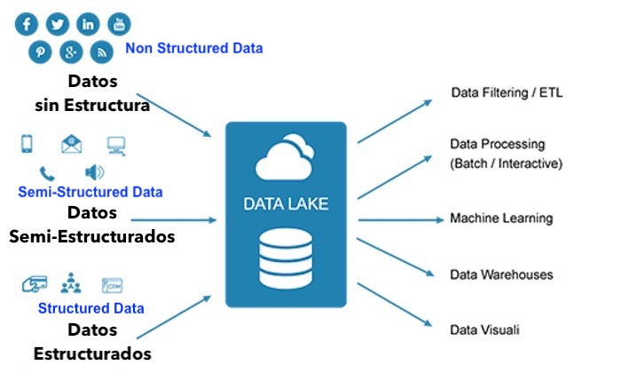
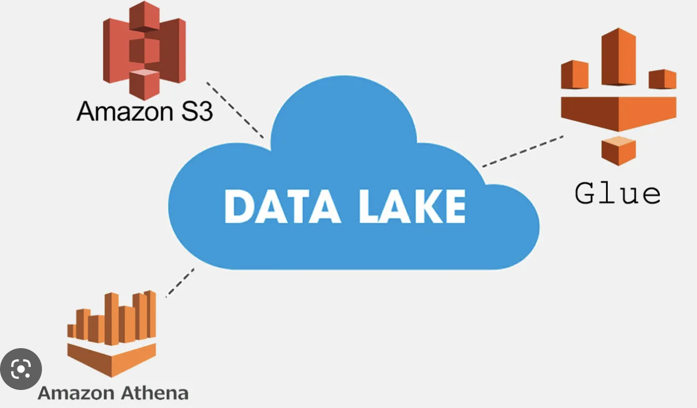

# Datalake

In this practice we will setup a datalake on HDFS and Hive environment.


### Prerequisites
* [Install docker](https://docs.docker.com/engine/install/) 

### What You Will Learn
- Datalake Concepts and Components
- Hive
- HDFS
- Implement a Datalake on HDFS and Hive

# Practice

You're working on a global e-commerce company, and the company recieves multiple CSV and JSON files every day about the products that has been sold.

The company wants to have the product information into a single source that can be consumed by other systems. To achieve that, the company wants you to design and implement a datalake for it.


### Requirements
* Create a Datalake for the product files of the e-commerce.

## Step 1

### Datalake

A datalake is a centralized repository that allows you to **store and manage large volumes of structured, semi-structured, and unstructured data**. In a datalake, data is stored in its raw form, without any transformation or pre-processing, so that it can be accessed and analyzed by different teams across the organization. Also the **data or files stored on the datalake, it can be given an schema so that way you can query the data of the files on regular SQL**.



### Where can be implemented a Datalake?

There are several different forms in which a datalake can be implemented, depending on the technologies and tools that are used. Some of the most common implementations of datalakes include:

+ **HDFS with Hive**: As I mentioned earlier, HDFS and Hive are commonly used to implement datalakes. HDFS provides a distributed file system for storing large volumes of data, while Hive provides a SQL-like interface for querying and analyzing the data.
+ **S3 with Athena**: Amazon S3 is a cloud-based storage service that is commonly used to implement datalakes. Athena is a serverless query service that allows you to run SQL queries against data stored in S3. This combination provides a scalable and cost-effective solution for storing and querying large volumes of data.
+ **Azure Blob Storage with Azure Data Lake Analytics**: Microsoft Azure provides Blob Storage, which is a scalable and secure cloud storage solution that can be used to store large volumes of data. Azure Data Lake Analytics is a serverless analytics service that allows you to run big data analytics jobs against data stored in Blob Storage.
+ **Google Cloud Storage with BigQuery**: Google Cloud Storage is a scalable and secure cloud storage solution that can be used to implement a datalake. BigQuery is a fully-managed data warehouse service that allows you to run SQL queries against data stored in Cloud Storage.



### How to Implement a Data Lake on HDFS/Hive

To implement a datalake using HDFS and Hive, you would typically follow these steps:

1. **Ingest data into HDFS**: The first step is to ingest the data that you want to store into HDFS. This can be done using a variety of tools, including Apache Kafka, Apache Flume, and Apache NiFi. The data can be stored in its raw form, without any transformation or pre-processing.
2. **Define a schema**: Once the data is stored in HDFS, you can define a schema for it using Hive. This involves creating a table that defines the structure of the data, including the column names, data types, and any other metadata that is required.
3. **Query the data**: Once the schema is defined, you can query the data using HiveQL. Hive will automatically map the queries to the data stored in HDFS, and it will distribute the queries across the nodes in the Hadoop cluster to perform the analysis at scale.
4. **Iterate and refine**: As you work with the data, you may discover that the schema needs to be refined or updated to better support your analysis. Hive allows you to easily modify the schema as needed, without having to manually modify the data stored in HDFS.


### How files can be stored on a Datalake's Filesystem

If you're storing raw, pre-processed, and processed data in a datalake, it's a good idea to organize the data in a way that makes it easy to manage and query. One common approach is to use a hierarchical directory structure, where the data is organized by year, month, and day. Here's an example of how you could organize the data in a datalake:

+ **Raw data**: The raw data can be stored in a top-level directory called "raw", with subdirectories for each year, month, and day. For example, you could have a directory structure like this:

```
raw/
   year=2022/
      month=01/
         day=01/
            data1.csv
            data2.csv
         day=02/
            data3.csv
            data4.csv
      month=02/
         day=01/
            data5.csv
            data6.csv
         day=02/
            data7.csv
            data8.csv
   year=2023/
      month=01/
         day=01/
            data9.csv
            data10.csv
         day=02/
            data11.csv
            data12.csv
      month=02/
         day=01/
            data13.csv
            data14.csv
         day=02/
            data15.csv
            data16.csv
```
+ **Pre-processed data**: The pre-processed data can be stored in a separate directory called "pre-processed", with a similar directory structure as the raw data. For example, you could have a directory structure like this:

```
preprocessed/
   year=2022/
      month=01/
         day=01/
            data1_preprocessed.csv
            data2_preprocessed.csv
         day=02/
            data3_preprocessed.csv
            data4_preprocessed.csv
      month=02/
         day=01/
            data5_preprocessed.csv
            data6_preprocessed.csv
         day=02/
            data7_preprocessed.csv
            data8_preprocessed.csv
   year=2023/
      month=01/
         day=01/
            data9_preprocessed.csv
            data10_preprocessed.csv
         day=02/
            data11_preprocessed.csv
            data12_preprocessed.csv
      month=02/
         day=01/
            data13_preprocessed.csv
            data14_preprocessed.csv
         day=02/
            data15_preprocessed.csv
            data16_preprocessed.csv
```

+ **Processed data**: The processed data can be stored in a separate directory called "processed", with a similar directory structure as the raw data and pre-processed data. For example, you could have a directory structure like this:

```
processed/
   year=2022/
      month=01/
         day=01/
            data1_processed.csv
            data2_processed.csv
         day=02/
            data3_processed.csv
            data4_processed.csv
      month=02/
         day=01/
            data5_processed.csv
            data6_processed.csv
         day=02/
            data7_processed.csv
            data8_processed.csv
   year=2023/
      month=01/
         day=01/
            data9_processed.csv
            data10_processed.csv
         day=02/
            data11_processed.csv
            data12_processed.csv
      month=02/
         day=01/
            data13_processed.csv
            data14_processed.csv
         day=02/
            data15_processed.csv
            data16_processed.csv
```

### Apache Hive

Apache Hive is a tool that is built on top of Hadoop and is designed to allow you to query and analyze data stored in HDFS or other distributed storage systems. **Hive provides a SQL-like language called HiveQL to query data**, and it is able to take advantage of the distributed processing capabilities of Hadoop to perform queries at scale.

One of the key features of Hive is its ability to create schemas for files stored on HDFS. When you create a table in Hive, you define the schema of the table, including the column names, data types, and any other metadata that is required. **Hive then maps the columns in the table to the columns in the underlying data files stored on HDFS**, based on the file format and the data in the files.

Hive **supports a wide range of file formats, including CSV, JSON, Avro, ORC, and Parquet**. Each file format has its own way of storing data, and Hive is able to interpret the data in the files and create schemas for the tables based on the file format.

For example, if you have a CSV file stored on HDFS that contains customer data, you can create a table in Hive that maps to the columns in the CSV file. Here is an example HiveQL statement that creates a table based on a CSV file stored on HDFS:

```
CREATE TABLE customers (
    id INT,
    name STRING,
    email STRING,
    age INT
)
ROW FORMAT DELIMITED
FIELDS TERMINATED BY ','
LINES TERMINATED BY '\n'
STORED AS TEXTFILE
LOCATION '/path/to/csv/file';
```

And then you can query the CSV file data as regular SQL queries.

### Apache Hive Components

Hive have multiple components, such as:

+ **Hive Metastore**: The Hive Metastore is a central repository that stores metadata information about Hive tables, including the table schema, column names, data types, and partitioning information. The Metastore stores this metadata in a relational database, such as MySQL, Oracle, or PostgreSQL. By separating the metadata from the actual data stored on HDFS, Hive is able to provide a level of abstraction that allows users to query and analyze data using SQL-like syntax, without having to worry about the underlying storage system.
+ **Hive Query Processor**: The Hive Query Processor is responsible for translating HiveQL queries into MapReduce or Tez jobs that can be executed on a Hadoop cluster. The Query Processor parses the HiveQL queries, performs optimization, and generates a query plan that is optimized for distributed processing.
+ **Hive Execution Engine**: The Hive Execution Engine is responsible for executing the MapReduce or Tez jobs generated by the Query Processor. The Execution Engine manages the distribution of the jobs across the nodes in the Hadoop cluster and ensures that the jobs are executed in a fault-tolerant and scalable manner.
+ **Hive CLI and Beeline**: The Hive CLI (Command Line Interface) and Beeline are command-line tools that allow users to interact with Hive using a command-line interface. The Hive CLI is an interactive shell that allows users to enter HiveQL commands and receive the results directly in the shell. Beeline is a JDBC client that can be used to connect to Hive from external tools and applications.
+ **Hive Drivers and APIs**: Hive provides a variety of drivers and APIs that allow developers to integrate Hive with external tools and applications. These drivers and APIs include JDBC, ODBC, and Thrift, and they allow developers to use Hive as a data warehousing tool for a wide range of use cases.


First let's start the containers from the docker-compose.yml with following command:

```
docker-compose up -d
```

The docker-compose command will start sic containers that has a Hadoop YARN containerized environment with hive integration-

## Step 2

### Uploading Raw files into HDFS

Now we are going to upload the `raw_files` of the products into HDFS.

First let's copy all the CSV files of `raw_files` directory into the namenode container with the following command:

```
docker cp ./raw_files session_9_datalake-namenode-1:/tmp
```

Now let's connect to the namenode service container with:

```
docker-compose exec namenode bash
```

Now move to /tmp/raw_files with the following command:

```
cd /tmp/raw_files/
```

Once there now let's create  `/raw/year=2023/month=01/day=01/` and `/raw/year=2023/month=01/day=02/` directories on HDFS:

```
$ hdfs dfs -mkdir -p /raw/year=2023/month=01/day=01/
$ hdfs dfs -mkdir -p /raw/year=2023/month=01/day=02/
```

Now upload into `/raw/year=2023/month=01/day=01/` the **products_1.csv** and **products_2.csv** with the following commands:

```
$ hdfs dfs -put products_1.csv /raw/year=2023/month=01/day=01/
$ hdfs dfs -put products_2.csv /raw/year=2023/month=01/day=01/
```

Now upload into `/raw/year=2023/month=01/day=02/` the **products_3.csv** with following command:

```
hdfs dfs -put products_3.csv /raw/year=2023/month=01/day=02/
```

Now we are done uploading the raw files into hdfs, now let's exit of the container's bash session with:

```
exit
```

## Step 3

### Creating Hive tables from RAW files

Now we are going to create tables on Hive by using the RAW files that we uploaded into HDFS.

First, let's connect to hive-metastore service container with following command:

```
docker-compose exec hive-metastore bash
```

Once there, now we are able to connect to Hive with following command:

```
hive
```

Then we can create a new database for the products with following command:

```
create database products_db;
```

Once done, you can see available databases with following command;

```
show databases;
```

Then, let's use products_db by executing following command:

```
use products_db;
```

Now we are going to create a **products** table with the data that we uploaded into HDFS, to do so, let's execute following command:

```
CREATE EXTERNAL TABLE products (
  id INT,
  product_name STRING,
  product_price INT,
  product_country STRING,
  number_sold_per_day INT
)
PARTITIONED BY (year INT, month INT, day INT)
ROW FORMAT DELIMITED
FIELDS TERMINATED BY ','
STORED AS TEXTFILE
LOCATION '/raw/';
```

Now let's do a select * from products to see what happen:

```
select * from products;
```

As we can see, there is NO data, the reason is because we need to add the partitions of the directories that we created to load the data, to do so let's execute following statement:

```
MSCK REPAIR TABLE products;
```

And if we do again a select * from products, we would able to see data now:

```
select * from products;
```

Also we can filter the data even by year, month and day, for example if we like the data from (year=2023, month=01, day=02), we can do the following SQL statement:

```
select * from products where year='2023' and month='01' and day='01';
```

### Notes

Also Hive is capable to automatically add partitions, you can see this page for more information:

https://docs.cloudera.com/HDPDocuments/HDP3/HDP-3.0.0/using-hiveql/content/hive-create_partitions_dynamically.html

Also you can connect to Hive within hive-metastore with following command:

```
/opt/hive/bin/beeline -u jdbc:hive2://localhost:10000
```

In this case the connection is made by a JDBC java driver.

Also there are other JDBC Java drivers to connect to Hive, one of the most populars is presto

```
./presto.jar --server localhost:8080 --catalog hive --schema default
```


## Conclusion

In summary, a datalake is a centralized repository for storing and managing large volumes of data, and it can be implemented using HDFS and Hive to provide a scalable and fault-tolerant storage and querying solution for big data analytics and data science projects.

