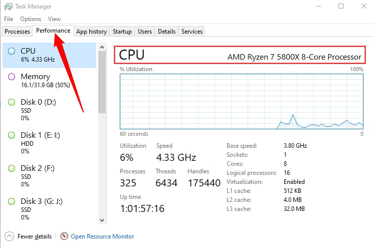
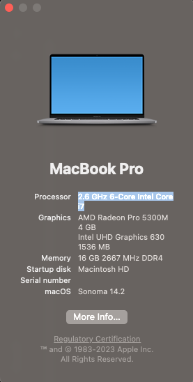
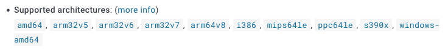
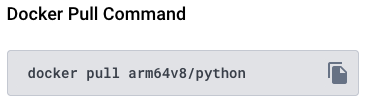

# Docker troubleshooting

These practices were built having in mind al intel chip, if your pc have a different architecture this could help you to have the practice working.

>Use only if you have problems with your practices.

## Before Start

If you want a quick solution go to [QuickFix](#quick-fix), if you want to go deep into the problem go to the next section

## What's my architecture

* First we need to know what processor type we have installed:
  * Windows
    * Go to Task Manager (Ctrl + Shift + Esc) > Performance > CPU
      
  * Mac
    * Go to About this Mac > Processor
      
  * Linux
    * Run the command `lscpu`

      ```sh
      $ lscpu
      Architecture:            x86_64
        CPU op-mode(s):        32-bit, 64-bit
        Address sizes:         45 bits physical, 48 bits virtual
        Byte Order:            Little Endian
      CPU(s):                  2
        On-line CPU(s) list:   0,1
      Vendor ID:               GenuineIntel
        Model name:            12th Gen Intel(R) Core(TM) i5-12400
          ...
      ```

* Then a quick search on google will tell us the architecture

## Dockerfile support

>We will use as example Apple Silicon M1

* On your Dockerfile you will see something like this

  ```Dockerfile
  # Dockerfile
  FROM python:3.10
  ```

  ```yml
  # Composer
  image: python:2
  ```

* Press Cmd/Ctrl + Click and this should take you to the docker hub \
  *In this case <https://hub.docker.com/_/python/>*
* Scroll to Supported architectures section
  
* Click your architecture \
  *In this example `arm64v8`*
  
* Using the `Docker Pull Command` information, replace on your Dockerfile/Composer
  

  ```Dockerfile
  # Dockerfile
  FROM arm64v8/python:3.10
  ```

  ```yml
  # Composer
  image: arm64v8/python:2
  ```

* Cmd/Ctrl + F or scroll to the tag section and verify the version your are using exists \
  *In this case `3.10` and `2`*
  
* If the version you are using is not supported in your architecture use the closest highest version available and replace in your Dockerfile/Composer

  ```Dockerfile
  # Dockerfile
  FROM arm64v8/python:3.10
  ```

  ```yml
  # Composer
  image: arm64v8/python:3.8
  ```

* The file should now run normally

## Quick fix

* Based on your processor brand pick your architecture \
  The most common brands are:

  |Brand|Architecture|Ex|
  |-|-|-|
  |Intel|x86_x64|i3, i5, i7|
  |AMD|amd64|Ryzen 7, Ryzen 9|
  |Apple Silicon|arm64v8|M1, M2|

* Replace in your Dockerfile/Compose using `architecture:latest`
  * Original

    ```Dockerfile
    # Dockerfile
    FROM python:3.10
    ```

    ```yml
    # Composer
    image: python:2
    ```

  * Will change to

    ```Dockerfile
    # Dockerfile
    FROM arm64v8/python:latest
    ```

    ```yml
    # Composer
    image: arm64v8/python:latest
    ```
